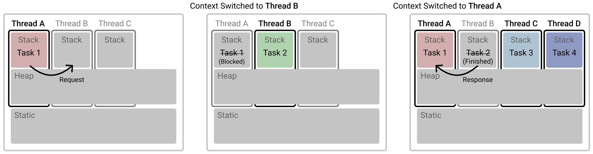

처음 Kotlin 를 사용하던 중에 비동기 처리를 위해 Coroutine 개념을 마주했었습니다. 동기란 요청을 보낸 후 요청에 대한 반환값을 얻기 이전까지 대기하는걸 의미하고, **비동기는 그 대기시간동안 다른 일을 수행하여 효율성을 높히는걸 의미**합니다.

동기와 비동기는 ‘대기’가 필요한 작업들이 빈번한 프로그래밍에 등장하는 개념이고 이를 ‘blocking’으로 명명하여 예로는 OS 시간에 배웠던 I/O 나 Network Request/Response 처리가 있습니다. 과거에는 앞서 말한 예를 처리할때에만 비동기를 사용했던것으로 기억하는데요. 현재에는 어떤 작업이든지 잘게 쪼개어 비동기로 하는 것으로 보입니다. 이런 분위기를 이끌어 온것은 사용이 간편해짐을 들 수 있는데 여기서 설명할 Coroutine 개념도 Thread 보다 비동기 사용이 쉽도록 만들어주었기 때문아닐까 생각이 듭니다.

# Process & Thread

> **Process**: Program 이 메모리에 적재되어 실행되는 인스턴스<br>
> **Thread**: Process 내 실행되는 여러 흐름의 단위

먼저 Thread 는 Process 보다 작은 단위의 실행 인스턴스로만 알고 있는데, 메모리 영역도 조금 다릅니다.


Process 는 독립된 메모리 영역(Heap)을 할당받고 각 Thread도 독립된 메모리 영역(Stack)을 할당받습니다. Thread 는 본질적으로 Process 내에 속해있기 때문에 Head 메모리 영역은 해당 Process 에 속한 모든 Thread 들이 공유할 수 있습니다.

Program 에 대한 Process 가 생성되면 Heap 영역과 하나의 Thread 와 하나의 Stack 영역을 갖게되고, **Thread 가 추가될때마다 그 수만큼의 Stack 이 추가**됩니다. Thread 가 100 개라면 전체 메모리에 100 개의 Stask 이 생성되는 것입니다.

# Concurrency & Parallelism

## Concurrency 동시성

> **Interleaving 시분할**: 다수의 Task 가 있는데, 각 Task 들을 평등하게 조금씩 나누어 실행하는것


총 실행시간은 Context Switching 에 대한 비용을 제외하곤 각 Task 수행시간을 합친것과 동일합니다.
예를 들어 3 개의 Task 각각이 10분씩 걸린다고 했을때, **총 30분이 소요**되는것입니다.

## Parallelism 병렬성

> **Parallelizing 병렬수행**: 다수의 Task 가 있는데, 각 Task 들이 한번에 수행되는 것


Task 수 만큼 자원이 필요하며, Context Switching 은 필요없습니다.
총 실행시간은 다수의 Tasks 중 가장 소요시간이 긴 Task 만큼 걸립니다.
예를 들어 3 개의 Task 각각이 10, 11, 12분씩 걸린다면, **총 12분이 소요**되는것입니다.

# Thread & Coroutine

Thread, Coroutine 모두 Concurrency 동시성 (Interleaving) 를 보장하기 위한 기술입니다. 여러개의 작업을 동시에 수행할 때 Thread 는 각 작업에 해당하는 메모리 영역을 할당하는데, 여러 작업을 동시에 수행해야하기 때문에 OS 레벨에서 각 작업들을 얼만큼씩 분배하여 수행해야지 효율적일지 Preempting Scheduling 을 필요로 합니다. A 작업 조금 B 작업 조금을 통해 최종적으로 A 작업과 B 작업 모두를 이뤄내는 것입니다. Coroutine 은 Lightweight Thread 라고 불립니다. 이 또한 작업을 효율적으로 분배하여 조금씩 수행하여 완수하는 Concurrency 를 목표로하지만 각 작업에 대해 Thread 를 할당하는 것이 아니라 작은 Object 만을 할당해주고 이 Object 들을 자유자재로 스위칭함으로써 Switching 비용을 최대한 줄였습니다.

## Thread

- Task 단위 : **Thread**
  - 다수의 작업 각각에 Thread 를 할당합니다.<br>
    각 Thread 는 위에 설명했듯 자체 Stack 메모리 영역을 가지며 JVM Stack 영역을 차지합니다.
- **Context Switching**
  - **OS Kernel 에 의한 Context Switching** 을 통해 Concurrency 를 보장합니다.
  - **Blocking** : 작업 1(Thread) 이 작업 2(Thread) 의 결과가 나오기까지 기다려야한다면<br>
    작업 1 Thread 는 Blocking 되어 그 시간동안 해당 자원을 사용하지 못합니다.



* 쉬운 설명을 위해 CPU 는 Single Core 로 가정합니다.

위 그림에서 작업들은 모두 Thread 단위인것을 알 수 있습니다. Thread A 에서 작업 1을 수행중에 작업 2가 필요할때 이를 비동기로 호출하게 됩니다. 작업 1은 진행중이던 작업을 멈추고(Blocked) 작업 2는 Thread B 에서 수행되며 이때 CPU 가 연산을 위해 바라보는 메모리 영역을 Thread A 에서 Thread B 로 전환하는 Context Switching 이 일어납니다. 작업 2가 완료되었을때 해당 결과값을 작업 1에 반환하게 되고, 동시에 수행할 작업 3과 작업 4는 각각 Thread C 와 Thread D 에 할당됩니다. 싱글 코어 CPU 는 동시 연산이 불가능하므로 이때에도 OS Kernel 의 Preempting Scheduling 에 의해 각 작업 1, 3, 4 각각을 얼만큼 수행하고 멈추고 다음 작업을 수행할지 결정하여 그에 맞게 세 작업을 돌아가며 실행함으로써 Concurrency 를 보장합니다.

## Coroutine

- Task 단위 : **Object** = **Coroutine**
  - 다수의 작업 각각에 Object 를 할당합니다.<br>
    이 Coroutine Object 는 객체를 담는 JVM Heap 에 적재됩니다.
- **Programmer Switching** = No Context Switching
  - **프로그래머의 코딩을 통해 Switching 시점을 마음대로** 정함으로써 Concurrency 를 보장합니다.
  - **Suspend** = Non-Blocking : 작업 1(Object) 이 작업 2(Object) 의 결과가 나오기까지 기다려야한다면<br>
    작업 1 Object 는 Suspend 되지만 작업 1 을 수행하던 Thread 는 그대로 유효하기 때문에 작업 2 도 작업 1 과 동일한 Thread 에서 실행될 수 있습니다.


* 쉬운 설명을 위해 CPU 는 Single Core 로 가정합니다.

작업의 단위는 Coroutine Object 이므로 작업 1 수행중에 비동기 작업 2가 발생하더라도 작업 1을 수행하던 같은 Thread 에서 작업 2를 수행할 수 있으며, 하나의 Thread 에서 다수의 Coroutine Object 들을 수행할 수도 있습니다. 위 그림에 따라 **작업 1과 작업 2의 전환에 있어 단일 Thread A 위에서 Coroutine Object 객체들만 교체함으로써 이뤄지기 때문에 OS 레벨의 Context Switching 은 필요없습니다.** 한 Thread 에 다수의 Coroutine 을 수행할 수 있음과 **Context Switching 이 필요없기 떄문에 Coroutine 을 Lightweight Thread 로도 부릅니다.**

다만 위 그림의 Thread A 와 Thread C 의 예처럼 다수의 스레드가 동시에 수행된다면 Concurrency 보장을 위해 두 Threads 간 Context Switching 은 수행되어야합니다. 따라서 Coroutine 을 사용할때에는 No Context Switching 이라는 장점을 최대한 활용하기 위해 다수의 Thread 를 사용하는 것보다 단일 Thread 에서 여러 Coroutine Object 들을 실행하는 것이 좋습니다.

> 결국 Coroutine 으로 ‘작업’의 단위를 Thread 가 아닌 Object 로 축소하면서<br>
> 작업의 전환 및 다수 작업 수행에 굳이 다수의 Thread 를 필요로 하지 않게됩니다.

<br>

> Coroutine 은 Thread 의 대안이 아니라 기존의 Thread 를 더 잘게 쪼개어 사용하기위한 개념이다.<br>
> 하나의 Thread 가 다수의 코루틴을 수행할 수 있기 때문에 더 이상 작업의 수만큼 Thread 를 양산하며 메모리를 소비할 필요가 없다.

- 각 스레드마다 갖는 Stack 메모리 영역을 갖지 않기때문에, 스레드 사용시 스레드 개수만큼 Stack 메모리에 따른 메모리 사용공간이 증가하지 않아도 된다.
- 같은 프로세스내에 ‘공유 데이터 구조’(Heap)에 대한 locking 걱정도 없다.


Thread 와 Coroutine 의 예로 보여드린 그림들을 위와 같이 축약해보았습니다. Coroutine 을 사용한다면 Task 가 바뀌어도 Thread 는 그대로 유지되는 것을 볼 수 있습니다. 그에 따라 자연스레 Context Switching 횟수도 확연히 줄어들은것을 볼 수 있습니다. Coroutine 에서 설명드린바와 같이 Task 3 과 Task 4 도 Thread C 가 아닌 Thread A 에서 수행되도록 한다면 하나의 Context Switching 도 없게 설계할 수 있습니다. 즉, Coroutine 이 수행될 Thread 도 프로그래머가 Shared Thread Pool 을 지정하여 결정한다는 의미이며, Coroutine 을 활용한 효율성은 오로지 프로그래머의 몫이라는 의미입니다.

### 각 언어의 Coroutine

- **Future** = Java 비동기 지원
- **Promise** / **Generators** = JavaScript 비동기 지원
  - 제너레이터는 yield 구문에 의해서만 실행을 멈춥니다. 즉 잘게잘게 쪼개어 (Iterator) 얼려놓았다 (Freeze/Yield)
- **Deferred** = Kotlin 비동기 지원
  - Non Blocking Cancellable ‘Future’(Java) = Coroutine Object
  - Coroutine Builder 인 async { } 를 통해 정의된다.
  - Coroutine 에서 설명했듯이 Deferred 객체를 수행할땐 Thread 를 Blocking 하지 않고<br>
    해당 구문이 끝날때까지 awaits 하였다 끝나면 계속 이어간다.

### Stackful & Stackless

Coroutine 을 조금 더 깊게 알아보았다면 Stackful 과 Stackless 이 두 종류로 나뉘는것을 볼 수 있다. 본 글의 맨 처음에서 언급했듯이 Thread 는 자체 메모리 영역인 Stack 을 갖는다. Stack 은 함수 실행 순서를 적재하고 그를 관리할 수 있게 해준다. Lightweight Thread 인 Coroutine 의 Stackful & Stackless 는 Coroutine 이 자체 Stack 을 가지는가? 갖지 않는가?를 의미한다. Stackful Coroutine 은 Coroutine 내부에서 다른 함수를 호출하였을때 해당 함수에서 현재 Coroutine 을 suspend 할 수 있음 (정확히는 yield 호출을 할 수 있음) 을 의미한다. Stackless Coroutine 은 함수에 대한 Stack 을 따로 갖지 않기 때문에 호출하려는 함수를 다시 한번 Coroutine 객체로 묶어서 ‘Coroutine 중첩 호출’을 해야지 이전 Coroutine 과 내부 Coroutine 을 suspend 를 통해 연결할 수 있다.

- **Coroutine** : Stackful Functions
  - Coroutine 내부 함수에서 Yield(Suspending the Coroutine) 호출 가능
- **Generators** : Stackless Functions
  - Coroutine 내부 함수에서 Yield(Suspending the Coroutine) 호출 불가능
  - 예를 들면 Coroutine 내부에 있는 Arrays.forEach() 함수 안 구문에선 forEach() 함수를 코루틴 적용이 가능하게 따로 정의하지 않는한 Yield 호출이 불가능하다.

# Kotlin Coroutine

## `buildSequence {}`

- 순차적 Yield/Resuming
  - Yield 를 통해 멈춥니다.
  - Resume 을 통해 순차수행합니다.

```kotlin
fun g() = buildSequence {
  yield(1); yield(2);
}
for (v in g()) {
  println(v)
}
```

## `runBlocking {}`

- **Main Thread 를 Blocking** 한 채 + **{ } 구문 내 작업을 새 Thread 에 할당하여 수행**
- runBlocking { } 내부에 다수의 async { } 들을 정의하였다면<br>
  해당 모든 async 들이 다 수행 완료, 반환되었을때 Main Thread 에 대한 Blocking 을 풉니다.

## `launch {}`

- **Main Thread 를 Unblocking** 한 채 + { } 구문 내 작업을 수행

## `async {}`

- **Main Thread 를 Unblocking** 한 채 + { } 구문 내 작업을 수행 후 **반환**
  - async { } 는 launch { } 와 같은 동작을 하지만 반환값이 존재하는 Deferred 입니다.<br>
    즉, launch 는 끝까지 실행하면 끝나는거고 async 는 끝까지 실행하고 반환값을 가진 객체를 반환한다.
  - Deferred, which has an await() function that returns the result of the coroutine.

---

- https://stackoverflow.com/questions/1934715/difference-between-a-coroutine-and-a-thread
- https://stackoverflow.com/questions/43021816/difference-between-thread-and-coroutine-in-kotlin/43232925
- https://kotlinlang.org/docs/tutorials/coroutines/coroutines-basic-jvm.html
- https://medium.com/@jooyunghan/stackful-stackless-%EC%BD%94%EB%A3%A8%ED%8B%B4-4da83b8dd03e

---