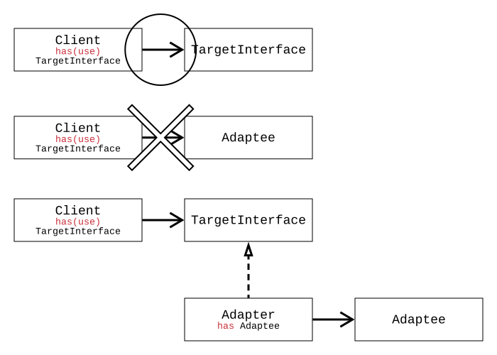

# The Art of Disguise

In the story of the Three Little Pigs, there's a wolf who disguises itself as a sheep by wearing a sheepskin and powdering its paws white. Of course, it's so clumsy that it gets laughed at by the youngest pig, but "disguise" was necessary for it to enter the pigs' house. This post will talk about makeup and disguise. Let's take a moment to understand their difference.

## Makeup

Makeup is about decorating yourself to be a slightly **exaggerated version of your current self**.
You remain yourself; to put it in more difficult terms, you **add something extra to decorate** without harming your essence.

## Disguise

Disguise is about decorating yourself to appear as **something completely different from your current self**.
It's about **dressing up as something entirely different**, not yourself.

In this chapter, we will learn about the Decorator pattern, which corresponds to makeup, and the Adapter pattern, which corresponds to disguise. Finally, we'll conclude by covering the Facade pattern, which, unlike the previous two patterns, simply bundles multiple classes into a single class rather than changing one class into another.

# Adapter Pattern = Disguise

As mentioned, the wolf disguised itself as a gentle sheep to enter the Three Little Pigs' house. It changed its terrifying claws into pretty white hands by powdering them and mimicked a gentle "Baaaaaaa" sound instead of its growl. Expressing this with classes makes it very easy to understand.

-   **Wolf**

```java
class Wolf {
    public String getClaw() {
        return "Sharp Claw";
    }
    public String getGrowl() {
        return "Grrrrrrr";
    }
}
```

-   **The wolf "disguises" itself as a sheep to enter the Three Little Pigs' house.**

```java
class WolfWantsToBeSheep implements Sheep {
    public Wolf wolf; // The Adaptee
    public String getHand() {
        return wolf.getClaw().replace("Sharp Claw", "White Hand");
    }
    public String getSound() {
        return wolf.getGrowl().replace("Grrrrrrr", "Baaaaaaa");
    }
}
```

Now, the wolf can go anywhere a sheep can. Let's try to enter the Three Little Pigs' house, which only allows sheep.

-   Only sheep can enter the Three Little Pigs' house.

```java
public void WelcomeToPigHouse(Sheep sheep);
```

-   You can see that a real sheep enters the Three Little Pigs' house just fine.

```java
WelcomeToPigHouse(new Sheep());
```

-   Oh, even the wolf, disguised as a sheep, can now enter the Three Little Pigs' house!

```java
WelcomeToPigHouse(new WolfWantsToBeSheep(new Wolf()));
```

If we consider any class or function as a **client**, **clients are implemented to work only with a specific target interface**. Due to this constraint, even if you want to use a different class with that client, you **cannot use it if that class is not an implementation of the target interface**. Like the example above, the wolf was born a wolf, but to go to the Three Little Pigs' house, it had to become a gentle sheep. In general business, sudden requirements sometimes arise where a class needs to be used as a different class that fits the client's purpose.

## Object Adapter

As in the wolf and sheep example, the Adapter pattern creates a **new implementation class for the target interface** called an **Adapter**. Inside this Adapter, it holds the **external class that wants to disguise itself as the target interface** as an object. This wrapped implementation of an existing object, adapted to a different interface, is called an **Adaptee**. You implement each function of the target interface by utilizing the original functions and properties of the Adaptee.

This is more specifically called an **'Object Adapter'** because the Adapter **holds the Adaptee as an object**. We learned this as 'composition'. Looking at the code below, `Adapter` has `Adaptee` as an object. The class diagram will help you understand it a bit better.

```java
public void Client(TargetInterface interface);

class Adapter implements TargetInterface {
    private Adaptee adaptee;
    // ... implements functions of TargetInterface by utilizing adaptee's functions.
}
```

```java
this.Client(new Adapter(new Adaptee()));
```

With the help of the Adapter, the Adaptee can now be injected into clients that only use `TargetInterface`.



Then, what is a **'Class Adapter'**? A Class Adapter doesn't 'compose' (has) the Adaptee as an object but 'inherits' (extends) it as a class.

## Class Adapter

The Class Adapter is rather simpler. If you look at the code and class diagram below, there are two differences from the Object Adapter.

-   The Adapter does not compose (has) the Adaptee but inherits (extends) it.
-   The Target exists as a Class, not an Interface, and accordingly, it uses inheritance (extends) rather than implementation (implements).

Let's briefly understand the difference between Object Adapter and Class Adapter through pseudo-code.

-   **Object Adapter**

```java
class Adapter implements TargetInterface {
    private Adaptee adaptee;
    // ... implements functions of TargetInterface by utilizing adaptee's functions.
}
```


-   **Class Adapter**

```java
class Adapter extends Target, Adaptee { // Note: This is pseudo-code for illustration
    // ... extends Target's functions by utilizing adaptee's functions.
}
```


Some of you might have flinched looking at the code above. Java does not support multiple inheritance for classes. In the Class Adapter code, you can see two classes being extended by a single Adapter class: one is the target class to be extended, and the other is the Adaptee class, which is the object being extended. Of course, Java does not support multiple inheritance of classes in this way, so this logic is unusable in Java, and this structure itself is not recommended because it undermines flexibility.

## Multiple Adapters

Multiple Adapters means supporting not just one target interface, but multiple target interfaces. If you want to use a single Adaptee class with various interfaces, you can connect `TargetOneInterface` and `TargetTwoInterface` with a single Adapter class and implement all methods of both interfaces. If it were a Class Adapter instead of an Object Adapter, you would extend (inherits) two classes, `TargetOne` and `TargetTwo`.

While Java does not support multiple inheritance for classes, it does support multiple inheritance for interfaces, so syntax like `implements A, B` is perfectly usable for interfaces.

-   **Multiple (Object) Adapters**

```java
public void ClientOne(TargetOneInterface interface1);
public void ClientAnother(TargetTwoInterface interface2);

class Adapter implements TargetOneInterface, TargetTwoInterface {
    private Adaptee adaptee;
    // ... implements all functions of TargetOne/TwoInterface by utilizing adaptee's functions.
}
```

# Decorator Pattern - Makeup

The Decorator pattern corresponds to 'makeup' in that even if you add countless additional features to a class, that class maintains the functionality of its original class. The reason why the Decorator pattern is discussed after the Adapter pattern is that its underlying principle is similar to the Adapter-Adaptee concept. If an Adapter **'disguises' an Adaptee** as a **TargetInterface**, a Decorator **'applies makeup' to a Decoratee** to remain a **Decoratee** itself.

-   Adapter Pattern - **Disguise: Adaptee != TargetInterface**

```java
class Adapter implements TargetInterface {
    private Adaptee adaptee;
}
```

-   Decorator Pattern - **Makeup: Decoratee == Decoratee**

```java
class Decorator extends Decoratee { // Decorator is also a Decoratee
    private Decoratee decoratee; // It wraps another Decoratee
}
```

The Decorator pattern is not used for just a single instance of makeup. It can recursively "apply makeup" to itself repeatedly. No matter how many different `DecoratorA`s or `DecoratorB`s you create to decorate it, because it ultimately remains a `Decoratee` class, existing clients don't need to worry much and can continue using it as before.

> The Decorator pattern makes a Decorator class apply makeup to a Decoratee as a Decoratee.
> Since a Decorator inherits from Decoratee, it can also be a Decoratee.
> Therefore, a Decorator can recursively position itself on a Decoratee, allowing for infinite layers of makeup.

-   **Decoratee**: The object you want to decorate.

```java
class Decoratee {
    // ... core functionality
}
```

-   **Decorator**: The object that decorates.

```java
class Decorator extends Decoratee { // Inherits from Decoratee to maintain its type
    private Decoratee decoratee; // Wraps an actual Decoratee instance
    // ... extends decoratee's functions to provide improved functionality.
}
```

The simple code above is sufficient if you only want very basic decorating. However, even so, I recommend separating it into an **'Abstract Decorator'** and **'Concrete Decorator'** as shown below, due to the following advantages:

-   Common logic or properties (especially the decoratee itself) needed by concrete decorators can be placed in the abstract decorator for use during implementation.
-   Numerous concrete decorators can be managed under a single abstract decorator.

Do you remember the first principle of design patterns: "Program to an interface, not an implementation"? The advantage of using interfaces (or abstract classes) instead of implementations was their utility and reusability, allowing you to attach and detach desired concrete classes. For example, if you want to manage concrete decorators in a list or set, you can create a list or set of the abstract decorator type.

# Facade Pattern - Bundle

The last pattern we will learn is the Facade pattern. The **Adapter and Decorator patterns share the commonality of each having a single Adaptee or Decoratee**, and their difference was whether it was a **'disguise' (Adapter)** or **'makeup' (Decorator)**. The fact that the Facade pattern is discussed in this chapter implies it also shares some common ground with them. What could it be?

The Facade pattern shares the same commonality as the Adapter and Decorator patterns. It internally holds classes to be utilized, much like an Adaptee or Decoratee. However, while Adapter and Decorator each held only one Adaptee or Decoratee, a **Facade holds a large number of classes**. And while the difference between Adapter and Decorator was 'disguise' vs. 'makeup,' the Facade simply becomes a new class in itself.

Adapter and Decorator patterns had a desired appearance by inheriting the interface or class they wanted to become. The Facade pattern, however, simply throws in necessary objects to create logic for a desired purpose, nothing more. In a way, one might wonder if it's truly appropriate to discuss the Facade pattern when explaining Adapter and Decorator, but I included it hoping it might facilitate better understanding.

-   (Object) Adapter

```java
class Adapter implements TargetInterface {
    private Adaptee adaptee;
    // ... implements functions of TargetInterface by utilizing adaptee's functions.
}
```

-   Facade

```java
class Facade {
    private ClassA classA;
    private ClassB classB;
    private ClassC classC;
    // ... creates new functions that utilize ClassA, B, and C.
}
```

A Facade has no `extends` or `implements` clauses after it. It's simply a single class that bundles multiple other classes together.

---

Concentration often wanes towards the end of long articles. Here's a three-line summary for you:

---

**Adapter Pattern**

> **'Disguises'** one class (Adaptee) as another class (Target Interface).

```java
class Adapter implements TargetInterface {
    private Adaptee adaptee;
    // ... implements functions of TargetInterface by utilizing adaptee's functions.
}
```

**Decorator Pattern**

> **'Applies makeup'** to one class (Decoratee) as that same class (Decoratee).

```java
class Decorator extends Decoratee {
    private Decoratee decoratee;
    // ... extends decoratee's functions to provide improved functionality.
}
```

The example code above presents a simple Decorator class for understanding. As explained in the main text, it's recommended to use an abstract/concrete decorator structure.

**Facade Pattern**

> **Bundles multiple classes** into **a single, different class**.

```java
class Facade {
    private ClassA classA;
    private ClassB classB;
    private ClassC classC;
    // ... creates new functions that utilize ClassA, B, and C.
}
```

---