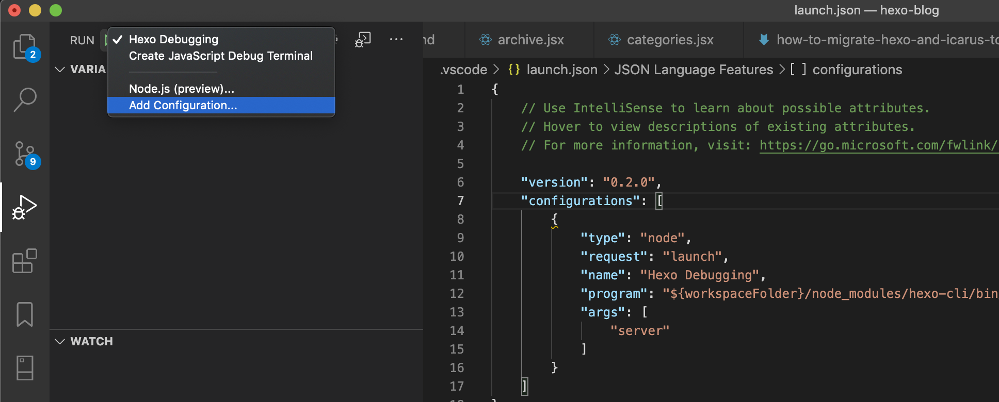

# Customizing Hexo Themes

Even after choosing a theme for Hexo, you might find parts you want to modify. Although themes often provide YAML-based configurations, if you desire more granular control, you'll need to directly edit the theme's code. When I started my self-hosted Hexo blog, the Icarus theme I selected was broadly divided into two types of code:

-   `.styl`: Contains CSS configurations based on Bulma.
-   `.jsx`: Defines how articles written in `.md` format are rendered on the page.

## Customizing .styl Files

Settings such as width, height, font size, and color are configured in the `.styl` code. Analyze the CSS settings of each element on your browser's page. If a corresponding setting exists, modify its value. If not, Bulma's default settings will be used, so you'll need to add your desired settings to override them.


## Customizing .jsx Files

The rendering of articles and widgets on the page is configured in `.jsx` code. To understand how content is rendered on the screen and whether your modified code is working correctly, debugging is essential. Since I manage my Hexo blog using VSCode, I debug Hexo within VSCode.


# Debugging Setup

VSCode debugging settings can be configured via the "Add Configuration..." option in the debug list to the right of "RUN" in the Debug view.



Selecting "Add Configuration..." will create a `.vscode` directory and a `launch.json` file within your current project directory. It will then open this file and display a list of configuration options you can add, as shown below.


From the list, select "Node.js: Launch Program" to add a configuration.


Modify it as follows:

```json:launch.json
{
    "version": "0.2.0",
    "configurations": [
        {
            "type": "node",
            "request": "launch",
            "name": "Hexo Debugging",
            "program": "${workspaceFolder}/node_modules/hexo-cli/bin/hexo",
            "args": [
                "server"
            ]
        }
    ]
}
```

Since this is for debugging `hexo server` running locally, the target program is `hexo-cli`'s `bin/hexo`, and you can see `server` in the `args`. Now you can enjoy creating your custom theme while debugging. Furthermore, you might even share your unique theme with others or contribute extended functionalities as a Git contributor to existing themes.

---

- https://gary5496.github.io/2018/03/nodejs-debugging/
- https://stackoverflow.com/questions/57125171/how-to-debug-inspect-hexo-blog

---