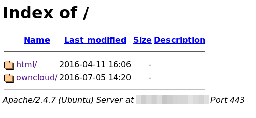
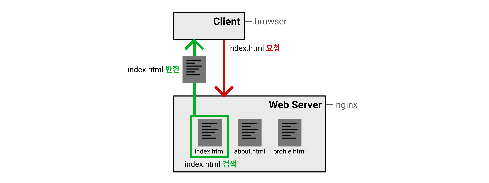
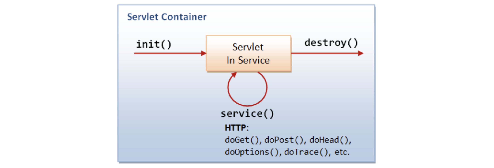
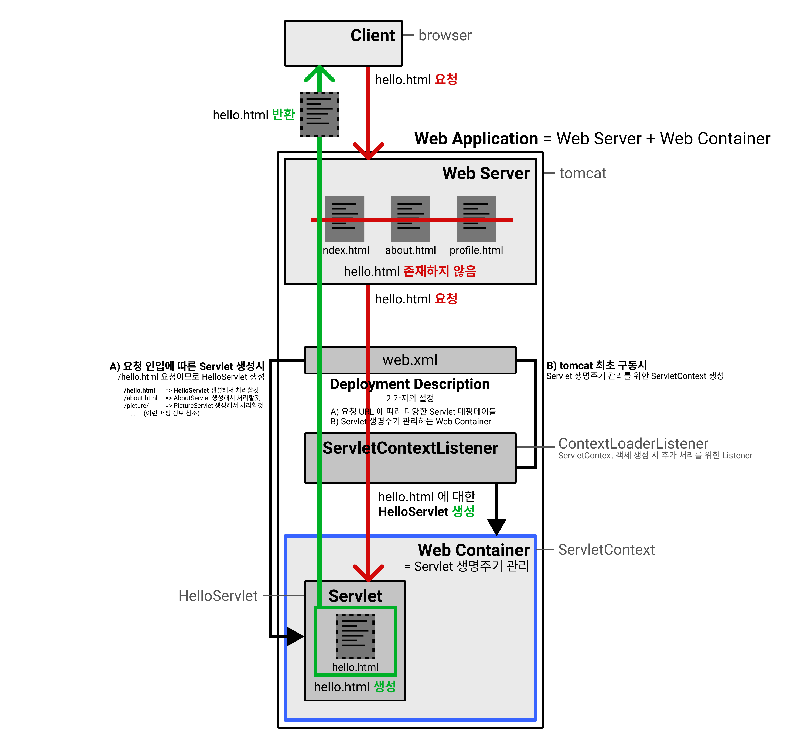
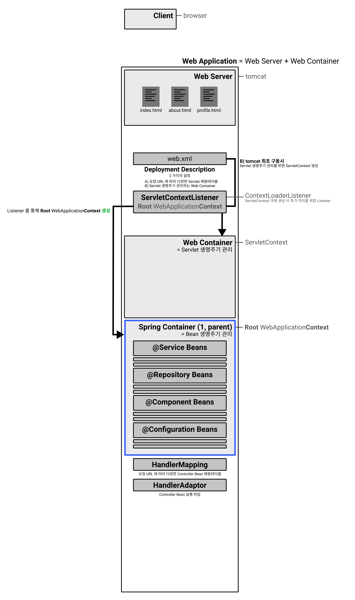
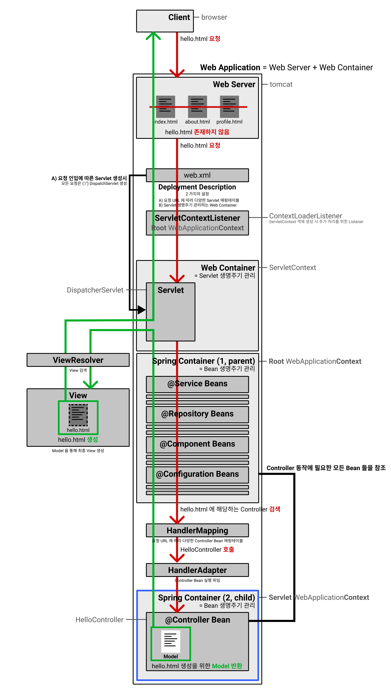
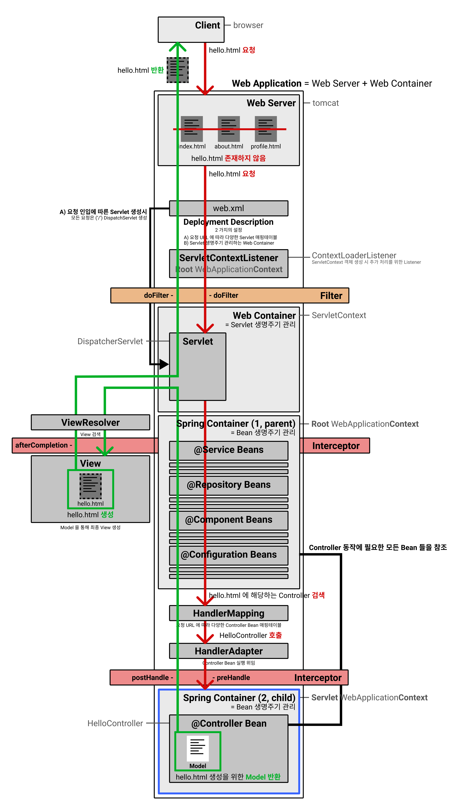
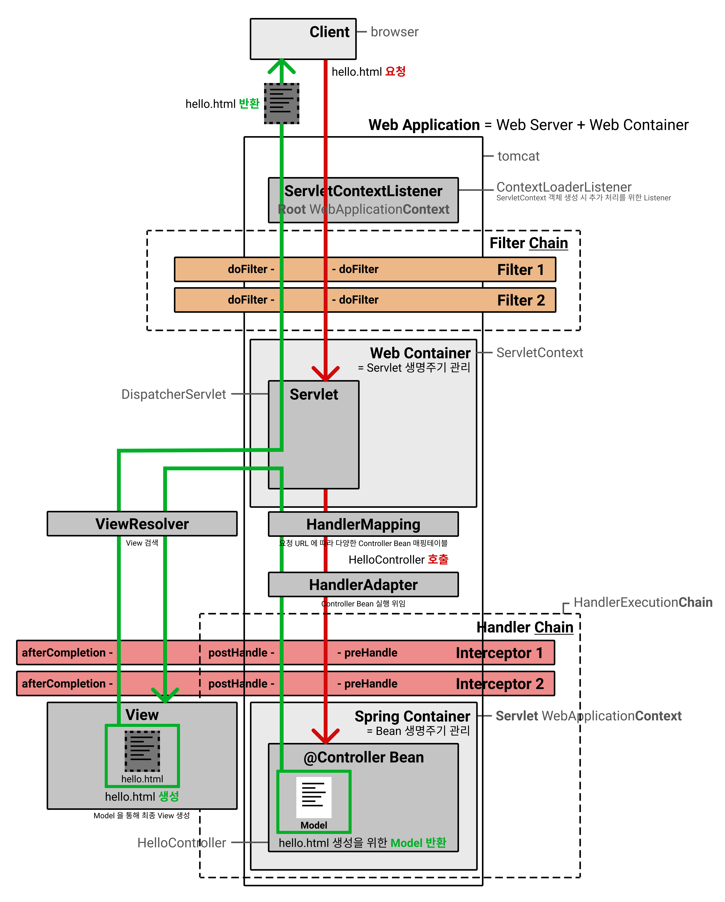
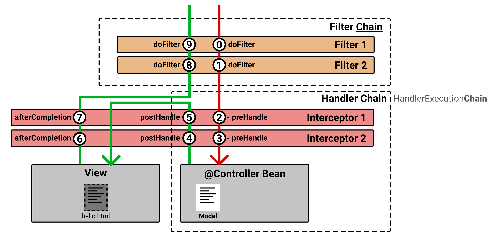

# Web Server (**Static Pages**)

> Displays **pages located on the server** to users.

In the early days of the web, static documents (HTML) were stored on a server, and when a user requested one, the file would be downloaded and displayed in their browser. For example, if you wanted to view the `hello.html` document on a specific server like `aaron.com`, you would call `aaron.com/hello.html` in your browser. Some readers might have seen pages like the one below when a university professor distributed lecture materials using their research lab's server.

This method required explicitly loading all files to be served into the actual server. If a user tried to access a file that didn't exist on the server, a `404 Not Found Error` would be returned. Servers that provide static pages to users in this manner are called **Web Servers**, and commonly encountered examples include **Apache** and **Nginx**.

## Example) Nginx Request/Processing Flow

As an example of a **Web Server**, **Nginx** processes user requests through the following steps:

*   The user requests a specific page (`index.html`) from the **Web Server**.
*   The **Web Server** searches for `index.html` and, if found, returns it to the user.

# Web Application (**Dynamic Pages**)

> It dynamically generates and displays **pages that are not pre-existing on the server** to users **for each request**.

Web servers evolved beyond simply providing one-way services that share static documents with users. They began to receive requirements for interactive, bidirectional services such as user registration, writing posts, and viewing posts written by others. Like typical applications, this necessitated database connectivity and asynchronous API calls for dynamic page rendering based on user status. The server was no longer just **returning static resources located on the server** but began to **dynamically create and return resources (pages) corresponding to the information requested by the user**.

To handle application-like requirements on the web, it became necessary to connect the **Web Server** with **programs developed in various languages** to pass user requests from the server to the program. This method of connecting web servers and programs is called **CGI (Common Gateway Interface)**, and it has been developed in various languages. In Java, the concept of a **Servlet object emerged, connecting Web Server requests/responses with Java Applications**.

Since a Servlet is created for each user request, **managing Servlet resources for multiple requests** became necessary. The component responsible for this is the **Web Container**, which is also referred to as a Servlet Container from the Servlet's perspective.

*   **Web Server**, which governs user requests/responses,
*   and adding a **Web Container** as a Servlet manager for running appropriate Java Applications based on requests,

Combining these two creates a **Web Application**.

*   **Web Application** = **Web Server** + **Web Container** (= Servlet Container)
    *   The **Web Container** manages the **lifecycle of Servlet resources** according to user requests.
    *   **Creation (init) -> Processing (service) -> Destruction (destroy)**

## Example) Tomcat Request/Processing Flow

As an example of a **Web Application**, **Tomcat** processes user requests through the following steps:

Compared to the Web Server diagram, everything added below the Web Server is related to the Web Container. Let's examine it in reverse order, from bottom to top, starting with the Web Container. The names indicated in gray are actual class/interface names.

*   **<u>ServletContext (Web Container)</u>**
    *   Web container for Servlet object lifecycle management (Context in the sense of management).
    *   This ServletContext manages the lifecycle of Servlets for all requests.
*   **<u>ServletContextListener</u>**
    *   Defines tasks to be performed when the ServletContext is first launched (Listener).
*   **<u>web.xml (Deployment Description)</u>**
    *   As the name Deployment Description suggests, it contains configurations for Servlets when the web container starts up.
        *   B) Which `ServletContextListener` interface implementation to execute.
        *   A) Mapping of 'which request' to 'which type' of Servlet object to create.
            *   E.g., Access to `/hello.html` is dynamically handled by `HelloServlet`.

Now that we understand the configuration, let's examine the web application startup procedure according to the diagram above.

### During Initial Startup

*   When the Tomcat web application first starts up, the **<u>Web Container (ServletContext)</u>** is launched first.
*   B) When ServletContext starts, the **<u>ServletContextListener</u>** configured in `web.xml` is executed simultaneously.

### During Request Processing

*   The user requests a specific page (`index.html`) from the **<u>Web Server</u>**.
*   The Web Server searches for `index.html`. Since it does not exist, it delegates the request to the **<u>Web Container (ServletContext)</u>**.
*   A) The **<u>ServletContext</u>** creates a Servlet of the type matching the `index.html` request as defined in `web.xml`.
    *   The created Servlet dynamically generates the page requested by the user, returns it to the user, and then is destroyed.

# Spring Framework

As Java Servlet-based web application development became active, the Spring Framework emerged to facilitate Java web development by applying various design patterns. While early web applications handled requests by **allocating a Servlet for each request** to dynamically render pages, Spring processes requests by **allocating Beans, which are smaller units than Servlets, for each request**. This means that instead of having multiple Servlets, Spring uses a single Servlet (which, as we'll discuss later, is the DispatcherServlet) and employs a diverse and large number of Beans in the backend to provide appropriate processing for requests.

*   The **Servlet Container** processes each URL request in units of **Servlet**.
    *   Since the unit processing requests is a **Servlet**, the **Servlet Container** manages Servlets.
*   The **Spring Container** processes each URL request in units of **Bean**.
    *   Since the unit processing requests is a **Bean**, the **Spring (Bean) Container** manages Beans.

Since **Spring is fundamentally a framework that supports development by separating roles into three groups: Model, View, and Controller using the MVC model**, even developers with no prior knowledge of design patterns can create web applications with excellent maintainability and reusability. Furthermore, because **Spring provides everything needed for a web application through Bean configurations, such as JPA for database access, transactions, and security**, any beginner can easily build a robust web application, provided they have a solid understanding. In fact, one of Spring's strengths is the ability to build applications even without a deep understanding. This translates to maximum productivity for both junior and senior developers alike.

# Spring MVC Concepts

To understand how Spring MVC operates, you only need to know about **MVC** and the **Front Controller pattern** (**2-level Controller**).

## MVC (Model, View, Controller)

1.  When a user requests a page, the **Controller receives the request** that is appropriate for it.
2.  It **retrieves/creates the Model**, which contains the information needed for the requested page.
3.  It then **generates the final page, the View**, using the retrieved/created Model, and **returns it** to the user.

## Front (2-level) Controller Pattern

In the MVC model described above, the part that receives requests is called the Controller.

*   From Tomcat's perspective, the Servlet that processes requests would be the Controller.
*   From Spring's perspective, the Bean that processes requests would be the Controller.

The meaning of a **2-level Controller** is as follows:

*   Front Controller: All user requests are first received by Tomcat's **single Servlet (DispatcherServlet)** at the very front.
*   Page Controller: Based on the request URL, it maps to a Spring Controller Bean, generates the page, and returns it.

The foremost **Tomcat single Servlet (DispatcherServlet)** is called the **Front Controller** because it's the first to receive requests. The subsequent **Spring Controller Bean** is called the **Page Controller** because it's used for actual page generation.

# Spring MVC Request/Processing Flow

## During Initial Startup

First, let's look at which objects are created and prepared when **Spring + Tomcat** first starts up. You can see that a **Spring Container** has been newly added beneath the **Web Container**.

As shown in the diagram above, connecting Spring to Tomcat requires two configurations in Tomcat's configuration file, `web.xml`.

*   web.xml (Deployment Description)
    *   B) Through the `ServletContextListener` interface implementation:
        *   1: Not only starts the **<u>ServletContext</u>** = **<u>Front Controller</u>**
            *   A) All requests are handled by a single `Servlet` object (DispatcherServlet) corresponding to the Front Controller.
        *   2: Also starts the **<u>Root WebApplicationContext</u>** simultaneously (next) = **<u>Page Controller</u>**
            *   This is for pre-creating common Spring Bean objects (@Service, @Repository, @Component...).

## During Request Processing

After initial startup, Tomcat is ready to receive all requests through a single DispatcherServlet. Spring also has various Beans prepared in the Root WebApplicationContext for Controller Beans to return results. Now, let's examine how user requests are processed. It might look a bit complex, but it's just a slight extension of what we saw in the [Initial Startup](/spring/spring-mvc-structure-and-security/#%EC%B5%9C%EC%B4%88-%EA%B5%AC%EB%8F%99%EC%8B%9C-1) section, so there's no need to be intimidated.

The keywords of Spring can be said to be IoC and DI. Simply put, while traditionally developers directly created objects using `new` and manually injected them, Spring allows developers to specify only the interface, and the **<u>ApplicationContext (= Spring Container, inheriting BeanFactory)</u>** creates objects called Beans and automatically injects them based on developer configurations. In Spring, basic Java objects are thus referred to and used as Beans.

*   Spring Container = ApplicationContext

From a web application perspective, Beans in Spring can be broadly categorized into **two types** as follows. Accordingly, the **Spring Container** that manages the lifecycle of these Beans is also divided into **two parts**.

*   **Common Beans** shared among all Beans regardless of the request, for appropriate processing when a request comes in.
    *   E.g., `@Service`, `@Repository`, `@Component`, etc., registered via `@ComponentScan`.
    *   Lifecycle management:
        *   **<u>Root WebApplicationContext</u>** (Spring Container 1 in the diagram)
*   **Beans that only need to be created when a request comes in**, similar to Servlets allocated per request.
    *   E.g., `@Controller`, `@Interceptor`, etc., registered via `@ComponentScan`.
    *   Lifecycle management:
        *   **<u>Servlet WebApplicationContext</u>** (Spring Container 2 in the diagram)

Looking at the diagram above, you can see that another Spring Container 2 has been created under Spring Container 1, which was generated during initial startup. While not critically important, the terms 'parent' and 'child' indicate a hierarchical relationship between the two containers. It simply means that Beans in the child <u>Servlet WebApplicationContext</u> can reference Beans in the parent <u>Root WebApplicationContext</u>, but not vice-versa.

---

Request processing proceeds in the following flow. Let's examine it according to the red lines (request) and green lines (response) in the diagram.

1.  The user requests a specific page (`index.html`) from the **<u>Web Server</u>**.
2.  The **Web Server** searches for `index.html`. Since it does not exist, it delegates the request to the **<u>Web Container (ServletContext)</u>**.
3.  A) The ServletContext creates a **<u>single DispatcherServlet</u>** for any request (`/`) as defined in `web.xml`.
4.  The **<u>DispatcherServlet</u>** searches for a **<u>HandlerMapping</u>** to find the appropriate Spring Controller for the page requested by the user.
5.  The DispatcherServlet invokes the found **<u>Spring Controller Bean</u>** through a **<u>HandlerAdapter</u>**.
6.  The HandlerAdapter invokes the **<u>HelloController Bean</u>**.
7.  The HelloController utilizes Beans within the **<u>Root WebApplicationContext</u>** and returns the result to the **<u>DispatcherServlet</u>**.
8.  The DispatcherServlet receives the Controller's result and generates the **<u>result page (= View)</u> (`index.html`)** via the **<u>ViewResolver</u>**.
9.  The DispatcherServlet returns the **<u>result page (= View)</u> (`index.html`)** to the user.

---

The code-level flow of the above process is well-organized in [this blog link](https://galid1.tistory.com/526), which can be a good reference.

Thus, we have visually explored how Spring MVC receives, processes, and returns user requests. Having delved into such detail, you should now better understand the meaning of numerous methods and classes (e.g., `invoke`, `DispatcherServlet`, `preHandle`, `postHandle`) found in Spring log stack traces when exceptions occur in controllers or services.

Although this has been a long post, I'd like to delve a bit deeper: into Interceptors and Filters. The simple difference between them is whether they are managed by Servlet or by Spring. Understanding their order and timing of invocation will be greatly beneficial when learning/applying Spring Security later on. Of course, if you've found it challenging to get this far, I hope you'll come back and read this section later.

# Differences Between Spring Interceptor and Filter

Regardless of whether it's Spring, any web application that provides services open to some users absolutely requires security. Spring Security not only offers modules and configurations related to login and sessions for easy use, but it also allows developers to add desired security elements—such as applying custom authentication modules or implementing different security processing based on the request URL—to be executed before the actual request is delivered to the Spring Controller. This is where **Interceptor** and **Filter** come into play.

Earlier, we learned that a web application using Spring is largely composed of two parts: **Tomcat (Web Container)** and **Spring (Spring Container)**. You can understand that **Interceptors** and **Filters** are distinguished by their management entity and execution time, corresponding to these two components: **Tomcat** and **Spring**.

> It's perfectly fine as Filters are part of Servlet specification. Filters are called by your Server (Tomcat), while Interceptors are called by Spring[^2](https://stackoverflow.com/questions/26908910/spring-mvc-execution-order-filter-and-interceptor)

*   **Filters are part of the Servlet specification and are called by your Server (Tomcat).**
*   **Interceptors are called by Spring.**

Below is a diagram illustrating the management entity and execution time of Interceptor and Filter for easy understanding.

## Filter (Tomcat)

*   Defined in the Servlet (J2EE 7 standard) specification.
    *   **Configured in the web application's (Tomcat) Deployment Descriptor (web.xml)**.
        *   This can also be configured in modern Spring.
*   Called **before/after DispatcherServlet** with **one** function.
    *   `doFilter()`
        *   Called **just before** the request enters `DispatcherServlet.service()` (after `init()`).
        *   Called **just after** `DispatcherServlet.service()` returns the result (before `destroy()`).

Since the `doFilter` function is called **twice—once upon request entry and once upon result return**—it is **suitable for global logic that needs to be processed both before the request and after the return, such as encryption/decryption**.

## Interceptor (Spring)

*   Defined in the Spring Framework specification.
    *   **Configured in the Spring WebApplicationContext**.
*   Called **before/after Controller** with **three** functions.
    *   `preHandle()` = Called **just before** the request enters the Controller.
    *   `postHandle()` = Called **just after** the Controller returns the result.
    *   `afterCompletion()` = Called **just after** the View is generated based on the Controller's result.

It is **suitable for logic that needs detailed processing at the point of Controller entry or result return**. For example, for requests entering a specific URL, URL-specific information can be pre-configured in the session just before Controller entry, allowing it to be used within the Controller's internal logic. Conditions could also be added to prevent this logic from executing for other URLs.

---

It is important to note that because Filters and Interceptors have different management entities, the following situation can occur:

Since a Filter is not managed by the Spring Container, if you need to use Spring Beans within a Filter's logic, you cannot use `@Autowired` for dependency injection. Instead, you must first obtain the Spring `WebApplicationContext` object and then directly retrieve and use the configured Beans within it through hardcoding.

## Invocation Order of Multiple Interceptors and Filters

You can specify and use multiple Filters and Interceptors depending on the situation. When using multiple Filters or Interceptors, you can configure the invocation order for each group (Filters among themselves, Interceptors among themselves), but it is not possible to mix them in a pattern like Filter - Interceptor - Filter - Interceptor.

To understand the operational sequence when using **two Filters** and **two Interceptors**, let's focus on DispatcherServlet and HandlerAdapter, as shown below.

Briefly summarized, it follows the diagram/flow below.

1.  `doFilter` (F1)
2.  `doFilter` (F2)
3.  `preHandler` (I1)
4.  `preHandler` (I2)
5.  **<u>Controller Request Processing</u>**
6.  `postHandler` (I2)
7.  `postHandler` (I1)
8.  **<u>View Rendering</u>**
9.  `afterCompletion` (I2)
10. `afterCompletion` (I1)
11. `doFilter` (F2)
12. `doFilter` (F1)

We have explored the Web Server, Web Application, and then CGI as an example to connect the Web Server and Web Application, followed by Servlet and Container. Then, we delved into the Spring Container, the differences between Filter and Interceptor, and their execution order. I hope this article is helpful to other developers studying or using Spring. The referenced articles are also excellent, so I recommend taking a look at them if you have time.

---

1.  [Spring Working Principles #1](https://asfirstalways.tistory.com/334), [#2](https://devpad.tistory.com/24), [#3](https://taes-k.github.io/2020/02/16/servlet-container-spring-container/)
2.  [How Tomcat Calls Spring](http://www.deroneriksson.com/tutorial-categories/java/spring/introduction-to-the-spring-framework)
3.  [Java Servlet](https://mangkyu.tistory.com/14)
4.  [Differences Between Web Server and Web Application](https://gmlwjd9405.github.io/2018/10/27/webserver-vs-was.html)
5.  [Spring DispatcherServlet Working Principles #1](https://jess-m.tistory.com/15), [#2](https://dynaticy.tistory.com/entry/Spring-MVC-Dispatcher-Servlet-%EB%82%B4%EB%B6%80-%EC%B2%98%EB%A6%AC-%EA%B3%BC%EC%A0%95-%EB%B6%84%EC%84%9D)
6.  [Spring web.xml Explanation #1](https://sphere-sryn.tistory.com/entry/%EC%8A%A4%ED%94%84%EB%A7%81%ED%94%84%EB%A0%88%EC%9E%84%EC%9B%8C%ED%81%AC-%ED%94%84%EB%A1%9C%EC%A0%9D%ED%8A%B8%EC%9D%98-%EA%B0%80%EC%9E%A5-%EA%B8%B0%EB%B3%B8%EC%84%A4%EC%A0%95-%EB%B6%80%EB%B6%84%EC%9D%B8-webxml%EC%97%90-%EB%8C%80%ED%95%98%EC%97%AC-%EC%95%8C%EC%95%84%EB%B3%B4%EC%9E%90), [#2](https://gmlwjd9405.github.io/2018/10/29/web-application-structure.html)
7.  [Spring's Two Types of ApplicationContext](https://jaehun2841.github.io/2018/10/21/2018-10-21-spring-context/#web-application-context)
8.  [Servlet Container & Spring Container](https://velog.io/@16616516/%EC%84%9C%EB%B8%94%EB%A6%BF-%EC%BB%A8%ED%85%8C%EC%9D%B4%EB%84%88%EC%99%80-%EC%8A%A4%ED%94%84%EB%A7%81-%EC%BB%A8%ED%85%8C%EC%9D%B4%EB%84%88)
9.  [Spring MVC Code-Based Working Principles](https://galid1.tistory.com/526)