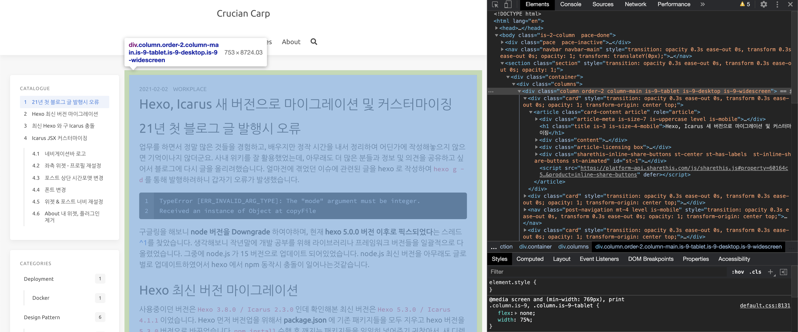
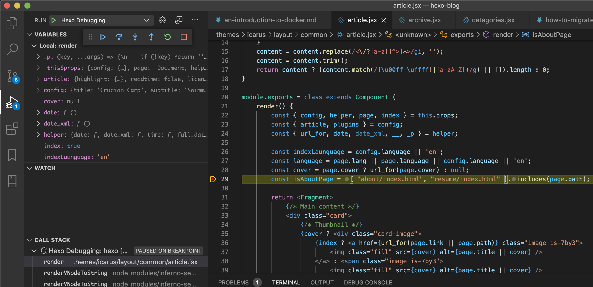
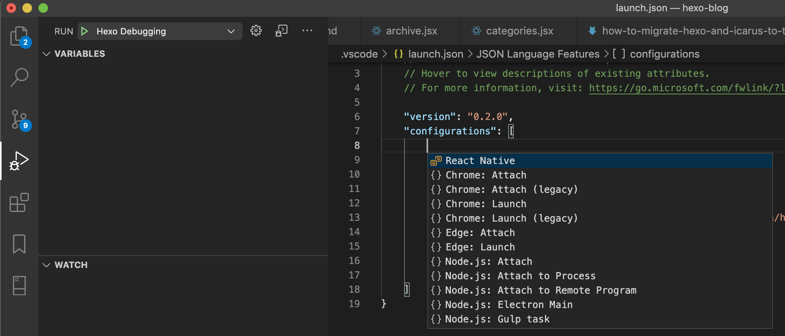
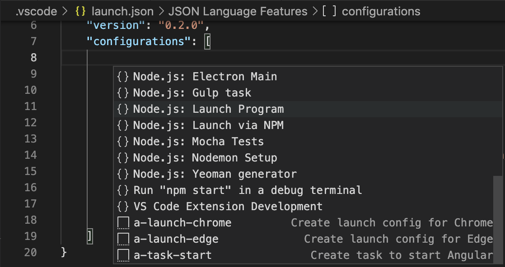

# Hexo 테마 커스터마이징

hexo 에서 원하는 테마를 선택하더라도 수정하고 싶은 부분들이 있을 수 있습니다. 아무리 테마에서 yaml 기반의 config 를 제공한다고 하더라도, 더 세밀한 부분까지 원하는대로 바꾸고싶다면 테마 코드를 직접 수정해야합니다. Hexo 설치형 블로그를 시작하면서 제가 선택했던 Icarus 테마는 크게 두가지 타입의 코드로 나뉘어져있습니다.

- `.styl` : bulma 를 기반으로한 CSS 설정들이 있습니다.
- `.jsx` : .md 로 작성한 글들을 페이지에 어떻게 렌더링할지 정의되어있습니다.

## `.styl` 커스터마이징

너비, 높이, 폰트사이즈, 색깔등의 설정은 `.styl` 코드에서 설정하면 되며, 브라우저에서 페이지 각 요소의 CSS 설정들을 분석하여 그에 해당하는 설정이 있다면 값을 수정하고, 없다면 bulma 의 설정을 그대로 사용하는것이므로 오버라이딩을 위해 원하는 설정을 추가해줍니다.



## `.jsx` 커스터마이징

글이나 위젯을 페이지에 렌더링 하는 부분은 `.jsx` 코드에서 설정하면됩니다. 화면에 어떻게 렌더링되는지, 내가 수정한 코드가 제대로 동작하는지 알기위해 디버깅을 필요로합니다. hexo 블로그 운영은 VSCode 를 통해 하고있어서 VSCode 에서 hexo 를 디버깅하고 있습니다.



# 디버깅 설정

VSCode 의 디버깅 설정은 디버깅 창에서 RUN 우측 디버깅 리스트에서 `Add Configuration...` 통해 가능합니다.


`Add Configuration...` 선택하게되면 현재 프로젝트 디렉토리에서 `.vscode` 라는 디렉토리 한개와 그 안에 `launch.json` 파일 하나를 생성하고, 해당 파일로 이동하여 어떤 설정을 추가할지 아래와 같이 리스트를 보여줍니다.



리스트에서 `Node.js: Launch Program` 을 선택하면 설정이 한개 추가되는데,



아래와 같이 수정 입력하면 됩니다.

```json:launch.json
{
    "version": "0.2.0",
    "configurations": [
        {
            "type": "node",
            "request": "launch",
            "name": "Hexo Debugging",
            "program": "${workspaceFolder}/node_modules/hexo-cli/bin/hexo",
            "args": [
                "server"
            ]
        }
    ]
}
```

로컬에 살행한 `hexo server` 에 대한 디버깅이기 때문에 타켓 프로그램은 `hexo-cli` 의 `bin/hexo` 이며, `args` 에 `server` 가 들어가는것을 보실 수 있습니다. 이제 디버깅을 하면서 즐겁게 나만의 커스텀 테마를 만드시면 됩니다. 더 나아가서 그렇게 만든 나만의 테마를 사람들과 공유할수도, 이미 있는 테마에 git contributor 로 확장된 기능을 추가할수도 있을것입니다.

---

- https://gary5496.github.io/2018/03/nodejs-debugging/
- https://stackoverflow.com/questions/57125171/how-to-debug-inspect-hexo-blog

---
