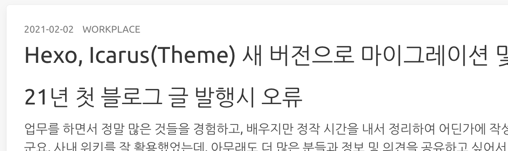
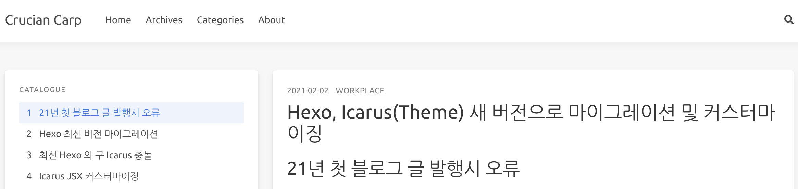
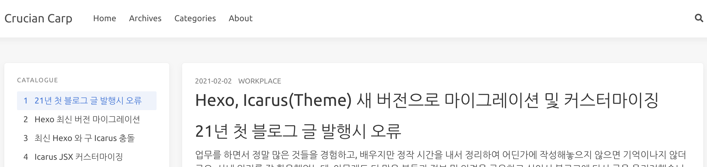
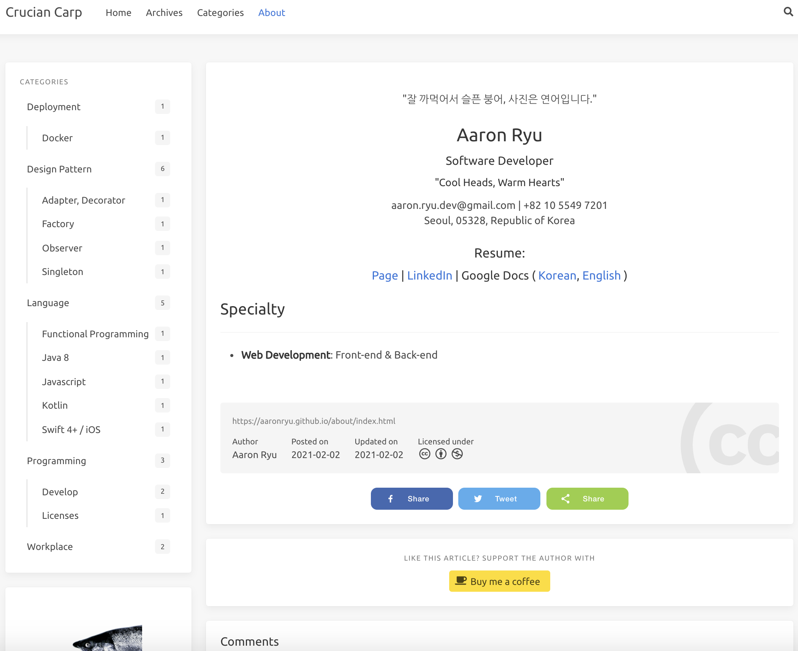
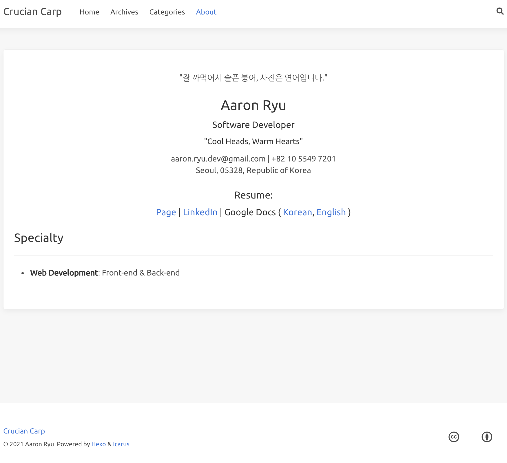

# 21년 첫 블로그 글 발행시 오류

업무를 하면서 정말 많은 것들을 경험하고, 배우지만 정작 시간을 내서 정리하여 어딘가에 작성해놓으지 않으면 기억이나지 않더군요. 사내 위키를 잘 활용했었는데, 아무래도 더 많은 분들과 정보 및 의견을 공유하고 싶어서 블로그에 다시 글을 올리려했습니다. 얼마전에 겪었던 이슈에 관련된 글을 hexo 로 작성하여 `hexo g -d` 를 통해 발행하려하니 갑자기 오류가 발생했습니다.

```bash
TypeError [ERR_INVALID_ARG_TYPE]: The "mode" argument must be integer.
Received an instance of Object at copyFile
```

구글링을 해보니 [node 버전을 Downgrade 하여야하며, 현재 hexo 5.0.0 버전 이후로 픽스되었다는 스레드](https://github.com/hexojs/hexo/issues/4263)를 찾았습니다. 생각해보니 작년말에 개발 공부를 위해 라이브러리나 프레임워크 버전들을 일괄적으로 다 올렸었습니다. 그중에 node.js 가 15 버전으로 업데이트 되어있었습니다. node.js 최신 버전을 아무래도 글로벌로 업데이트하였어서 hexo 에서 npm 동작시 충돌이 일어나는것같습니다.

# Hexo 최신 버전 마이그레이션

사용중이던 버전은 **Hexo 3.8.0** / **Icarus 2.3.0** 인데 확인해본 최신 버전은 **Hexo 5.3.0** / **Icarus 4.1.1** 이었습니다. Hexo 먼저 버전업을 위해서 package.json 에 기존 패키지들을 모두 지우고 hexo 버전을 5.3.0 버전으로 바꾸었습니다. `npm install` 수행 후 깨지는 패키지들을 일일히 넣어주기 귀찮아서, 새 디렉토리에서 `hexo init` 하여 자동 생성된 package.json 을 참조했습니다.


# 최신 Hexo 와 구 Icarus 충돌

hexo 버전 업데이트 후 hexo server 로 로컬에 페이지를 띄워보니 icarus 테마 파일에서 계속해서 특정 변수를 찾을 수 없음 등의 오류가 발생하였습니다. 구글링하니 이 또한 버전문제로 파악되어 기존의 icarus 테마의 커스터마이징 설정 _config.yml 만을 백업한 채 모두 지우고 icarus 를 최신버전으로 (1) npm install 이 아닌 (2) git submodule 을 통해 (커스터마이징을 위해) 설치하였습니다. 다시 실행하니 jsx 코드만 덩그러니 노출되는 문제가 발생하였는데 jsx 라서 react.js 인줄알았더니 inferno.js 로 개발되어있어서 해당 라이브러리를 설치하여 해결하었습니다.

# Icarus JSX 커스터마이징

어떤 테마든 수정을 해야하는 깐깐한 성격탓에 예전 icarus 테마는 ejs 코드를 분석해서 커스터마이징을 따로 하였었습니다. **예전엔 ejs-based 였던 icarus 가 이젠 jsx-based 로 되어서, 이전 커스터마이징 코드를 그대로 사용할 순 없고, 또 다시 분석해서 수정해야했습니다.** 프론트 개발을 쭉 react.js 로 해왔었고 icarus 개발 프레임워크인 inferno.js 도 react-like 를 표방하는만큼 디버깅만 할 줄 알면 크게 어렵진 않을것같았고, 실제로도 그랬습니다. 다만, icarus 프로젝트가 jsx 로 변환되면서 과거에 난잡했던 ejs 구조에서 컴포넌트 단위로 모듈화가 잘되어졌기 때문에 **페이지마다 렌더링을 다르게해야하는 부분은 공통 컴포넌트에 예외 조건을 넣는 방식으로 처리해야했습니다.** 아래 커스터마이징한 코드들을 보시면 이해가 되실겁니다.

# VSCode 를 통한 Hexo 디버깅

테마를 수정하기 위해서는 가장 먼저 hexo, icarus jsx 들이 페이지로 어떻게 렌더링 되는지 알아야합니다. 로컬에서 hexo 테스트를 위해 실행하는 `hexo server` 명령어는 hexo-cli 에 정의되어있는 npm 스크립트를 실행한것입니다. 테마 설정을 바꾸거나 글을 수정하면 바로 로컬 페이지에 적용이되는데 이는 npm 를 통해 동적으로 렌더링하고 있기 때문입니다. 저는 icarus 테마가 어떻게 동작하는지 이해하고, 수정한 제 코드가 제대로 동작하는지 확인하기 위해 VSCode 를 통해 디버그를 진행하였습니다. **VSCode 에서 디버깅하는 방법은 본 블로그에 발행해놓은 "VSCode 에서 Hexo 디버깅 하는 방법" 글에서 잘 설명해놓았으니 참고하시면 됩니다.**

## 네비게이션바 로고

제일 상단의 네비게이션바에 기본적으로는 로고 이미지를 올리도록 설정되어있지만, 해당 블로그를 표현할 수 있는 단어로 치환 및 폰트 사이즈를 설정하였습니다.


```yml:_config.icarus.yml
# Path or URL to the website's logo
logo:
    text: Crucian Carp
```

```yml:include/style/navbar.styl
.navbar-logo
    img
        max-height: $logo-height
    font-size: 1.4rem
```

## 좌측 위젯 - 프로필 재설정

본 블로그에서는 웹 검색에 이점을 버리더라도 글의 구성을 제일 심플하게 하고싶었기 때문에 Tag 를 모두 사용하지 않습니다. 좌측 위젯에 프로필에서 Post 개수와 Category 개수만 보여주도록 Tag 개수는 표기하지 않도록 코드를 삭제하였습니다.


```jsx:layout/widget/profile.jsx (아래 코드 모두 삭제)
<div class="level-item has-text-centered is-marginless">
    <div>
        <p class="heading">{counter.tag.title}</p>
        <a href={counter.tag.url}>
            <p class="title">{counter.tag.count}</p>
        </a>
    </div>
</div>
```

```jsx:layout/widget/profile.jsx (아래 코드 모두 삭제)
tag: {
    count: tagCount,
    title: _p('common.tag', tagCount),
    url: url_for('/tags')
}
```

## 포스트 상단 시간포맷 변경

icarus 테마는 기본적으로 포스트 상단에 글 최초 작성 이후 얼마나 지났는지, 업데이트 후 얼마나 지났는지 표기해주는데, 개인적으로는 과거 네이버같은 WYSIWYG 블로그에서 표기해주는 포스트 최초 작성일을 날짜 형태로 보는것을 선호해서 이 또한 바꿔주었습니다.



```jsx:layout/common/article.jsx (time 을 div 로 변경 및 Update Date 삭제)
<div class="level-left">
    {/* Creation Date */}
    {page.date && <span class="level-item" dangerouslySetInnerHTML={{
        __html: _p(`<div>${date(page.date)}</div>`)
    }}></span>}
    {/* author */}
    {page.author ? <span class="level-item"> {page.author} </span> : null}
```

## 폰트 변경

폰트는 hexo 블로그 처음 시작할때 글들을 모두 한글로 작성할것이라 자간 간격이 아주 조금은 벌어져있는것이 가독성이 좋다고 판단하여 hexo 사용 처음부터 사용해왔던 나눔고딕 폰트를 계속 사용하기로 했습니다.

```:include/style/base.styl ('Nanum Gothic' 폰트 추가 및 기존 미사용 폰트 삭제)
$family-sans-serif ?= 'Ubuntu', 'Nanum Gothic', sans-serif
$family-code ?= 'Source Code Pro', monospace, 'Microsoft YaHei'
```

## 위젯 & 포스트 너비 재설정

icarus 에서 제공하는 위젯은 (1) 우측, (2) 좌측이 있는데 이 둘을 모두 사용하면 중간에 포스트 너비가 짧아져 가독성을 떨어트릴수있다고 판단했습니다. 좌측 위젯만 사용했음에도 위젯 너비가 포스트 너비에 비해 길다고 생각하여 조율해주었습니다.

- 4(좌측 위젯) + 8(글) = 12



- 3(좌측 위젯) + 9(글) = 12



**icarus 의 너비 분배는 bulma css 12 셀 규칙을 사용**합니다. 기존엔 아래와 같았습니다.

- **4(좌측 위젯)** + 8(글) = 12
- 8(글) + **4(우측 위젯)** = 12
- **3(좌측 위젯)** + 6(글) + **3(우측 위젯)** = 12

여기서 본 블로그는 위젯을 포스트의 가독성을 위해 좌측 하나만 사용할것이기 때문에

- **3(좌측 위젯)** + 9(글) = 12
- 9(글) + **3(우측 위젯)** = 12

포스트의 너비는 8에서 9으로 위젯은 4에서 3으로 재정의하였습니다.

```jsx:layout/common/widgets.jsx (위젯 하나의 너비 4 -> 3)
function getColumnSizeClass(columnCount) {
    switch (columnCount) {
        case 2:
            return 'is-3-tablet is-3-desktop is-3-widescreen';
        case 3:
            return 'is-3-tablet is-3-desktop is-2-widescreen';
    }
    return '';
}
```

```jsx:layout/layout.js (포스트 너비 8 -> 9)
<div class="columns">
    <div class={classname({
        column: true,
        'order-2': true,
        'column-main': true,
        'is-12': columnCount === 1,
        'is-9-tablet is-9-desktop is-9-widescreen': columnCount === 2,
        'is-9-tablet is-9-desktop is-8-widescreen': columnCount === 3
    })} dangerouslySetInnerHTML={{ __html: body }}></div>
    <Widgets site={site} config={config} helper={helper} page={page} position={'left'} />
    <Widgets site={site} config={config} helper={helper} page={page} position={'right'} />
</div>
```

## About 내 위젯, 플러그인 제거

상단 네비게이션바에서 About 을 클릭하시면 저에 대한 개략적인 정보를 아실수있습니다. 또한 개인 Resume 페이지를 따로 만들어서 굳이 Google docs 나 Linkedin 으로 접속하지 않아도 저의 이력을 한눈에 볼 수 있도록 Resume 페이지도 따로 마련해두었습니다.

구 icarus 의 ejs 시절에는 About, Resume 페이지 모두 각각 따로 ejs 페이지가 있었기때문에 해당 페이지만 수정하면 되었었지만, 새 icarus 의 jsx 에서는 포스트에 대한 컴포넌트가 about, resume 등 모든 페이지의 기본 컴포넌트로 사용되고있었습니다. 정적 리스트를 만들어서 특정 페이지에 대해서만 위젯과 플러그인을 표시하지 않도록 필터링 하는 로직을 넣었습니다.

- 위젯도 위젯이지만 **buy me a coffee** 가 킬링포인트입니다.



- About 페이지는 저를 표현하는것만으로 충분합니다.



```jsx:layout/layout.jsx (About, Resume 여부 조건)
const isAboutPage = [ "about/index.html", "resume/index.html" ].includes(page.path);
```

```jsx:layout/layout.jsx (좌측, 우측 위젯에 About, Resume 여부 조건 추가)
<Head site={site} config={config} helper={helper} page={page} />
<body class={`is-${columnCount}-column`}>
    <Navbar config={config} helper={helper} page={page} />
    <section class="section">
        <div class="container">
            <div class="columns">
                <div class={classname({
                    column: true,
                    'order-2': true,
                    'column-main': true,
                    'is-12': columnCount === 1,
                    'is-9-tablet is-9-desktop is-9-widescreen': columnCount === 2,
                    'is-9-tablet is-9-desktop is-8-widescreen': columnCount === 3
                })} dangerouslySetInnerHTML={{ __html: body }}></div>
                {!isAboutPage && <Widgets site={site} config={config} helper={helper} page={page} position={'left'} />}
                {!isAboutPage && <Widgets site={site} config={config} helper={helper} page={page} position={'right'} />}
```

```jsx:layout/common/article.jsx (About, Resume 여부 조건)
const isAboutPage = [ "about/index.html", "resume/index.html" ].includes(page.path);
```

```jsx:layout/common/article.jsx (포스트 하단 모든 플러그인에 About, Resume 여부 조건 추가)
{/* Licensing block */}
{!isAboutPage && !index && article && article.licenses && Object.keys(article.licenses)
    ? <ArticleLicensing.Cacheable page={page} config={config} helper={helper} /> : null}

{/* Tags */}
{!isAboutPage && !index && page.tags && page.tags.length ? <div class="article-tags is-size-7 mb-4">
    <span class="mr-2">#</span>
    {page.tags.map(tag => {
        return <a class="link-muted mr-2" rel="tag" href={url_for(tag.path)}>{tag.name}</a>;
    })}
</div> : null}

{/* "Read more" button */}
{!isAboutPage && index && page.excerpt ? <a class="article-more button is-small is-size-7" href={`${url_for(page.link || page.path)}#more`}>{__('article.more')}</a> : null}

{/* Share button */}
{!isAboutPage && !index ? <Share config={config} page={page} helper={helper} /> : null}

{/* Donate button */}
{!isAboutPage && !index ? <Donates config={config} helper={helper} /> : null}

{/* Post navigation */}
{!isAboutPage && !index && (page.prev || page.next) ? <nav class="post-navigation mt-4 level is-mobile">

{/* Comment */}
{!isAboutPage && !index ? <Comment config={config} page={page} helper={helper} /> : null}
```

<del>지금 보고 계신 이 블로그와 본 포스트는</del> 현재 버전의 TPO. 블로그 직전에 2021년에 만들었던 블로그와 포스트는 위 요소들을 모두 커스터마이징한 Icarus 테마로 구성된것입니다. 몇년전에 hexo 나 icarus 를 적용하셨었고, 마이그레이션을 앞두고 계시거나 커스텀하게 수정하는걸 원하시는 분께 본 글이 도움이 되셨으면 좋겠습니다. 이후로 CSS, JSX 에 자잘한 수정이 있을순 있으나 따로 다 업데이트하진 않으려합니다.

---