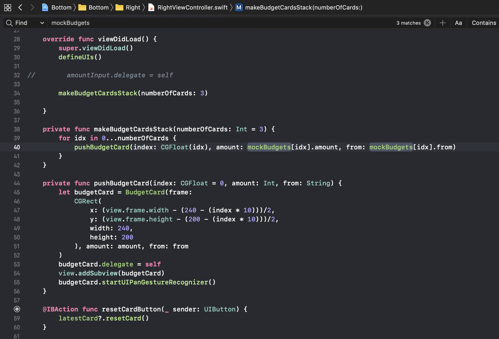

iOS 는 어떻게 보면 웹 어플리케이션 개발과 거의 유사하다고 생각됩니다. 다만 .NET WebForm 처럼 View 와 Controller 가 강결합 되어있어서, React.js 렌더링(프론트) 로직과 View 데이터를 전달해주는 Controller 를 따로 생각할 수 없습니다. 처음 스위프트 앱을 만들때 앱도 결국 웹 페이지와 거의 유사한 모델이기 때문에 웹 어플리케이션 개발 방식 그대로 개발하려했습니다. MVC 와 MVVM 에 대한 작은 경험을 그대로 적용해보았습니다.

# MVC / MVVM

기존 웹 어플리케이션을 만들때 서버에서는 Controller, Application, Service, Repository 순으로 분류하여 작업했습니다. HTML, Javascript 는 View 에, JPA 같은 데이터 레벨은 Model 에, Model 을 활용한 모든 비지니스 로직과 View 와 POST/GET 통신으로 이벤트를 주고받는 중간 레이어는 Controller 에 해당합니다. 웹 어플리케이션에서 MVC 의 Controller 는 사실상 View Model 에 해당합니다. View 를 그려주는것이 아니라 View 를 그릴 수 있는 View Model 을 전달해주고 이를 처리하는건 클라이언트 엔진위인 Single Page 니까요. 이름만 들어도 알만한 프론트엔드 프레임워크인 .js 류들이 이런 패턴을 사용합니다.

## iOS 앱 개발 시 Massive Controller 문제

MVVM 패턴을 그대로 적용하려니 iOS 에서 에러가 발생합니다. **문제의 핵심은 View.storyboard 와 ViewController.swift 가 사실상 하나의 View 라는것**입니다. 일반적으로 프론트엔드와 백엔드의 코드 베이스가 JS, Java 등으로 나뉘는것과 달리 iOS Swift 는 View 를 모두 .swift 에서 처리합니다. ViewController.swift 가 Controller 라는 이름을 갖고있지만 사실상 View 에 해당하고 View.storyboard 는 CSS/HTML 및 Router 가 포함된 개념으로 볼 수 있습니다.

스위프트는 본질적으론 MVC 패턴입니다. 다만 언어의 특성상 웹 어플리케이션의 MVC 와는 조금 구별해야하는것 처럼 보입니다. **스위프트에서는 Controller 가 사실상 View 에 해당하는것이기 때문에 렌더에 해당하는 로직을 Controller 가 갖습니다.** Service, Repository 모듈화를 잘한다해도 Controller 에는 View 렌더 로직뿐만 아니라, View 렌더에 필요한 데이터 조작에 대한 ‘일부’ 비지니스 로직도 포함하게 됩니다. **이 문제를 Massive Controller 라고 칭합니다.**

# 첫 개발 시 사용한 MVC 패턴

MVC 를 그대로 적용해본 제 첫 Swift 코드는 아래와 같았습니다. Bar 같은 여러 Asset 에 그려줄 데이터(Model)들을 받아와서 통계 데이터를 만들고(비지니스 로직) 그걸 View 에 주입해서 그려주었죠(View). 물론 보시는것과 같이 간단한 **UIView 임에도 View 를 그리는 로직뿐만 아니라 View Model 에 대한 로직을 보실 수 있습니다.**

# 리팩토링 시 사용한 MVVM 패턴

Controller 가 커지면 무의식적으로 불안감이 발생합니다. 코드를 작성하면서 이건 정말 아닌것같은 느낌을 많이 받아서 리팩토링을 진행했습니다. **사실상 View 의 의미를 갖는 Controller 아래에 진정한 의미의(…) Controller인 View Model 을 두는 것입니다.** 모양, 색깔, 크기에 해당하는건 ViewController 에 두고 이에 필요한 ViewModel 은 ViewModelController 가 제공하는것입니다. 아래 예를 보면 ViewController 에서 ViewModel 인 mockBudgets 만을 잘 사용하고 있습니다. View(Controller)와 ViewModel(Controller) 바인딩 시 Rx 를 사용한다고 하는데 아직 이것까진 적용해보지 못했습니다.

# 최근 개발에 사용중인 VIPER 패턴

그러다 개인 프로젝트이기에 시간 날때마다 작업을 하니 제가 짠 코드도 몇일 몇주가 지나서 보면 너무 새로운 겁니다. 매번 개발을 진행할때, 더 진척이 생길때마다 코드를 다시 읽고 이해하는 시간이 길어졌고, 이건 코드들이 각 구체적이고 명확한 역할을 가지지도 않는다는걸로 이해됐습니다. 물론 Service, Repository 레벨의 코드들은 정리가 잘되어있어서 문제가 없었지만 View 는 아무리 적응하려해도 힘들더군요. 심지어 저는 Swift 를 처음 공부하면서 첫 어플리케이션을 만들고 있는것이니까요.

## VIPER 패턴

**VIPER 는 사실 View Model 의 이중화**라고 보면 됩니다. **기존 비지니스 로직을 View 와 연관된 비지니스 로직, Model 데이터 레벨에 가까운 비지니스 로직 및 로깅, 네트워크 인스턴스 관리 이렇게 둘로 세분화한것**으로 이해하면 쉽습니다. 전자를 **Presentator** 후자를 **Interactor** 라고 부릅니다. 그렇게 3개에서 4개의 컴포넌트가 되었습니다. 거기에 ViewController 간 화면 전환과 같은 segue 처리를 맡는 Router 가 추가되어 총 5개가 됩니다.

제 기존 코드에서 Model 은 이미 잘 정리되어있었기 때문에 이 부분은 Entity 와 Interactor 로 이미 분리되어 있었습니다. ViewModel 에도 최대한 Model 에 대한 로직은 넣지 않았으니까요. **기존 ViewController 에 몰려있던 View 에 대한 관련 비지니스 로직들을 Presentator 로 이관**을 해보니 기존 View 에 View Model 로직들이 너무 많았었구나 싶었습니다. 또한 화면 전환(segue) 처리도 기존 ViewController 가 갖고있었는데 사실 이건 메타적으로 생각해보면 ViewController 간 이동을 조율하는것이므로 상위 레벨의 컴포넌트가 관리하는게 맞았습니다. segue 이동에 대해 매 ViewController 마다 중복해 갖는 보일러플레이트 코드들을 어떻게 중앙처리할까 했더니 VIPER 의 Router 를 사용하면 되는것이었습니다.

이렇게 적용을 해보았는데 컴포넌트가 5개이다 보니 기반 코드가 너무 많습니다. 귀찮았지만 앞으로의 생산성을 위해 적용해봤는데요. 효과는 아직 모르겠습니다. ReSwift(Redux on Swift) 개념도 있는듯한데 React.js 를 짧게 사용해보면서 컴포넌트들이 해봐야 고작 1, 2 레이어여서 굳이 Redux 를 적용할 필요가 없었기 때문에 배워보지 못했습니다. 이건 추후에 적용해보는걸로 해야겠습니다. 아무래도 새로운 아키텍쳐 패턴이나 요즘 핫하다는걸 적용해보면 좋겠지만 아무리 개인 개발이라도 빨리 배포를 하는게 더 중요하겠지요.

---