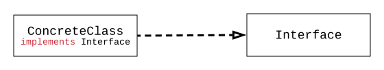
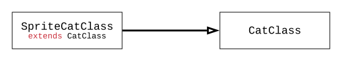
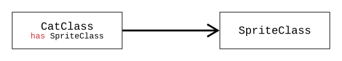
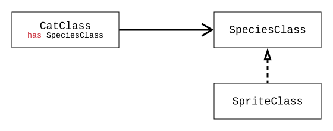
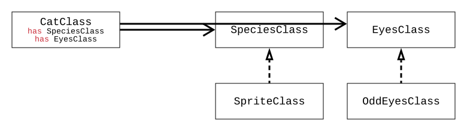

# デザインパターン

デザインパターンとは、簡潔に言えば**『オブジェクト指向パラダイムにおいて、より良いコードとは何かについての考察の結果』**です。この概念は、Gang of Fourという4人のプログラマーが書いた[Design Patterns](https://en.wikipedia.org/wiki/Design_Patterns)という本を通じて世に出ました。これは、オブジェクト指向プログラミングに限らず、どの言語でも通用する開発方式を含んでいます。

様々なパターンを探る前に、すべてのパターンに共通する原則であり、パターンが生まれるきっかけとなった3つの原則を見てみましょう。

-   **重複の最小化**: ある箇所の修正が、重複した他のコードの修正を伴うべきではありません。
-   **コード変更の容易性**: コードは常に完璧ではなく、要求事項は常に変わりえます。
-   **再利用性**: 整頓されたコードは、全く異なる要求事項や似たような場合にもそのまま使用できる必要があります。

## デザインパターン 3つのカテゴリ

-   **Creational Patterns（生成に関するパターン）**: オブジェクトを生成する方法
    -   例) Singleton Pattern
-   **Structural Patterns（構造に関するパターン）**: オブジェクト間の関係/構成する方法
    -   例) Facade Pattern
-   **Behavioral Patterns（振る舞いに関するパターン）**: オブジェクト間の通信方法
    -   例) Observer Pattern

デザインパターンは上記のように3つのカテゴリに分けられ、それぞれに非常に多くのパターンが存在します。[Refactoring Guru](https://refactoring.guru/design-patterns/catalog)ページをぜひ参照してください。実際に各カテゴリにどのようなパターンが存在するのかを見ることができ、各パターンごとに、なぜ生まれたのか、どのような概念なのかが例のコードとともに、今後の学習に大いに役立つでしょう。

## ジュニアにはあまりにも遠いデザインパターン

大規模なプロジェクトを経験したことがない場合、デザインパターンを知らないのは当然のことかもしれません。

> コード一行の変更が、他の行に劇的な変更を引き起こすような大規模なプロジェクトを作ったことがない。

大学のチームプロジェクトで、ユーザーの電話から周辺AP情報を受け取り、Raspberry Piに該当顧客の位置を伝える在室表示器を作った時も、2つのサーバーを作ったにもかかわらずコードが複雑になることはなかったため、パターンを適用するかどうかを悩む必要はありませんでした。学生の方ならご存知かと思いますが、計画および構築に60%、開発に20%を費やした後、残りの20%は他の活動に費やされがちです。

> また、チームプロジェクトのコードは二度と見ることはありません。要求変更を求める教授もおらず、他のプロジェクトに活用する機会もありません。

『デザインパターン』は面接準備の際、繰り返し触れるテーマですが、**結局はコードとして直接プロジェクトを開発し、自分で経験しなければなりません。** 本ブログでまとめるデザインパターンの記事は、理解に重点を置き、忘れないように復習しやすい形で短く掲載する予定です。各パターンは文章で明瞭に説明するよう努めますが、**クラスダイアグラム**への理解があってこそ、より実装に即した理解ができるでしょう。

# クラスダイアグラム - 矢印

クラスダイアグラムは、その名前が示す通り、**Class間の関係を表で簡単に説明したもの**で、Classの概念が存在するオブジェクト指向プログラミング(OOP)におけるプロジェクト実装のための設計図と見なせます。クラスダイアグラムは、ClassとInterfaceの2つの関係を説明する**Implements、Extends、Compositionのこの3つの核心的な矢印だけを見れば終わり**です。コードはJavaライクな擬似コードに基づいて説明します。

## implements (実装)



先の[オブジェクト指向プログラミング](/pattern/two-principles-on-oop)の記事をよく読んでいれば、オブジェクト指向コードはClassよりもInterfaceを単位として構成されることを既にご存知でしょう。<b>『どのような作業を行うか』</b>はInterfaceで明示し、<b>『どのように作業するか』</b>は望む具象クラス(Concrete Class)を適材適所に注入して実際の作業を実行します。

Classを初めて学んだ後には、以下のように定義して使用します。

```java
ConcreteClass clazz = new ConcreteClass();
```

次にInterfaceとポリモーフィズムを学ぶと、**Interfaceに具象クラス(Concrete Class)を代入**することができます。

```java
Interface clazz = new ConcreteClass();
```

実際には、柔軟性を高めるために、具象クラスを直接明示せず、望む具象クラスを動的にInterfaceに外部から注入する方式が用いられます。具象クラスを注入して作業を実行するという意味で**Dependency Injection**、あるいはコード自身が『実装決定権』を持たないという理由でこれを**Inversion of Control**とも呼びます。これについてはSpringの記事で別途深く扱います。

```java
private Interface clazz;
public void setClass(Interface clazz) {
    this.clazz = clazz;
}
setClass(new ConcreteClass();
```

## extends (継承)



継承は、Classのいくつかの関数に対して追加機能を拡張したり、別のロジックの関数で置き換えたりする際に使用します。昔は継承をAnimalという『親クラス』にCat、Dogのような『子クラス』として習いましたが、このような**上位-下位概念は先に学んだImplementsが適切**であり、**継承は単純な機能/定義の拡張にのみ使用**します。つまり、間違って習っていたということです。

Catの中から縞模様のあるCatをStripeCatと定義する場合、Catの縞模様以外のすべての関数と変数は同じです。

## composite (構成、合成)



Classの機能/定義の拡張には、継承だけでなく、合成もあります。

-   **継承**: 本来のClassを**拡張**して → 新しいClassを定義
-   **合成**: 本来のClassを**変数として使用**する → 新しいClassを定義

なぜ[オブジェクト指向プログラミング](/pattern/two-principles-on-oop)では**継承(extends)よりも合成(composite)を使用**するよう勧めるのでしょうか？もう一度復習すると、

-   **継承(extends)は『硬直した拡張性』を持ちますが、**
-   **interface実装(implements)と合成(composite)の組み合わせは『開放的な拡張性』を持つ**からです。

上記の合成の例の図にinterface(implements)を追加したところ、**Cat種**をより良く表現できるようになりました。



上位概念である『種』の下に『縞模様種』、『黒い種』などをすべて処理できる拡張性を持つようになりました。直前の継承(extends)の例と比較すると、子クラスであったSpriteCatClassが持っていたSprite情報が、Catクラスの外にあるSpriteClassに移動しました。なぜ**Inversion of Control**と呼ばれるのかがわかる部分です。



Catが『縞模様種』だけでなく『オッドアイ』の目を持つと仮定してみましょう。これもinterface(implements)とcompositeを通じてEyesClassにOddEyesClassを明示することで、Catは『種』と『目』に拡張性を持つようになりました。

これにより、先に学んだ[オブジェクト指向プログラミング](/pattern/two-principles-on-oop)の第1原則<b>「『クラス-継承』よりも『インターフェース-合成』を使用せよ」</b>と第2原則<b>「『具象クラス』よりも『インターフェース』で構成せよ」</b>を改めて反芻することができました。

これからは、2つの原則と3つの矢印（実装、継承、構成）でデザインパターンを見ていきましょう。

---

1.  https://martinfowler.com/articles/injection.html
2.  http://www.nextree.co.kr/p11247/
3.  http://www.nextree.co.kr/p6753/