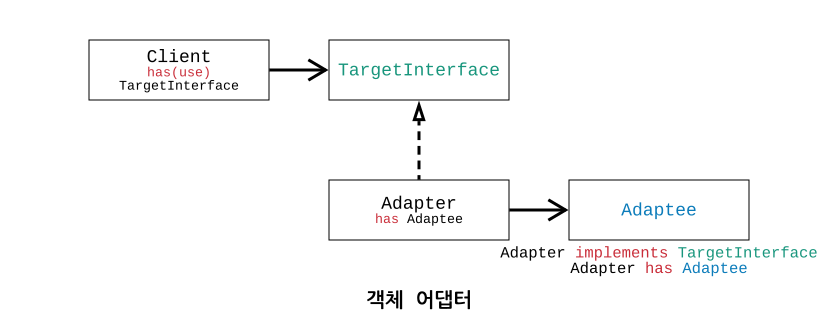
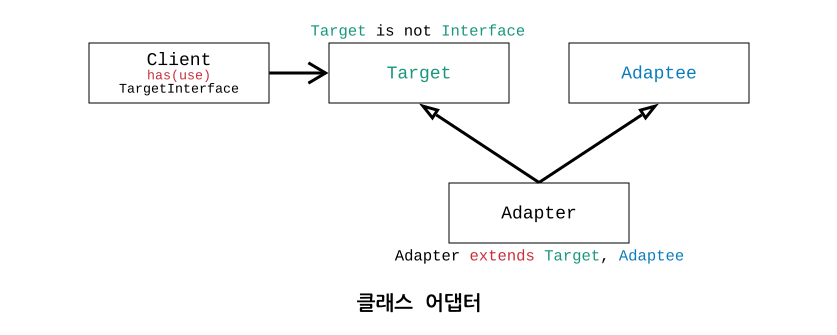

# 変装術

三匹のこぶたの物語には、羊の皮をかぶり、白い粉で手を塗って羊に変装したオオカミが登場します。もちろん、あまりにもお粗末なため末っ子の子ぶたに笑われますが、こぶたたちの家に入るためには「変装」が必要だったのです。今回お話しする内容は、化粧と変装についてです。ここで、その違いを少し見てみましょう。

## 化粧

化粧は、現在の自分の姿を少し**誇張した自分の姿**に飾り付けることです。
自分自身はそのまま、難しく言えば本質を損なわない範囲で、その上に**何かを追加で飾り付けたもの**です。

## 変装

変装は、現在の自分の姿を**完全に別のものの姿**に飾り付けることです。
自分自身ではない、**完全に別の何かとして飾り付けたもの**です。

この章で学ぶのは、化粧に該当するデコレーターパターンと、変装に該当するアダプターパターンです。最後に、これまでの二つのパターンとは異なり、複数のクラスを一つのクラスに単純にまとめるファサードパターンについて触れて終わりにします。

# アダプターパターン = 変装

先ほど、オオカミは三匹のこぶたの家に入るために、おとなしい羊に変装しました。恐ろしい爪を白い粉で可愛い手のように変え、唸り声をおとなしい羊のように「メー」と真似しようとします。これをクラスで表現すると、非常に理解が容易になります。

-   **オオカミ**

```java
class Wolf {
    public String getClaw() {
        return "Sharp Claw";
    }
    public String getGrowl() {
        return "Grrrrrrr";
    }
}
```

-   **オオカミは三匹のこぶたの家に入るために羊に「変装」しました。**

```java
class WolfWantsToBeSheep implements Sheep {
    public Wolf wolf; // アダプティー (Adaptee)
    public String getHand() {
        return wolf.getClaw().replace("Sharp Claw", "White Hand");
    }
    public String getSound() {
        return wolf.getGrowl().replace("Grrrrrrr", "Baaaaaaa");
    }
}
```

これでオオカミは、羊が入れる場所ならどこでも行けるようになりました。羊しか入れない三匹のこぶたの家に入ってみましょう。

-   三匹のこぶたの家には羊しか入れません

```java
public void WelcomeToPigHouse(Sheep sheep);
```

-   実際の羊は三匹のこぶたの家にうまく入っていけることがわかります

```java
WelcomeToPigHouse(new Sheep());
```

-   なんと、羊に変装したオオカミも三匹のこぶたの家にうまく入れるようになりましたね

```java
WelcomeToPigHouse(new WolfWantsToBeSheep(new Wolf()));
```

あるクラスや関数を**クライアント**と見なすと、**クライアントは特定のターゲットインターフェースにのみ合うように実装**されています。この制約のため、たとえそのクライアントで別のクラスを使用したいと思っても、**そのクラスがターゲットインターフェースの実装体でなければ使用できません**。上記の例のように、生まれたときからオオカミだったが、三匹のこぶたの家に行くためにはおとなしい羊にならなければならない状況のようなものです。一般的なビジネスにおいても、このようにあるクラスをクライアントの目的に合ったクラスとして使用しなければならないという突然の要求が発生することがあります。

## オブジェクトアダプター

上記のオオカミと羊の例のように、アダプターパターンは**アダプター**という**ターゲットインターフェースに対する新しい実装クラス**を生成し、その中に**ターゲットインターフェースに変装したい外部クラス**をオブジェクトとして内部に持ちます。このように、既存のオブジェクトを一度別のインターフェースでラップした実装をアダプターと呼び、ラップされる元のオブジェクトを「**アダプティー**」と呼びます。アダプティーの元の関数やプロパティを活用して、ターゲットインターフェースの各関数を実装すればよいのです。

これをより具体的には**「オブジェクトアダプター」**と呼ぶのは、**アダプターがアダプティーをオブジェクトとして持っているため**です。これを私たちは「コンポジション」と学びましたね。以下のコードを見ると、`Adapter`が`Adaptee`をオブジェクトとして持っています。クラス図が理解を少し助けてくれるでしょう。

```java
public void Client(TargetInterface interface);

class Adapter implements TargetInterface {
    private Adaptee adaptee;
    // ... adapteeの関数を活用してTargetInterfaceの関数を実装します。
}
```

```java
this.Client(new Adapter(new Adaptee()));
```

アダプティーはアダプターの助けを借りて、`TargetInterface`のみを使用するクライアントに注入可能になりました。


では、**「クラスアダプター」**とは何でしょうか？ AdapterがAdapteeをオブジェクトの形で「コンポジション」（has）するのではなく、クラスの形で「継承」（extends）すればよいのです。

## クラスアダプター

クラスアダプターはむしろ単純です。以下のコードとクラス図を見ると、オブジェクトアダプターと二つの違いがあります。

-   AdapterがAdapteeをコンポジション（has）せず、継承（extends）しています。
-   TargetがInterfaceではなくClassとして存在し、それに伴い実装（implements）ではなく継承（extends）を行っています。

オブジェクトアダプターとクラスアダプターの違いを擬似コードで簡単に理解してみましょう。

-   **オブジェクトアダプター**

```java
class Adapter implements TargetInterface {
    private Adaptee adaptee;
    // ... adapteeの関数を活用してTargetInterfaceの関数を実装します。
}
```



-   **クラスアダプター**

```java
class Adapter extends Target, Adaptee { // 注：これは説明のための擬似コードです
    // ... adapteeの関数を活用してTargetの関数を拡張します。
}
```



上記のコードを見て、ひるんだ方もいるかもしれませんが、Javaではクラスに対する多重継承をサポートしていません。クラスアダプターのコードを見ると、2つのクラスを1つのアダプタークラスで拡張して使用していることがわかりますが、一つは拡張したいターゲットのクラスで、もう一つは拡張する対象クラスであるアダプティーのクラスです。もちろん、このような形でのJavaのクラス多重継承はサポートされていないため、このロジックはJavaでは使用できません。また、この構造自体が柔軟性を損なうため、使用を推奨する方式でもありません。

## 多重アダプター

多重アダプターは、既存の単一のターゲットインターフェースだけでなく、複数のターゲットインターフェースすべてをサポートすることを意味します。一つのアダプティークラスを、こちらのインターフェースだけでなく、あちらのインターフェースでも使用したい場合、`TargetOneInterface`と`TargetTwoInterface`を一つのアダプタークラスに接続し、両方のインターフェースのすべてを実装すればよいのです。オブジェクトアダプターではなくクラスアダプターであれば、2つのクラス`TargetOne`, `TargetTwo`を継承（extends）すればよいことになります。

Javaではクラスに対する多重継承はサポートしていませんが、インターフェースに対する多重継承はサポートしているため、`implements A, B`のような文法は十分に利用可能になります。

-   **多重（オブジェクト）アダプター**

```java
public void ClientOne(TargetOneInterface interface1);
public void ClientAnother(TargetTwoInterface interface2);

class Adapter implements TargetOneInterface, TargetTwoInterface {
    private Adaptee adaptee;
    // ... adapteeの関数を活用してTargetOne/TwoInterfaceの関数をすべて実装します。
}
```

# デコレーターパターン - 化粧

デコレーターパターンは、クラスに無数の追加機能を加えても、そのクラスは本来のクラスの機能を維持する「化粧」に該当します。デコレーターパターンをアダプターパターンの次に扱う理由は、実は原理がアダプター-アダプティーの概念と同じだからです。アダプターが**Adaptee**を**TargetInterface**に**「変装」**させたとしたら、デコレーターは**Decoratee**を**Decoratee**自分自身に**「化粧」**させる形になります。

-   アダプターパターン - **変装: Adaptee != TargetInterface**

```java
class Adapter implements TargetInterface {
    private Adaptee adaptee;
}
```

-   デコレーターパターン - **化粧: Decoratee == Decoratee**

```java
class Decorator extends Decoratee { // DecoratorもDecorateeである
    private Decoratee decoratee; // 別のDecorateeをラップする
}
```

デコレーターパターンは一度だけ化粧するために使用されるわけではありません。自分自身に再帰的に化粧を施し続けることができます。どれほど多様な`DecoratorA`、`DecoratorB`を作成して飾り付けても、結局`Decoratee`クラスであるため、既存のクライアントは特に気にすることなく、以前と同じように使用すればよいのです。

> デコレーターパターンは、DecoratorクラスがDecorateeをDecorateeとして化粧させるものです。
> DecoratorはDecorateeを継承するため、それ自身もDecorateeになることができます。
> したがって、Decoratorは再帰的にDecorateeの位置に置くことができ、無限に化粧を施すことができます。

-   **デコレーティー**: 飾り付けたいオブジェクト

```java
class Decoratee {
    // ...
}
```

-   **デコレーター**: 飾り付けるオブジェクト

```java
class Decorator extends Decoratee { // Decorateeから継承して型を維持する
    private Decoratee decoratee; // 実際のDecorateeインスタンスをラップする
    // ... decorateeの関数を活用して、より改善されたdecoratee関数に拡張します。
}
```

上記のような単純なコードでも、非常に基本的な飾り付けを望むだけであれば十分です。しかし、それでも以下のように**「抽象デコレーター」**と**「具象デコレーター」**に分けることをお勧めする理由は、以下の利点があるためです。

-   具象デコレーターで共通して必要となるロジックやプロパティ（特にデコレーティー自身）を抽象デコレーターに置き、実装時に活用できます。
-   多数の具象デコレーターを一つの抽象デコレーターで管理できます。

**「実装よりもインターフェースを使え」というデザインパターン第一原則**を覚えていますか？実装ではなくインターフェース（または抽象クラス）の利点は、必要な具象クラスを付けたり外したりできる有用性と再利用性でした。例えば、具象デコレーターをリストやセットにまとめて管理したい場合、抽象デコレーター型のリストやセットを作成して使用できますね。

# ファサードパターン - まとめ

最後に学ぶパターンはファサードパターンです。**アダプターとデコレーターパターンは、それぞれ一つのアダプティーまたはデコレーティーを持つという共通点**があり、違いは**アダプターが他のクラスに「変装」する**のに対し、**デコレーターは同じデコレーター（実質的にはデコレーティー）に「化粧」を施す**という点でした。この章でファサードパターンを扱うということは、これらとの共通点があるということでしょう。何が同じなのでしょうか？

ファサードパターンは、アダプター、デコレーターパターンと同じ共通点を持っています。アダプティー、デコレーティーのように活用するためのクラスを内部に持っています。ただし、アダプター、デコレーターがアダプティー、デコレーティーを一つずつしか持たなかったのに対し、**ファサードは非常に多くのクラスを持ちます**。そして、アダプターとデコレーターの違いが「変装」か「化粧」かという違いだったのに対し、ファサードはただそれ自体が新しいクラスになります。

アダプターとデコレーターパターンは、なりたいインターフェースやクラスを継承することで、なりたい姿を持っていましたが、ファサードパターンは、単に目的を達成するためのロジックを作るために、必要なオブジェクトを自由に詰め込むだけです。ある意味、アダプターとデコレーターを説明する際にファサードパターンに言及するのが適切かどうか疑問に思うかもしれませんが、理解を深めるのに役立つのではないかと思い含めてみました。

-   （オブジェクト）アダプター

```java
class Adapter implements TargetInterface {
    private Adaptee adaptee;
    // ... adapteeの関数を活用してTargetInterfaceの関数を実装します。
}
```

-   ファサード

```java
class Facade {
    private ClassA classA;
    private ClassB classB;
    private ClassC classC;
    // ... ClassA, B, Cを活用した新しい関数を作成します。
}
```

ファサードには、その後ろに`extends`や`implements`といったものは一切存在しません。単に複数のクラスを一つにまとめるクラスなのです。

---

いつも長い記事を読んでいると、最後のあたりで集中力が途切れてしまうことがあります。以下に3行要約をまとめてみました。

---

**アダプターパターン**

> 一つのクラス（アダプティー）を、別のクラス（ターゲットインターフェース）に**「変装」**させます。

```java
class Adapter implements TargetInterface {
    private Adaptee adaptee;
    // ... adapteeの関数を活用してTargetInterfaceの関数を実装します。
}
```

**デコレーターパターン**

> 一つのクラス（デコレーティー）を、その一つのクラス（デコレーティー）として**「化粧」**します。

```java
class Decorator extends Decoratee {
    private Decoratee decoratee;
    // ... decorateeの関数を活用して、より改善されたdecoratee関数に拡張します。
}
```

上記のサンプルコードは、理解を助けるためにシンプルなデコレータークラスとして記述しました。本文で説明した通り、抽象/具象デコレーターとして利用することをお勧めします。

**ファサードパターン**

> **複数のクラス**を**一つの一つの異なるクラス**に**まとめます**。

```java
class Facade {
    private ClassA classA;
    private ClassB classB;
    private ClassC classC;
    // ... ClassA, B, Cを活用した新しい関数を作成します。
}
```

---