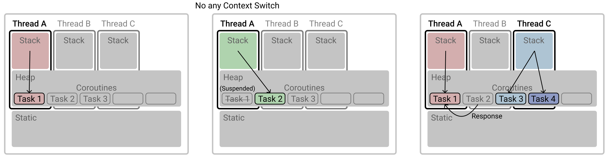
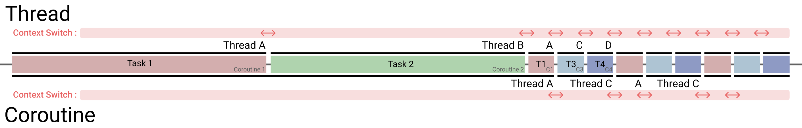

初めてKotlinを使用していた時に、非同期処理のためにコルーチンという概念に出会いました。**同期**とは、リクエストを送信した後、そのリクエストに対する戻り値を受け取るまで待機することを意味し、**非同期**とは、その待機時間中に他の作業を実行して効率を高めることを意味します。

同期と非同期は、「待機」が必要な処理が頻繁に登場するプログラミングにおける概念であり、これらは「ブロッキング」と名付けられます。例えば、OSの授業で習ったI/O処理やネットワークのリクエスト/レスポンス処理などが挙げられます。以前は、前述のような例を処理する際にのみ非同期が使用されていたと記憶していますが、現在ではどのような作業でも細かく分割して非同期で処理されるようになっています。このような傾向を促進しているのは、使いやすさが向上したことでしょう。ここで説明するコルーチンの概念も、スレッドよりも非同期処理を簡単に使えるようにしているためではないかと思います。

# プロセスとスレッド

> **プロセス**: プログラムがメモリにロードされ、実行されるインスタンス<br>
> **スレッド**: プロセス内で実行される複数のフローの単位

まず、スレッドはプロセスよりも小さい実行インスタンスであると認識されていますが、メモリ領域も少し異なります。


プロセスは独立したメモリ領域（ヒープ）を割り当てられ、各スレッドも独立したメモリ領域（スタック）を割り当てられます。スレッドは本質的にプロセス内に属しているため、ヒープメモリ領域は当該プロセスに属するすべてのスレッドが共有できます。

プログラムに対するプロセスが生成されると、ヒープ領域と一つのスレッド、そして一つのスタック領域を持ちます。**スレッドが追加されるたびに、その数だけスタックが追加されます**。もし100個のスレッドがある場合、全体メモリに100個のスタックが生成されることになります。

# 並行性と並列性

## 並行性 (Concurrency)

> **インターリービング (時分割)**: 複数のタスクがある場合に、各タスクを平等に少しずつ分けて実行すること。


総実行時間は、コンテキストスイッチングのコストを除けば、各タスクの実行時間を合計した時間と同じになります。例えば、3つのタスクがそれぞれ10分かかると仮定すると、**合計30分が必要**となります。

## 並列性 (Parallelism)

> **並列実行**: 複数のタスクが同時に実行されること。


タスクの数だけリソースが必要であり、コンテキストスイッチングは不要です。総実行時間は、複数のタスクの中で最も時間がかかるタスクの実行時間と同じになります。例えば、3つのタスクがそれぞれ10分、11分、12分かかると仮定すると、**合計12分が必要**となります。

# スレッドとコルーチン

スレッドとコルーチンはともに、並行性 (Concurrency) (インターリービング) を保証するための技術です。複数の処理を同時に実行する際、スレッドは各処理に対応するメモリ領域を割り当てますが、複数の処理を同時に実行する必要があるため、OSレベルで各処理をどれだけ分配して実行すれば効率的かを決定するためにプリエンプティブスケジューリングが必要です。つまり、タスクAを少し、タスクBを少し、というように実行し、最終的にタスクAとタスクBの両方を達成します。一方、コルーチンは軽量スレッドと呼ばれます。これもまた、処理を効率的に分配して少しずつ実行し完遂する並行性を目指しますが、各処理に対してスレッドを割り当てるのではなく、小さなオブジェクトのみを割り当て、これらのオブジェクトを自在に切り替えることで、スイッチングコストを最大限に削減しています。

## スレッド

*   タスク単位: **スレッド (Thread)**
    *   複数のタスクそれぞれにスレッドを割り当てます。
    *   上記で説明したように、各スレッドは独自のスタックメモリ領域を持ち、JVMスタック領域を占有します。
*   **コンテキストスイッチング (Context Switching)**
    *   **OSカーネルによるコンテキストスイッチング**を通じて並行性を保証します。
    *   **ブロッキング**: タスク1（スレッド）がタスク2（スレッド）の結果を待つ必要がある場合、
        タスク1のスレッドはブロックされ、その間、当該リソースを使用できません。


*   説明を簡単にするため、CPUはシングルコアであると仮定します。

上記の図では、すべてのタスクがスレッド単位であることがわかります。スレッドAがタスク1を実行中にタスク2が必要になった場合、これを非同期で呼び出します。タスク1は進行中の作業を中断し（ブロックされ）、タスク2はスレッドBで実行されます。この時、CPUが演算のために参照するメモリ領域がスレッドAからスレッドBに切り替わるコンテキストスイッチングが発生します。タスク2が完了すると、その結果値がタスク1に返され、同時に実行されるタスク3とタスク4はそれぞれスレッドCとスレッドDに割り当てられます。シングルコアCPUは同時演算が不可能なため、この場合もOSカーネルのプリエンプティブスケジューリングによって、各タスク1、3、4をどれだけ実行し、中断し、次のタスクを実行するかを決定し、それに合わせて3つのタスクを交代で実行することで並行性を保証します。

## コルーチン

*   タスク単位: **オブジェクト** = **コルーチン (Coroutine)**
    *   複数のタスクそれぞれにオブジェクトを割り当てます。
    *   このコルーチンオブジェクトは、オブジェクトを格納するJVMヒープにロードされます。
*   **プログラマーによるスイッチング** = コンテキストスイッチングなし
    *   **プログラマーのコーディングを通じてスイッチングのタイミングを自由に**決定することで、並行性を保証します。
    *   **サスペンド (Suspend)** = 非ブロッキング: タスク1（オブジェクト）がタスク2（オブジェクト）の結果を待つ必要がある場合、
        タスク1のオブジェクトはサスペンドされますが、タスク1を実行していたスレッドはそのまま有効であるため、タスク2もタスク1と同じスレッドで実行できます。



*   説明を簡単にするため、CPUはシングルコアであると仮定します。

作業の単位はコルーチンオブジェクトであるため、タスク1の実行中に非同期タスク2が発生しても、タスク1を実行していた同じスレッドでタスク2を実行できます。また、一つのスレッドで多数のコルーチンオブジェクトを実行することも可能です。上記の図に従い、**タスク1とタスク2の切り替えは、単一のスレッドA上でコルーチンオブジェクトを交換するだけで行われるため、OSレベルのコンテキストスイッチングは不要です**。一つのスレッドで多数のコルーチンを実行できること、そして**コンテキストスイッチングが不要であることから、コルーチンは軽量スレッドとも呼ばれます**。

ただし、上記の図のスレッドAとスレッドCの例のように、多数のスレッドが同時に実行される場合は、並行性を保証するために2つのスレッド間でのコンテキストスイッチングは実行されなければなりません。したがって、コルーチンを使用する際には、「コンテキストスイッチングなし」という利点を最大限に活用するために、多数のスレッドを使用するよりも、単一のスレッドで複数のコルーチンオブジェクトを実行することが推奨されます。

> 結局、コルーチンによって「作業」の単位がスレッドではなくオブジェクトに縮小されることで、
> 作業の切り替えや多数の作業の実行に、必ずしも多数のスレッドを必要としなくなります。

<br>

> コルーチンはスレッドの代替ではなく、既存のスレッドをより細かく利用するための概念です。
> 一つのスレッドが多数のコルーチンを実行できるため、もはや作業の数だけスレッドを量産してメモリを消費する必要がありません。

*   各スレッドが持つスタックメモリ領域を持たないため、スレッド使用時にスレッドの数だけスタックメモリによるメモリ使用量が増加することはありません。
*   同じプロセス内の「共有データ構造」（ヒープ）に対するロックの心配もありません。



スレッドとコルーチンの例として示した図を上記のように要約しました。コルーチンを使用する場合、タスクが変わってもスレッドは維持されることがわかります。それに伴い、コンテキストスイッチングの回数も大幅に減少していることが見て取れます。コルーチンで説明したように、タスク3とタスク4もスレッドCではなくスレッドAで実行されるように設計すれば、コンテキストスイッチングが全くない設計も可能です。つまり、コルーチンが実行されるスレッドもプログラマーが共有スレッドプールを指定して決定するという意味であり、コルーチンを活用した効率性は、ひとえにプログラマーの力量にかかっているということです。

### 各言語のコルーチン

*   **Future** = Javaにおける非同期サポート
*   **Promise** / **Generators** = JavaScriptにおける非同期サポート
    *   ジェネレーターは`yield`構文によってのみ実行を停止します。つまり、細かく分割し（イテレーター）、フリーズさせている（Freeze/Yield）状態です。
*   **Deferred** = Kotlinにおける非同期サポート
    *   非ブロッキングかつキャンセル可能なJavaの`Future`に相当するコルーチンオブジェクト。
    *   コルーチンビルダーである`async { }`を通じて定義されます。
    *   コルーチンの説明で述べたように、`Deferred`オブジェクトを実行する際、スレッドをブロックせず、当該ブロックが完了するまで`await`し、完了したら処理を続行します。

### スタックフルとスタックレス

コルーチンについてさらに深く掘り下げると、スタックフルとスタックレスの二種類に分けられることがわかります。本記事の冒頭で述べたように、スレッドは独自のメモリ領域であるスタックを持ちます。スタックは関数実行順序を格納し、その管理を可能にします。軽量スレッドであるコルーチンのスタックフルとスタックレスは、コルーチンが独自のスタックを持つか持たないかを意味します。スタックフルコルーチンは、コルーチン内部で他の関数を呼び出した際、その関数内で現在のコルーチンをサスペンドできる（正確には`yield`を呼び出せる）ことを意味します。スタックレスコルーチンは、関数に対するスタックを別途持たないため、呼び出そうとする関数を改めてコルーチンオブジェクトでラップして「コルーチンをネストして呼び出す」ことで、以前のコルーチンと内部のコルーチンをサスペンドを介して接続する必要があります。

*   **コルーチン (Coroutine)**: スタックフル関数
    *   コルーチン内部関数から`Yield`（コルーチンのサスペンド）を呼び出し可能。
*   **ジェネレーター (Generators)**: スタックレス関数
    *   コルーチン内部関数から`Yield`（コルーチンのサスペンド）を呼び出し不可能。
    *   例えば、コルーチン内部の`Arrays.forEach()`関数内の構文では、`forEach()`関数がコルーチン適用可能に別途定義されていない限り、`Yield`の呼び出しは不可能です。

# Kotlinコルーチン

## `buildSequence {}`

*   シーケンシャルなYield/Resuming
    *   `yield`を通じて停止します。
    *   `resume`を通じてシーケンシャルに実行を再開します。

```kotlin
fun g() = buildSequence {
  yield(1); yield(2);
}
for (v in g()) {
  println(v)
}
```

## `runBlocking {}`

*   **メインスレッドをブロックしたまま** + **`{ }`ブロック内のタスクを新しいスレッドに割り当てて実行**します。
*   `runBlocking { }`の内部に複数の`async { }`が定義されている場合、
    これらすべての`async`が完了し、結果を返した時にメインスレッドのブロックを解除します。

## `launch {}`

*   **メインスレッドをブロックせずに** + `{ }`ブロック内のタスクを実行します。

## `async {}`

*   **メインスレッドをブロックせずに** + `{ }`ブロック内のタスクを実行後、**値を返します**。
    *   `async { }`は`launch { }`と同じ動作をしますが、戻り値が存在する`Deferred`オブジェクトを返します。
    *   つまり、`launch`は最後まで実行すれば終わりですが、`async`は最後まで実行し、戻り値を持つオブジェクトを返します。
    *   `Deferred`は、コルーチンの結果を返す`await()`関数を持っています。

---
- https://stackoverflow.com/questions/1934715/difference-between-a-coroutine-and-a-thread
- https://stackoverflow.com/questions/43021816/difference-between-thread-and-coroutine-in-kotlin/43232925
- https://kotlinlang.org/docs/tutorials/coroutines/coroutines-basic-jvm.html
- https://medium.com/@jooyunghan/stackful-stackless-%EC%BD%94%EB%A3%A8%ED%8B%B4-4da83b8dd03e
---