# Disqus

2019年頃、JekyllやHexoといったSSG (静的サイトジェネレーター) を利用して技術ブログを構築するのが流行していました。しかし、コメント機能は基本的にサーバーとデータベースをストレージとして活用する必要があるという問題があります。SSGを活用したブログにはそのようなものは通常ありません！（もちろん、SupabaseのようなクラウドDBを活用することもできますが、ここではオールインワンコメントコンポーネントについて話しています）。Disqusは、コメントコンポーネントのHTMLを提供するだけでなく、その中央データベースまで提供してくれます。

- コメントコンポーネントHTMLレンダリング (iframe) + **独自の集中型データベース提供**

# Utterance

2023年、ReactベースのSSGジェネレーターであるGatsby技術でブログを再構築しようとした当時、コメント用のデータベースを活用するのではなく、個人のGitHubをストレージとして活用する技術であるUtteranceが流行していました。GitHubがProjectとDiscussions機能をリリースしたのは2023年頃からと認識していますが、それ以前は人々とのコミュニケーションチャネルとしてIssuesを活用していました。UtteranceはこのGitHub Issuesをストレージとしてコメントを投稿するという、非常に優れたアイデアでした。

- コメントコンポーネントHTMLレンダリング (iframe) + **個人のGitHub Issuesを活用**

# Giscus

2026年にAstroを活用してブログを開発しようとしたところ、最近ではコメントコンポーネントとしてGiscusが主流であり、性能も優れているとのことだったので採用することにしました。各ブログオーナーの個人GitHubをストレージとして活用するという原理はUtteranceと同じですが、UtteranceはGitHub Issuesを、GiscusはGitHub Discussionsを活用するという点だけが異なります。

- コメントコンポーネントHTMLレンダリング (iframe) + **個人のGitHub Discussionsを活用**

## Giscusコメントコンポーネントの実際のレンダリング原理 - `<iframe>`

ジュニアのフロントエンド開発者は、ページを構成する様々なインプットやボタンなどのHTMLコンポーネントはすべて自分で作成しなければならないと思っているかもしれませんが、実際の開発では外部で作成されたHTMLコンポーネントを使用する必要がある場合があります。例えば、高齢のペンション経営者向けにペンション予約ホームページを提供する場合、同じ予約ページを毎回各ペンション予約ホームページにコピー＆ペーストして提供する手間を省き、**共通の予約カレンダーHTMLコンポーネント**を提供することで、どのペンションオーナーのホームページであるかを判断し、空室情報を埋めて表示するといった事例があります。今日お話しするコメントコンポーネントも、多くの自社ブログを運営する開発者向けに**共通のコメントHTMLコンポーネント**を提供し、どのブログ記事であるかを判断してそれに対応するコメントを埋め込むものです。**このように、ユーザーが見ているページHTMLの中に、他のサーバーで作成されたHTMLを取り込んで含めるための技術の一つがiframeです。**

- ユーザーブラウザ = **ブログHTMLページ (親)** + **コメントHTMLコンポーネント (子)**
  - ブログHTMLページ (親) 内のコメントHTMLコンポーネント (子) はiframe形式で組み込まれている
    - **ブログHTMLページ** (親) 提供サーバー - メインページ
    - **コメントHTMLコンポーネント** (子) 提供サーバー - コメントコンポーネント

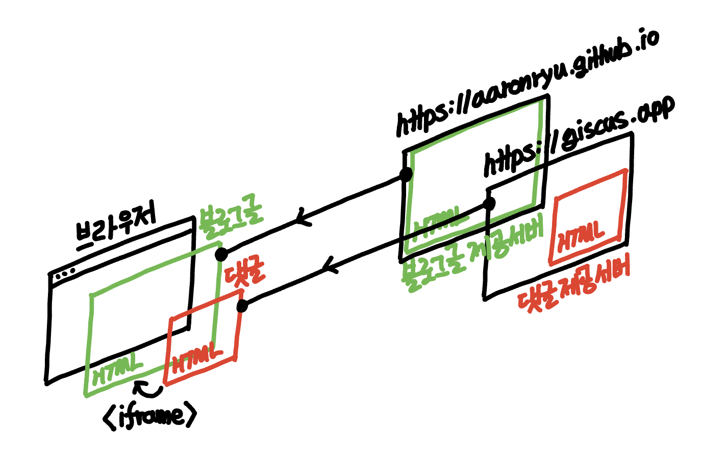

> ブログHTMLページ内のコメントHTMLコンポーネントがiframe形式で組み込まれています。

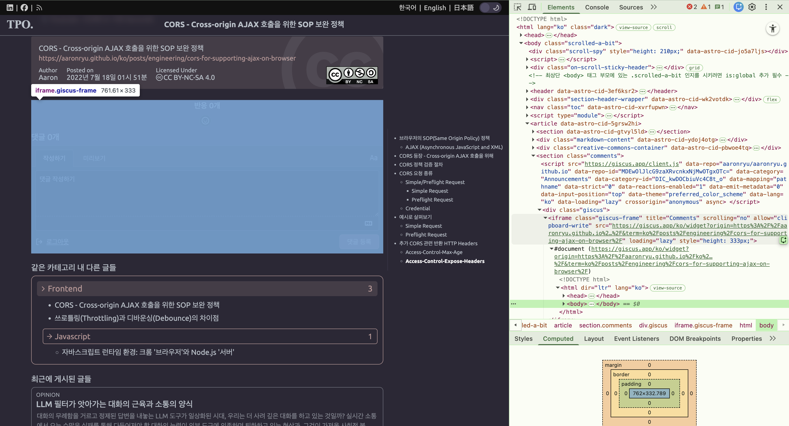

## Giscusコメントコンポーネントへの既存テーマCSS適用

ブログHTMLページ内にiframeとして組み込まれているコメントHTMLコンポーネントは、ブログHTMLページを取得した元のサーバーではなく、別のサーバーから取得されたものであるため、ブラウザは親HTMLと子HTMLをセキュリティ上の理由から隔離します。これにより、親が子のDOM、CSSOM、JSにアクセスすること、およびその逆のアクセスをすべてブロックします。

### `<iframe>`を境界とする親と子間の**Browsing Contextの分離/隔離**

iframeタグを持つ親HTMLとiframeタグ内の子HTMLは、個別のDOM、CSSOMツリーとしてレンダリングされ、ブラウザのSOP (Same-Origin Policy) により、これら2つのHTMLは異なるサーバーから来たリソースであるため、親HTMLからも子HTMLにアクセスできず、その逆の子HTMLからも親HTMLにアクセスできないように隔離されます。

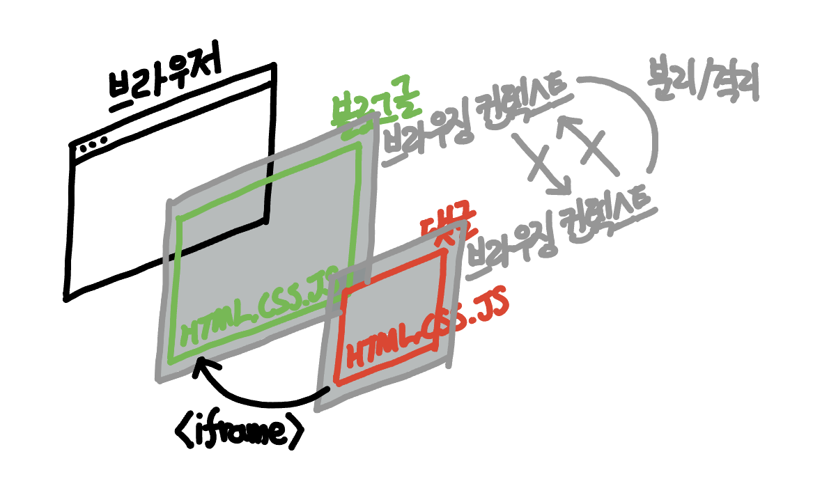

余談ですが、もしiframeの子と親の間でDOM、CSSOM操作やJSイベント呼び出しといったロジック接続が必要な状況があれば、PostMessage APIを活用して親HTMLと子HTML間でデータを送受信するようにすればよいでしょう。

### iframeと似ているが隔離レベルが低いShadow DOM

余談ですが、完全に隔離された個別のDOMである`<iframe>`と似た技術にShadow DOMというものがあります。これはCSSOMスタイルは隔離されていますが、iframeのように権限に関するSOP隔離がないため、GiscusのようなサードパーティコンポーネントがiframeではなくShadow DOMを使用した場合、DOMのグローバル変数が汚染されたり、皆さんが使用するブラウザのクッキー、ローカルストレージ、セッションなどにアクセスしてデータを勝手に操作したりする可能性があります。そのため、Giscusのようなサードパーティコンポーネントはiframeのみが唯一の選択肢だと考えるべきでしょう。

- iframeは、皆さんのブラウザを安全に保ちながら
    - 親CSSがコメント欄のデザインを壊さないようにし、かつ子CSSが親CSSを壊さないようにする
    - 親JSがコメント投稿機能を横取りできないようにし、かつ子JSが親JSを壊さないようにする

### GiscusコメントコンポーネントがテーマCSSを独自提供する仕組み

前述のBrowsing Context分離により、CSSデザインの適用において、ブラウザ内では2つのHTMLコンポーネントは完全に独立して適用されます。そのため、ブログHTMLページ (親) のグローバルCSS設定でコメントHTMLコンポーネント (子) にCSSを適用したり、上書きしたりすることはできません。

- **Browsing Contextの分離/隔離**
    - **ブログHTMLページ**提供サーバー - メインページCSSは別々
    - **コメントHTMLコンポーネント**提供サーバー - コメントコンポーネントCSSは別々

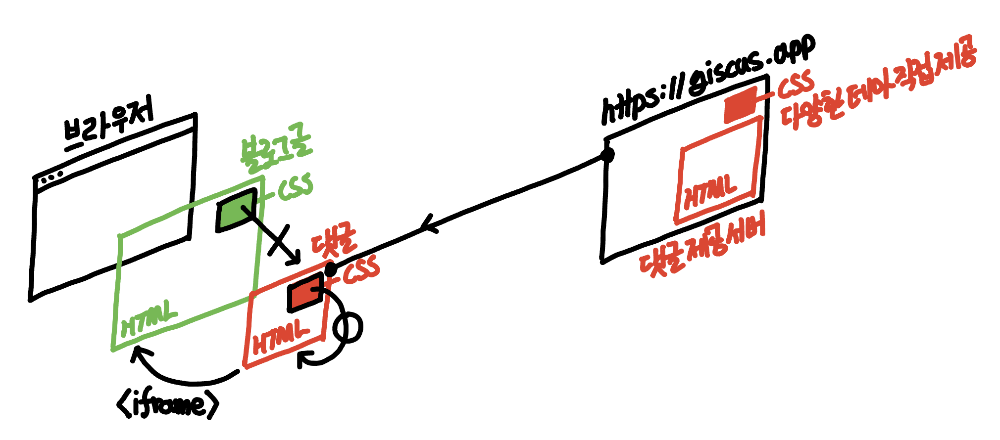

したがって、GiscusコメントHTMLコンポーネントを提供する場合、CSSもそのHTMLコンポーネントに含めて提供する必要があります。CSS自体は、外部サーバーに存在するパスであろうと、`https://giscus.app`と同じサーバーに存在するパスであろうと、何でも関係なく適用されます。Giscusは、`https://giscus.app`と同じサーバー内に複数のテーマに対応するCSSを蓄積して提供しているため、一般的的にはその中から一つを選んで使用します。

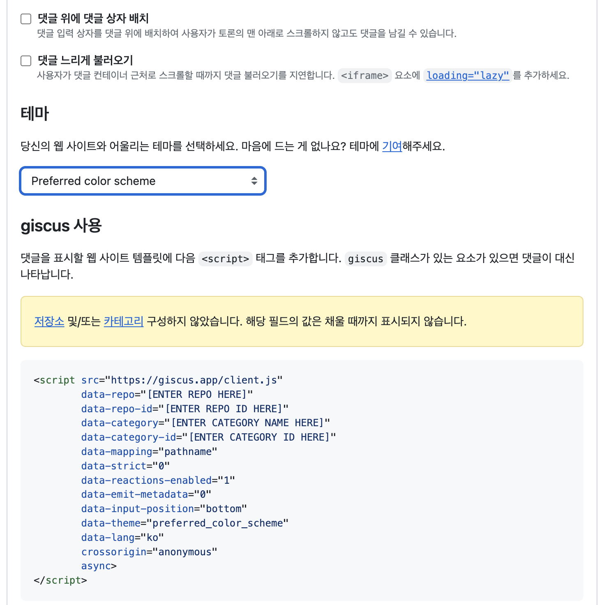

> Giscusの公式ページおよびリポジトリには、選択可能な様々なテーマがあります。

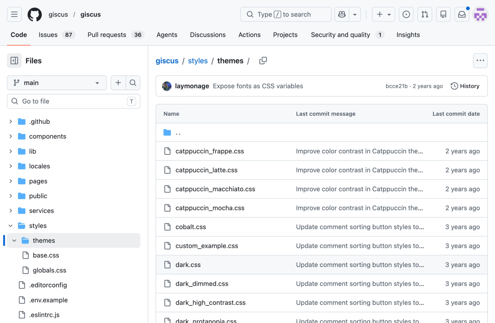

改めてまとめると、iframeで取得した子HTMLコンポーネントのデザインは、**親がコントロールできる領域ではなく、子HTMLコンポーネントに含まれるCSSのみが操作できるということです。** 下の画像を見ると、iframeで取得したコメントHTMLコンポーネントの内部に`<link>`タグがあり、その`href`に`/themes/preferred_color_theme.css`が含まれていることがわかります。そして、実際のそのリンクは相対パスであるにもかかわらず、iframeの親サーバーのパスではなく、iframeの子サーバーのパスである`https://giscus.com/themes/preferred_color_theme.css`であることが確認できます。

> 皆さんがGiscusが提供するテーマを使用している場合、そのテーマのCSSはGiscusサーバーに配置されています。

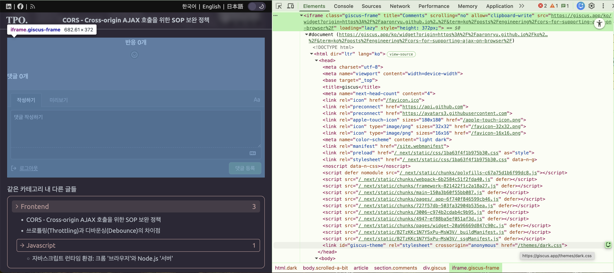

## GiscusコメントコンポーネントへのカスタムCSS適用

GiscusコメントHTMLコンポーネントに、同一サーバーで提供される様々なテーマCSSを適用できることは分かりました。筆者の場合は、ブログのテーマと色を直接決定・設定したため、Giscusの基本テーマの中には、本ブログのテーマカラーやルック＆フィールに合うものが存在しませんでした。そのため、Giscusの個々のHTML要素にカスタムCSSを適用しようと、ブログのグローバルCSSに設定を追加しても、さらに`!important`を追加しても、Giscusコメントコンポーネントは変わりませんでした。

その理由は、もちろん**iframeを境界とする親と子間のBrowsing Context分離/隔離**のため、グローバルCSSにどのような設定をしても、隔離されているiframe内のコメントHTMLには一切適用されなかったからです。Giscus公式ホームページに、私だけが使う個人テーマを作ってPRを上げるのは現実的ではないので、以下の方法を使う必要がありました。

### 外部に保存されたカスタムテーマCSSをGiscusコメントコンポーネントに独自提供する

直接作成したカスタムCSSを外部サーバーに保存し、iframe内部のGiscusコメントHTML内の`link`タグで取得するCSSパスを、私たちが定義した外部CSSパスに変更すればよいのです。

-   **既存**: iframe内部のコメントHTML内の`link`タグに**Giscusサーバーが提供するCSSファイルを提供**
-   **挑戦**: iframe内部のコメントHTML内の`link`タグに**外部サーバーが提供するCSSファイルを提供**
    -   **失敗**: iframe親CSSにiframe子HTMLに対するセレクタおよび`!important`でCSSを設定
        -   理由: **iframeを境界とする親と子間のBrowsing Context分離**

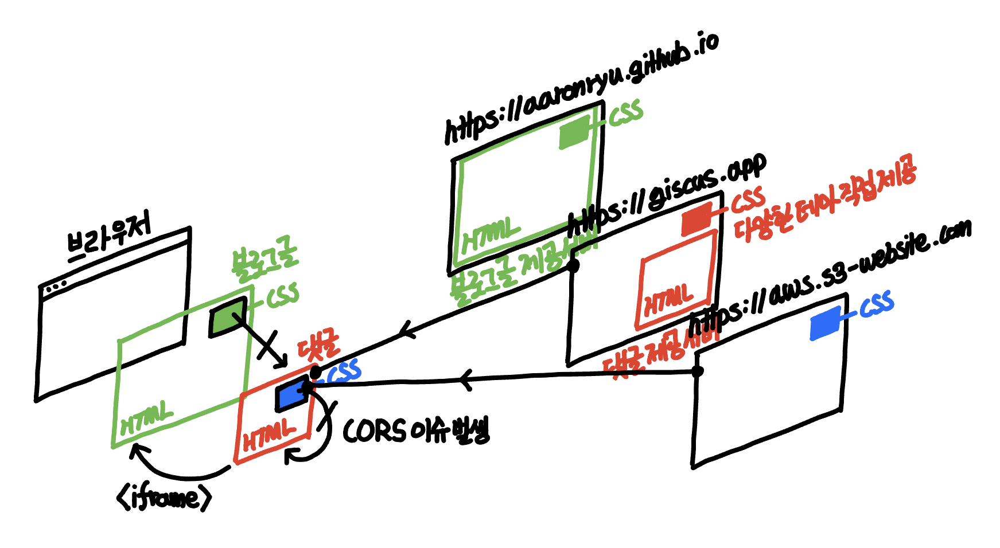

正確には、Giscusコメントをサーバーから作成して取得するスクリプトの`data-theme`属性に、外部から取得したい外部CSSのパスを入れればよいのです。

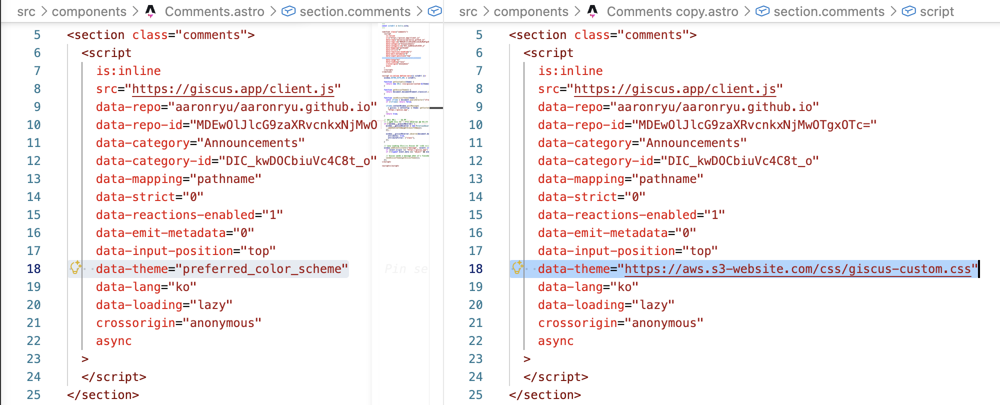

外部CSSが実際に存在すれば、下記のように目的のCSSが正しく適用されて表示されます。下の画像を見ると、GiscusコメントHTMLコンポーネントのすべての色が抜けていることが確認できます。

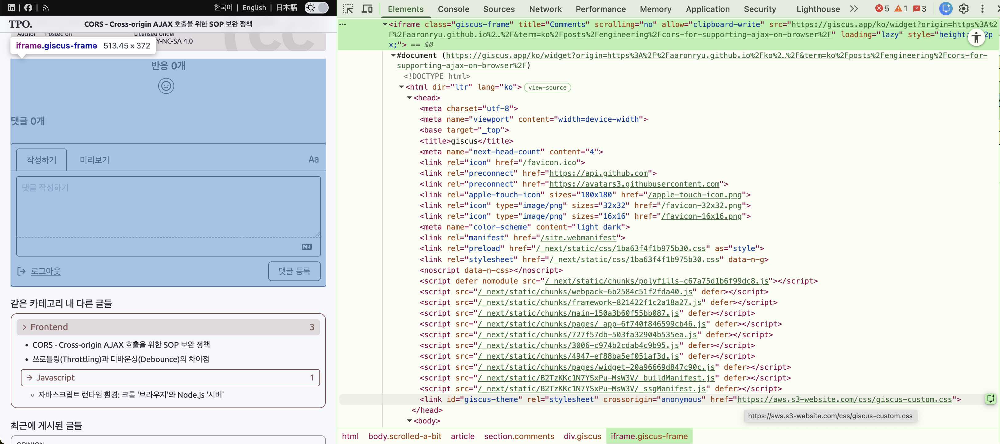

### (ケース1) 外部ローカルCSSの提供: 開発時

ブログをデプロイする前にGiscusコメントの表示をデバッグし、CSSを修正するためには、`http://localhost:4321`のローカルVite開発サーバーを通じてローカルで修正中のCSSファイルを提供する必要があります。ローカルファイルのCSSの完全なURLを指定すればよいでしょう。

```js
  <script
    is:inline
    src="https://giscus.app/client.js"
    data-repo="aaronryu/aaronryu.github.io"
    data-repo-id="MDEwOlJlcG9zaXRvcnkxNjMwOTgxOTc="
    data-category="Announcements"
    data-category-id="DIC_kwDOCbiuVc4C8t_o"
    data-mapping="pathname"
    data-strict="0"
    data-reactions-enabled="1"
    data-emit-metadata="0"
    data-input-position="top"
    data-theme="http://localhost:4321/css/giscus-custom.css" // [!code highlight]
```

### (ケース2) 外部リモートCSSの提供: デプロイ時

ローカルでのCSS開発が完了したら、CSSファイルをリモートサーバーにデプロイし、Giscusコメントコンポーネントに完全なURLを指定します。お気づきかもしれませんが、`data-theme`属性に入る値が**相対パス**の場合、Giscusサーバーは自身の`https://giscus.app`内部で基本提供しているテーマCSSを探して適用し、**絶対パス**の場合、指定されたリモートサーバーからCSSを取得して適用します。外部からCSSを取得するサーバーとしては、GitHub Pagesのパスをそのまま使用するのが最も手軽であり、Vercel、Netlify、AWS S3のような他の静的ファイルストレージを利用することもできます。

```js
  <script
    is:inline
    src="https://giscus.app/client.js"
    data-repo="aaronryu/aaronryu.github.io"
    data-repo-id="MDEwOlJlcG9zaXRvcnkxNjMwOTgxOTc="
    data-category="Announcements"
    data-category-id="DIC_kwDOCbiuVc4C8t_o"
    data-mapping="pathname"
    data-strict="0"
    data-reactions-enabled="1"
    data-emit-metadata="0"
    data-input-position="top"
    data-theme="https://aws.s3-website.com/css/giscus-custom.css" // [!code highlight]
```

## GiscusカスタムCSS適用時の問題

GiscusコメントHTMLコンポーネントが取得する外部CSSファイルのパスは、(ケース1) CSS開発時はローカルCSSパスの`http://localhost:4321/css/giscus-custom.css`を使用し、(ケース2) デプロイ時はリモートCSSパスの`https://aws.s3-website.com/css/giscus-custom.css`を使用します。これら2つのケースで取得される外部CSSパスは、GiscusコメントHTMLコンポーネントを取得した`https://giscus.app`や、GiscusコメントHTMLコンポーネントが含まれているメインページを取得したパス(オリジン)である`https://aaronryu.github.io`とは異なるため、ブラウザはセキュリティエラーを発生させます。

- 元のブログ記事ページを取得したオリジン: `https://aaronryu.github.io`
  - その内部のGiscusコメントコンポーネントを取得したオリジン: `https://giscus.app`
    - (ケース1) 開発時: 外部CSSを提供するローカルサーバー `http://localhost:4321/css/giscus-custom.css`
    - (ケース2) デプロイ時: 外部CSSを提供するリモートサーバー `https://aws.s3-website.com/css/giscus-custom.css`

> コメントコンポーネントまたはブログ記事ページを取得したパスとは異なるパスからCSSを取得しているというセキュリティエラー。

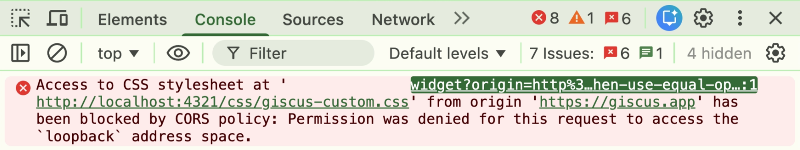

> **ブログ記事を取得したオリジン**と、**ブログ内のコメントが外部CSSを取得したオリジン**が異なります。

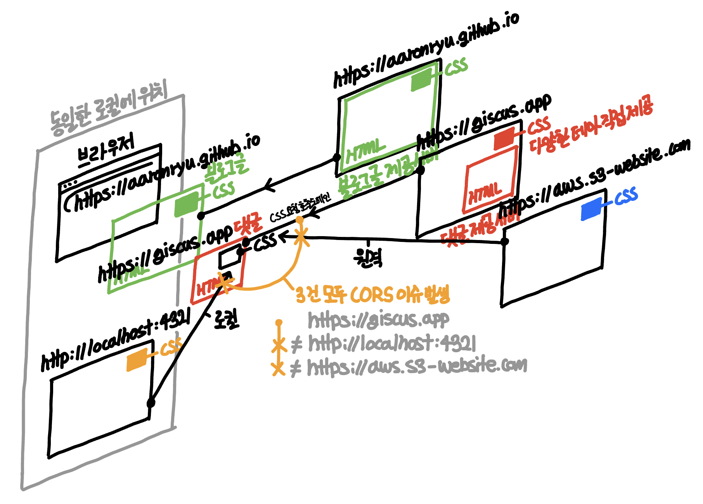

# GiscusカスタムCSS適用時の問題原理と解決策

## ブラウザセキュリティポリシー 4) SOP (Same-Origin Policy)

ブラウザは基本的に、HTMLから外部サーバーのCSS、画像などのファイルを取得したり、API呼び出しを行ったりするすべての行為をブロックします。しかし、当然ながらHTMLは外部サーバーからCSSを取得してページを華やかに表示したり、外部サーバーから画像を取得してユーザーに様々な写真を見せたり、外部サーバーにAPI呼び出しを行ってデータを取得または送信してユーザーに決済などの多様なサービスを提供したりする必要があります。そのため、HTMLファイルを取得したサーバーではない外部サーバーへのリクエストを、セキュリティの観点から意図的な呼び出しであるかどうかを区別できるように、CORSポリシーを導入してSOPポリシーを補完しています。

> HTML内部から
HTMLを取得したパス(オリジン)のサーバーではない
異なるパス(オリジン)のサーバーにリクエストしたり、異なるパス(オリジン)のサーバーからレスポンスを取得するすべての行為を
ブラウザが禁止します。

## ブラウザセキュリティポリシー 3) CORS (Cross-Origin Resource Sharing)

SOPについて改めて整理すると、`https://a.com`サーバーから取得したHTMLファイル内から`https://b.com`サーバーのCSSを取得してはならず、API呼び出しもできないというポリシーです。しかし、Google FontsもGoogleサーバーから取得する必要があり、外部ストレージに保存されているCSSも取得する必要があり、バックエンドサーバーからAPI呼び出しも行う必要があるため、このポリシーは現実的ではありません。そこでCORSポリシーという例外ポリシーを設け、特定の条件を満たす場合にのみ許可されるようになっています。

> CSS、フォントなどのアセットやAPI呼び出しは外部サーバーから取得せざるを得ないため、CORS例外ポリシーで一部のみ許可。

CSSなどのリソースやAPIを提供するリモートサーバーが、どのパス(オリジン)のHTMLから呼び出しを許可するかをヘッダーとしてレスポンスとともに返すと、ブラウザはサーバーがヘッダーで返した許可されたパス(オリジン)が現在のHTMLのパス(オリジン)と一致するかを検査し、一致する場合にリソースの使用を許可し、そうでない場合は破棄します。

GiscusコメントHTMLコンポーネントは`https://giscus.app`サーバーから取得されますが、GiscusコメントHTMLコンポーネントが参照しようとする外部CSSの出どころは、**(ケース1) 開発時: ローカル`http://localhost:4321`サーバー**、または**(ケース2) デプロイ時: リモート`https://aws.s3-website.com`サーバー**であるため、SOP違反となります。したがって、CORS例外ポリシーを通じてブラウザが許可できるようにする必要があります。

- 元のブログ記事ページを取得したオリジン: `https://aaronryu.github.io`
  - その内部のGiscusコメントコンポーネントを取得したオリジン: `https://giscus.app` ← 外部CSS呼び出しのオリジンはこれ
    - (ケース1) 開発時: 外部CSSを提供するローカルサーバー `http://localhost:4321/css/giscus-custom.css`
      - `http://localhost:4321`サーバーで`https://giscus.app`から取得したHTMLからの呼び出しを許可
    - (ケース2) デプロイ時: 外部CSSを提供するリモートサーバー `https://aws.s3-website.com/css/giscus-custom.css`
      - `https://aws.s3-website.com`サーバーで`https://giscus.app`から取得したHTMLからの呼び出しを許可

参考までに、ブラウザのサンドボックス原則により、外部CSS呼び出しを行ったオリジンは、「ブラウザのアドレスバーに表示された元のブログ記事ページのオリジン」である`https://aaronryu.github.io`ではなく、「実際に外部CSSリクエストを送信したiframe内のコメントコンポーネントのオリジン」である`https://giscus.app`となります。したがって、外部CSS提供サーバーのCORS許可Origin設定時には、`https://aaronryu.github.io`ではなく`https://giscus.app`を追加する必要があります。

### (ケース1) 開発時: 外部ローカルCSS提供サーバー`http://localhost:4321`におけるCORS設定

Astro開発のために使用するローカルVite開発サーバーの設定にCORS許可設定を追加すればよいです。

```jsx
export default defineConfig({
  // ...
  vite: {
    server: {
      headers: {
        "Access-Control-Allow-Origin": "*",
        "Access-Control-Allow-Methods": "GET",
        "Access-Control-Allow-Headers": "Content-Type",
      },
    },
  },
});
```

しかし、ローカルではこのように設定してCORSポリシーを通過したとしても、依然としてエラーが発生します。これは、後述するブラウザセキュリティポリシーのMixed Content (HTTPS + HTTP) とPNA (Private Network Access) のためです。


### (ケース2) デプロイ時: 外部ローカルCSS提供サーバー`http://aws.s3-website.com`におけるCORS設定

外部CSSストレージとしてNetlify、Vercel、AWS S3などを使用する場合、各ベンダーの設定方法に合わせてAccess-Control-Allow-Origin設定で`https://giscus.app`または`*` (全体許可) を行う必要があります。AWS S3は下記のようにバケットごとにCORSポリシーを定義できる機能を提供しており、一般的にAWS S3のような静的データ提供サーバーは、CSS、画像、動画などのデータ提供目的のためにCORSポリシーの許可オリジンに`*` (全体許可) を設定します。

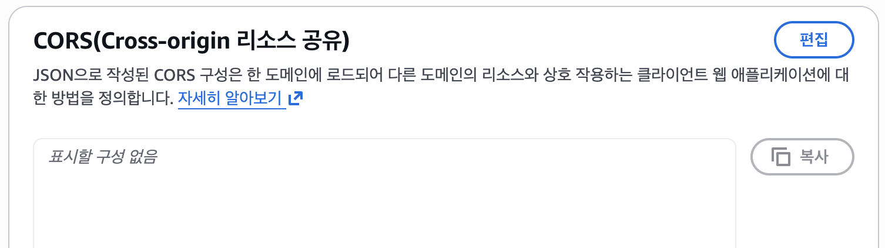

### (ケース2) デプロイ時: 外部ローカルCSS提供サーバー`http://aaronryu.github.io`におけるCORS設定

外部CSSストレージとしてGitHub Pagesを使用する場合、すでに設定がされているため、特別な設定は必要ありません。

> GitHub Pagesは、基本的にすべての公開リソースに対して`Access-Control-Allow-Origin: *`ヘッダーを提供します。

本ブログでは、Giscus用のカスタムCSSについても、SSGによって静的に生成されたブログHTML自体を`https://aaronryu.github.io`として提供しているため、CSSもこのGitHub Pagesを使用することにしました。一般的に、GitHub Pagesを通じてブログに必要なすべてのフォントやCSS、画像などのリソースを一箇所にまとめてストレージのように活用することは不自然なアプローチではありませんし、GitHub Pagesは本サーバーで提供するすべてのリソースに対して、デフォルトでCORSポリシーをすべて開放しています。それは、AWS S3のように静的ストレージとしても十分に活用可能だからです。そのため、別途CORS設定を行わなくても、外部CSSを正常に取得して使用することができます。

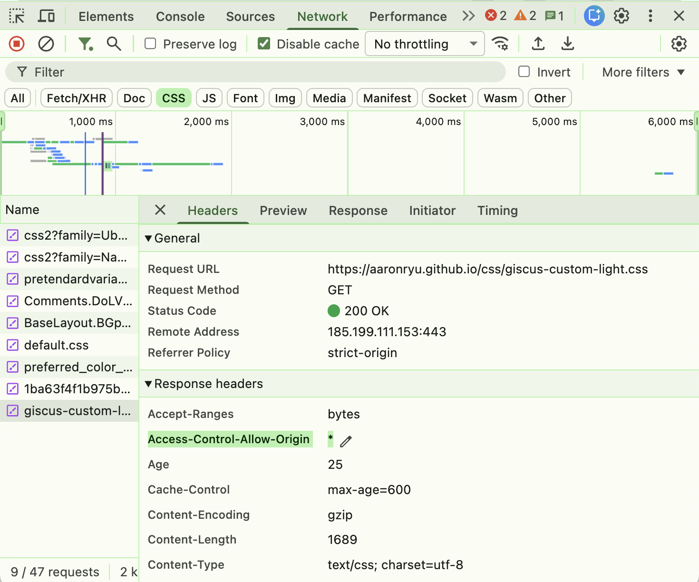

このように(ケース2)では、外部CSSを取得してくるリモートサーバーにGiscusコメントHTMLコンポーネントのオリジンである`https://giscus.app`のCORSポリシー設定を行うだけで、すべてが解決します。

しかし、(ケース2)では、`http://localhost:4321`ローカルサーバーから提供されるものは依然として2つの理由で不可能です。1つ目は、WebブラウザがHTTPSで受信したHTMLファイル内からCSSファイルをHTTPで受信しようとする試みをブロックするため、2つ目は、Webブラウザが`http://localhost:4321`のループバックアドレスまたは`http://192.168.0.7:4321`のプライベートアドレスからリソースを受信する試みをブロックするためです。

## ブラウザセキュリティポリシー 2) Mixed Content (HTTPS + HTTP)

ブラウザはSOP + CORSポリシーに従い、取得しようとしているリソースや呼び出そうとしているAPIを提供するサーバーのオリジンと、リソースを取得またはAPIを呼び出そうとしているページを取得したサーバーのオリジンが一致するかどうかを非常に慎重にチェックします。オリジンは`localhost`のようなドメインのみを意味するのではなく、`http://localhost:4321`のようにHTTP/HTTPSスキーマとポート番号までを総称する概念であるため、リソースを提供するサーバーのオリジンが`http://`で、リソースを呼び出すページのサーバーオリジンが`https://`である場合、HTTP/HTTPSスキーマが異なるためオリジンが異なると判断します。

Mixed Contentは、オリジンベースのCORSポリシーに似ていますが、それよりも少し狭い範囲のセキュリティポリシーで、`https://`ページ内から`http://`リソース(CSS、JS)を取得できないというセキュリティポリシーです。HTTPSという安全な経路で取得したHTMLページ内部で、HTTPという安全でない経路でリソース(CSS、JS)を取得しようとすると、公開CA認証を受けておらず、ハッカーが攻撃のために作成したコンテンツである可能性があり、その小さなコンテンツが全体のセキュリティを破壊する可能性があるため、許可されないのです。

- 元のブログ記事ページを取得したオリジン: `https://aaronryu.github.io`
  - その内部のGiscusコメントコンポーネントを取得したオリジン: `https://giscus.app` = **HTTPSコンテンツ**
    - (ケース1) 開発時: 外部CSSを提供するローカルサーバー `http://localhost:4321/css/giscus-custom.css`
    - = **HTTPコンテンツ** → したがって、**HTTPS**で取得したコメントHTMLから**HTTP**である外部CSSを取得することはできません。

HTTPSセキュリティポリシーの一環として、CORSが許可されていてもブロックされるため、ローカルサーバーのCSSは事実上使用不可能です。ローカル環境にあるローカルサーバーは、ローカルサーバー自身を信頼できるCA認証機関として任意に登録し、自己署名証明書を発行し、ローカルDNSにドメイン登録まで行わない限り（非常に複雑な手順）、`http://localhost:4321`にHTTPSを適用することはできないからです。

### ブラウザセキュリティポリシー 1) PNA (Private Network Access)

また、`http://localhost:4321`ローカルサーバーから外部CSSファイルを取得して使用できない理由の残りの1つは、ブラウザがHTMLページから外部リソースを呼び出す際に、`localhost`ループバックアドレスまたは`192.168.0.7`プライベートアドレスへのアクセスをブロックするポリシーです。SOP + CORSポリシーがHTMLページを取得したオリジンではない外部サーバーへのアクセスを遮断した理由は、外部サーバーに対する悪意のあるリクエスト攻撃に悪用される可能性があるためでした。このように、HTMLページを取得したオリジンではない外部サーバーへのアクセス自体が基本的に危険ですが、その外部サーバーが皆さんのローカルサーバー、あるいは会社の重要な情報を含んでいる（外部と隔離された）プライベートサーバーである場合、それはさらに危険な状況になりかねません。したがって、もしHTMLページがローカルサーバーまたはプライベートサーバーにアクセスしようとする場合、ブラウザはPNAポリシーを通じてそれを必死に阻止します。

- ブラウザは、私たちがアクセスするネットワークをセキュリティレベルに応じて大きく3つの領域に分類します。
  - **Public (公開) アドレス**: `giscus.app`, `aaronryu.github.io`, `google.com`
  - **Private (プライベート) アドレス**: `192.168.0.7`
  - **Local (ループバック) アドレス**: `localhost`, `127.0.0.1`
- ウェブブラウザはHTMLから、このうちローカルサーバーやプライベートサーバーへのアクセスをすべて根本的にブロックします。
  - PNAセキュリティの原則は、広域である公開アドレスから、狭域である下記アドレスへのアクセスをブロックすることです。
    - **Private (プライベート) アドレス**へのアクセス: `http://localhost:4321`
    - **Local (ループバック) アドレス**へのアクセス: `http://192.168.0.7:4321`

ただし、大企業などでやむを得ず外部リソースをプライベートサーバーから取得する場合があります。この場合、CORSポリシー設定と同様に、そのプライベートサーバーでPNA専用ヘッダー`Access-Control-Allow-Private-Network: true`を追加すれば、プリフライト(OPTION)リクエストを通じて確認し、問題なくリソースを取得することができます。

# ブラウザセキュリティポリシーまとめ

勘の良い読者の方は、ブラウザセキュリティポリシーを説明する際に数字が逆順になっていることに気づかれたかもしれません。これは、ブラウザが外部リソース（今回の例ではCSS）を取得する際に考慮するセキュリティポリシーが適用される順序です。

- ブラウザセキュリティポリシー
  - 1) **PNA** (Private Network Access) - ネットワークセキュリティ
    - 本HTMLページから外部リソースを取得する際に「**ローカルやプライベートネットワークにアクセスしているか？**」
  - 2) **Mixed Content** (HTTPS + HTTP) - 転送セキュリティ
    - 本HTMLページから外部リソースを取得する際に「**HTTPサーバーから取得しているか？**」
  - 3) **CORS** (Cross Origin Resource Sharing) - 例外許可
    - 本HTMLページから外部リソースを取得する際に「**サーバーが呼び出しと使用を許可しているか？**」
  - 4) **SOP** (Same Origin Policy) - 根本原則
    - 本HTMLページから外部リソースを取得する際に「**ページと異なるオリジンにアクセスしているか？**」

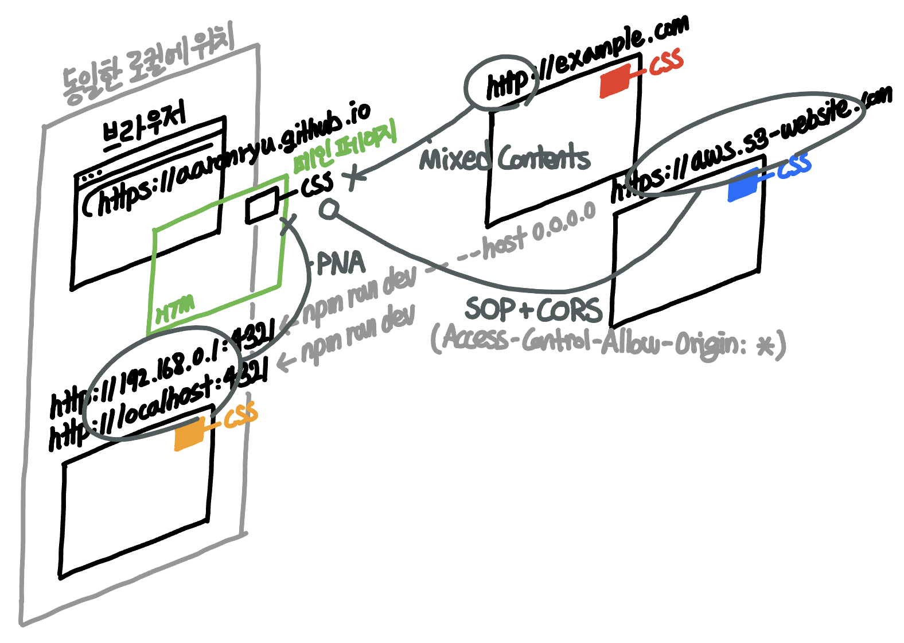

CORSはSOPポリシーの例外の扉を開く補完ポリシーと見ることができ、PNAとMixed ContentはSOPポリシーを補完する独立した追加ポリシーなのです。

# 番外編: ローカルlocalhostでもHTTPS適用とドメイン設定をする方法

## HTTPSの直接割り当てとドメイン設定

ローカルのlocalhostサーバーにHTTPSを適用するには、SSL証明書を発行する必要があります。OpenSSLを通じて、まず①**ルートCA(認証局)証明書**を作成してドメイン証明書を発行できる資格を得て、②先のルートCA証明書を基に**ドメイン証明書**に署名・発行します。しかし、これだけでは「信頼できない機関が認証したドメイン証明書」というエラーがブラウザに表示されるため、最初に発行した①**ルートCA(認証局)証明書**を、OSまたはブラウザの信頼できるルートCA証明書リストに追加するまで行う必要があります。

この手順自体が煩雑なため、`mkcert`ユーティリティを使用すると簡単です。`mkcert -install`コマンドでルートCA証明書の生成とリストへの追加を自動で行い、次に`mkcert localhost`コマンドでドメイン証明書の署名と発行も一度に手軽に行うことができます。

ドメインについては、Macユーザーの場合、ローカルDNSファイル`/etc/hosts`に`127.0.0.1`に対する希望のドメイン名を追加するだけで済みます。もちろん、Mixed Content (HTTPS + HTTP) エラーは前述のドメイン証明書の自己発行によって解決されますが、ドメイン名を割り当てても依然としてローカルまたはプライベートサーバーと認識されてブラウザでブロックされるため、PNA専用ヘッダー`Access-Control-Allow-Private-Network: true`を追加する必要があることを忘れないでください。

```jsx
export default defineConfig({
  // ...
  vite: {
    server: {
      headers: {
        "Access-Control-Allow-Origin": "*",
        "Access-Control-Allow-Methods": "GET",
        "Access-Control-Allow-Headers": "Content-Type",
        "Access-Control-Allow-Private-Network": true, // [!code highlight]
      },
    },
  },
});
```

## HTTPSの自動割り当てとドメイン割り当て

`ngrok`や`localtunnel`といったユーティリティを活用すると、外部にデプロイされているHTTPS適用済みのドメイン割り当て済みサーバーにローカルを接続し、ローカルがそのサーバーと同一のサーバーであるかのように動作させることができます。これはリバースプロキシトンネリング（Reverse Proxy Tunneling）技術を活用したものです。ローカルに`localtunnel`クライアントをインストールし、リモートの`localtunnel`サーバーにアウトバウンド接続を要求しながら、UDP Hole Punchingと類似した方法でリモート`localtunnel`サーバーと接続し、ファイアウォールを通過させておきます。これにより、外部からリモート`localtunnel`サーバーへのすべてのリクエストをローカル`localtunnel`クライアントに送信し、あたかも自分のサーバーを外部に公開しているのと同じ効果を得るのです。このように外部サーバーでリクエストを受け取り、ローカルサーバーに転送するため、これをリバースプロキシトンネリングと呼びます。