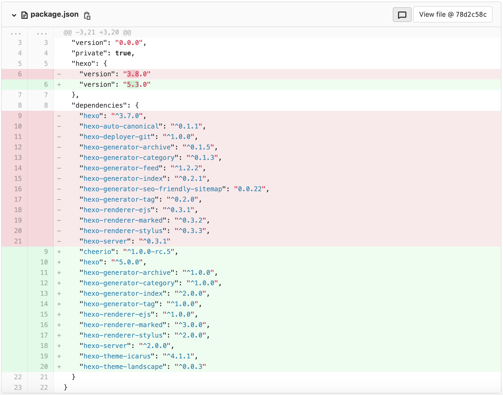
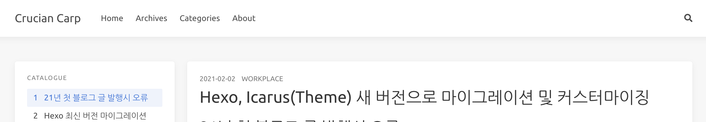
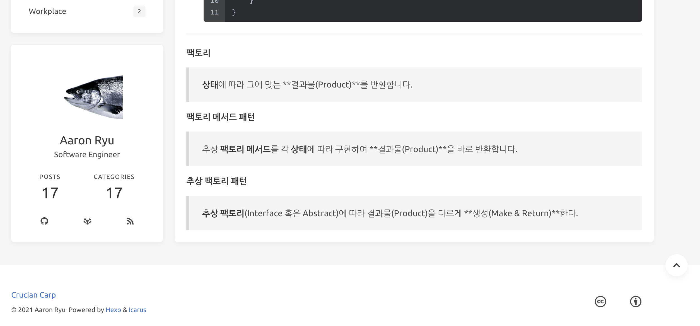

# 21年最初のブログ記事公開時のエラー

仕事を通して本当に多くのことを経験し、学びますが、時間を割いて整理しどこかに書いておかないと、すぐに忘れてしまいます。社内wikiをうまく活用していましたが、より多くの方と情報や意見を共有したいと思い、ブログに記事を再度アップしようとしました。先日経験した課題に関する記事をHexoで作成し、`hexo g -d`で公開しようとしたところ、突然エラーが発生しました。

```bash
TypeError [ERR_INVALID_ARG_TYPE]: The "mode" argument must be integer.
Received an instance of Object at copyFile
```

Googleで検索してみると、[Node.jsのバージョンをダウングレードする必要があり、Hexo 5.0.0以降のバージョンで修正されたというスレッド](https://github.com/hexojs/hexo/issues/4263)を見つけました。そういえば、昨年末に開発学習のためにライブラリやフレームワークのバージョンを一括でアップデートしていました。その中にNode.jsがバージョン15にアップデートされていたのです。Node.jsの最新バージョンをグローバルにアップデートしたため、Hexoでnpmが動作する際に衝突が発生しているようでした。

# Hexo最新バージョンへの移行

使用していたバージョンは**Hexo 3.8.0** / **Icarus 2.3.0**でしたが、確認した最新バージョンは**Hexo 5.3.0** / **Icarus 4.1.1**でした。まずHexoをバージョンアップするために、`package.json`から既存のパッケージをすべて削除し、Hexoのバージョンを5.3.0に変更しました。`npm install`を実行した後、壊れたパッケージを一つずつ追加していくのが面倒だったので、新しいディレクトリで`hexo init`を実行して自動生成された`package.json`を参照しました。



# 最新のHexoと古いIcarusの衝突

Hexoのバージョンアップ後、`hexo server`でローカルにページを表示してみたところ、Icarusテーマファイルで特定の変数が見つからないなどのエラーが頻繁に発生しました。Googleで検索すると、これもバージョン問題であることが判明しました。そこで、既存のIcarusテーマのカスタマイズ設定である`_config.yml`だけをバックアップしたまま、すべてを削除し、Icarusを最新バージョンで(1) `npm install`ではなく(2) `git submodule`を通じて（カスタマイズのために）インストールしました。再度実行すると、JSXコードだけがそのまま露出する問題が発生しましたが、JSXだったのでReact.jsだと思っていたらInferno.jsで開発されていたため、該当ライブラリをインストールして解決しました。

# Icarus JSXカスタマイズ

どんなテーマでも修正したくなる几帳面な性格のせいで、以前のIcarusテーマはEJSコードを分析して個別にカスタマイズしていました。**以前はEJSベースだったIcarusが、今はJSXベースになったため、以前のカスタマイズコードをそのまま使用することはできず、再度分析して修正する必要がありました。** フロントエンド開発をずっとReact.jsで行ってきており、Icarusの開発フレームワークであるInferno.jsもReact-likeを標榜しているため、デバッグさえできればそれほど難しくはないだろうと思っていましたし、実際その通りでした。ただし、IcarusプロジェクトがJSXに変換されたことで、過去の乱雑だったEJS構造からコンポーネント単位でモジュール化がしっかり行われたため、**ページごとにレンダリングを変える必要がある部分は、共通コンポーネントに例外条件を加える形で処理する必要がありました。** 以下のカスタマイズコードをご覧いただければご理解いただけるでしょう。

# VSCodeを使ったHexoのデバッグ

テーマを修正するためには、まずHexo、IcarusのJSXがページにどのようにレンダリングされるかを知る必要があります。ローカルでHexoのテストのために実行する`hexo server`コマンドは、`hexo-cli`に定義されているnpmスクリプトを実行したものです。テーマ設定を変更したり、記事を修正したりするとすぐにローカルページに適用されますが、これはnpmを通じて動的にレンダリングされているためです。私はIcarusテーマがどのように動作するのかを理解し、修正した自分のコードが正しく動作するかを確認するために、VSCodeを通じてデバッグを行いました。**VSCodeでのデバッグ方法は、本ブログに公開している「VSCodeでHexoをデバッグする方法」という記事で詳しく説明していますので、参考にしてください。**

## ナビゲーションバーのロゴ

最上部のナビゲーションバーには、デフォルトでロゴ画像を配置するように設定されていますが、私はブログを表現できる言葉に置き換え、フォントサイズを設定しました。



```yml:_config.icarus.yml
# Path or URL to the website's logo
logo:
    text: Crucian Carp
```

```yml:include/style/navbar.styl
.navbar-logo
    img
        max-height: $logo-height
    font-size: 1.4rem
```

## 左ウィジェット - プロフィール再設定

本ブログでは、ウェブ検索の利便性を犠牲にしても記事の構成を最もシンプルにしたかったため、タグは一切使用していません。左ウィジェットのプロフィールで、投稿数とカテゴリ数のみを表示するように、タグ数は表示しないようにコードを削除しました。



```jsx:layout/widget/profile.jsx (以下のコードをすべて削除)
<div class="level-item has-text-centered is-marginless">
    <div>
        <p class="heading">{counter.tag.title}</p>
        <a href={counter.tag.url}>
            <p class="title">{counter.tag.count}</p>
        </a>
    </div>
</div>
```

```jsx:layout/widget/profile.jsx (以下のコードをすべて削除)
tag: {
    count: tagCount,
    title: _p('common.tag', tagCount),
    url: url_for('/tags')
}
```

## 投稿上部の時間フォーマット変更

Icarusテーマはデフォルトで、投稿の上部に記事が最初に作成されてからどのくらい経過したか、更新されてからどのくらい経過したかを表示しますが、個人的には昔のNaverのようなWYSIWYGブログで表示される投稿の初回作成日を日付形式で見るのを好むため、これも変更しました。


```jsx:layout/common/article.jsx (timeをdivに変更し、Update Dateを削除)
<div class="level-left">
    {/* Creation Date */}
    {page.date && <span class="level-item" dangerouslySetInnerHTML={{
        __html: _p(`<div>${date(page.date)}</div>`)
    }}></span>}
    {/* author */}
    {page.author ? <span class="level-item"> {page.author} </span> : null}
```

## フォント変更

Hexoブログを始めたとき、すべての記事をハングルで書く予定だったので、字間がごくわずかに開いている方が可読性が良いと判断し、Hexoを使い始めて以来使用しているNanum Gothicフォントを継続して使用することにしました。

```:include/style/base.styl ('Nanum Gothic'フォントの追加と既存の未使用フォントの削除)
$family-sans-serif ?= 'Ubuntu', 'Nanum Gothic', sans-serif
$family-code ?= 'Source Code Pro', monospace, 'Microsoft YaHei'
```

## ウィジェットと投稿の幅の再設定

Icarusが提供するウィジェットには、(1)右と(2)左がありますが、両方を使用すると中央の投稿の幅が短くなり、可読性を損なう可能性があると判断しました。左ウィジェットのみを使用した場合でも、ウィジェットの幅が投稿の幅に比べて長いと感じたため、調整を行いました。

- 4（左ウィジェット）+ 8（記事）= 12


- 3（左ウィジェット）+ 9（記事）= 12


**Icarusの幅の配分は、Bulma CSSの12セルルールを使用**しています。以前は以下の通りでした。

- **4（左ウィジェット）** + 8（記事） = 12
- 8（記事）+ **4（右ウィジェット）** = 12
- **3（左ウィジェット）** + 6（記事） + **3（右ウィジェット）** = 12

本ブログでは、記事の可読性を高めるために左ウィジェットのみを使用するため、

- **3（左ウィジェット）** + 9（記事） = 12
- 9（記事）+ **3（右ウィジェット）** = 12

と、投稿の幅を8から9に、ウィジェットの幅を4から3に再定義しました。

```jsx:layout/common/widgets.jsx (ウィジェット一つの幅 4 -> 3)
function getColumnSizeClass(columnCount) {
    switch (columnCount) {
        case 2:
            return 'is-3-tablet is-3-desktop is-3-widescreen';
        case 3:
            return 'is-3-tablet is-3-desktop is-2-widescreen';
    }
    return '';
}
```

```jsx:layout/layout.js (投稿の幅 8 -> 9)
<div class="columns">
    <div class={classname({
        column: true,
        'order-2': true,
        'column-main': true,
        'is-12': columnCount === 1,
        'is-9-tablet is-9-desktop is-9-widescreen': columnCount === 2,
        'is-9-tablet is-9-desktop is-8-widescreen': columnCount === 3
    })} dangerouslySetInnerHTML={{ __html: body }}></div>
    <Widgets site={site} config={config} helper={helper} page={page} position={'left'} />
    <Widgets site={site} config={config} helper={helper} page={page} position={'right'} />
</div>
```

## Aboutページでのウィジェット、プラグインの削除

上部のナビゲーションバーから「About」をクリックすると、私に関する概要情報を確認できます。また、個人の履歴書ページも別途作成しており、Google DocsやLinkedInにアクセスしなくても、私の経歴を一目で確認できるようにしています。

旧IcarusのEJS時代には、AboutとResumeの各ページはそれぞれ独立したEJSページを持っていたため、そのページだけを修正すればよかったのですが、新しいIcarusのJSXでは、投稿のコンポーネントがAbout、Resumeなどすべてのページの基本コンポーネントとして使用されていました。そこで、特定のページでのみウィジェットとプラグインを表示しないようにフィルタリングするロジックを、静的リストを作成して導入しました。

- ウィジェットもそうですが、**buy me a coffee**がキリングポイントです。


- Aboutページは私を表現するだけで十分です。


```jsx:layout/layout.jsx (About, Resumeページ判定条件)
const isAboutPage = [ "about/index.html", "resume/index.html" ].includes(page.path);
```

```jsx:layout/layout.jsx (左右ウィジェットにAbout, Resumeページ判定条件を追加)
<Head site={site} config={config} helper={helper} page={page} />
<body class={`is-${columnCount}-column`}>
    <Navbar config={config} helper={helper} page={page} />
    <section class="section">
        <div class="container">
            <div class="columns">
                <div class={classname({
                    column: true,
                    'order-2': true,
                    'column-main': true,
                    'is-12': columnCount === 1,
                    'is-9-tablet is-9-desktop is-9-widescreen': columnCount === 2,
                    'is-9-tablet is-9-desktop is-8-widescreen': columnCount === 3
                })} dangerouslySetInnerHTML={{ __html: body }}></div>
                {!isAboutPage && <Widgets site={site} config={config} helper={helper} page={page} position={'left'} />}
                {!isAboutPage && <Widgets site={site} config={config} helper={helper} page={page} position={'right'} />}
```

```jsx:layout/common/article.jsx (About, Resumeページ判定条件)
const isAboutPage = [ "about/index.html", "resume/index.html" ].includes(page.path);
```

```jsx:layout/common/article.jsx (投稿下部のすべてのプラグインにAbout, Resumeページ判定条件を追加)
{/* Licensing block */}
{!isAboutPage && !index && article && article.licenses && Object.keys(article.licenses)
    ? <ArticleLicensing.Cacheable page={page} config={config} helper={helper} /> : null}

{/* Tags */}
{!isAboutPage && !index && page.tags && page.tags.length ? <div class="article-tags is-size-7 mb-4">
    <span class="mr-2">#</span>
    {page.tags.map(tag => {
        return <a class="link-muted mr-2" rel="tag" href={url_for(tag.path)}>{tag.name}</a>;
    })}
</div> : null}

{/* "Read more" button */}
{!isAboutPage && index && page.excerpt ? <a class="article-more button is-small is-size-7" href={`${url_for(page.link || page.path)}#more`}>{__('article.more')}</a> : null}

{/* Share button */}
{!isAboutPage && !index ? <Share config={config} page={page} helper={helper} /> : null}

{/* Donate button */}
{!isAboutPage && !index ? <Donates config={config} helper={helper} /> : null}

{/* Post navigation */}
{!isAboutPage && !index && (page.prev || page.next) ? <nav class="post-navigation mt-4 level is-mobile">

{/* Comment */}
{!isAboutPage && !index ? <Comment config={config} page={page} helper={helper} /> : null}
```

<del>今ご覧いただいているこのブログとこの記事は、</del>（現在のTPOブログの直前、2021年に作成された）ブログとこの記事は、上記の要素をすべてカスタマイズしたIcarusテーマで構成されています。数年前にHexoやIcarusを適用されたことがあり、移行を控えている方や、カスタムで修正したい方に本記事がお役に立てば幸いです。今後、CSSやJSXに細かな修正が入る可能性はありますが、すべてを個別に更新するつもりはありません。