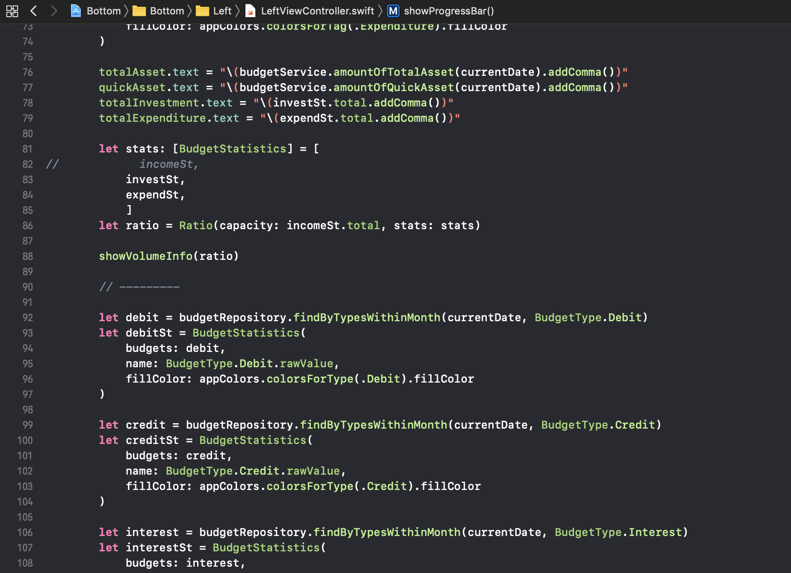

iOSは、ある意味でWebアプリケーション開発と非常に似ていると私は考えています。ただし、.NET WebFormのようにViewとControllerが密結合しており、React.jsのレンダリング（フロントエンド）ロジックとViewデータを渡すControllerを分けて考えることができません。初めてSwiftアプリを作成した際、アプリも結局ウェブページとほぼ同じモデルであるため、Webアプリケーション開発と同じ方法で開発しようとしました。MVCとMVVMに関する私の小さな経験をそのまま適用してみました。

# MVC / MVVM

従来のWebアプリケーションを作成する際、サーバー側ではController, Application, Service, Repositoryの順に分類して作業していました。HTMLとJavaScriptはViewに、JPAのようなデータレベルはModelに、Modelを活用したすべてのビジネスロジックとViewとPOST/GET通信でイベントをやり取りする中間レイヤーはControllerに該当します。WebアプリケーションにおけるMVCのControllerは、実質的にはViewModelに相当します。Viewを直接描画するのではなく、Viewを描画できるViewModelを渡し、それを処理するのはクライアントエンジン上のSingle Pageアプリケーションだからです。名前を聞けば誰もが知っているようなフロントエンドフレームワークの`.js`系が、このようなパターンを使用しています。

## iOSアプリ開発におけるMassive Controller問題

MVVMパターンをそのまま適用しようとしたところ、iOSでエラーが発生しました。**問題の核心は、`View.storyboard`と`ViewController.swift`が実質的に一つのViewであるということです。**一般的に、フロントエンドとバックエンドのコードベースがJS、Javaなどに分かれるのとは異なり、iOS SwiftではViewに関する処理をすべて`.swift`で行います。`ViewController.swift`はControllerという名前を持っていますが、実質的にはViewに該当し、`View.storyboard`はCSS/HTMLおよびRouterが含まれた概念と見なすことができます。

Swiftは本質的にはMVCパターンです。ただし、言語の特性上、WebアプリケーションのMVCとは少し区別して考える必要があるように思われます。**SwiftではControllerが事実上Viewに該当するため、レンダーに関するロジックをControllerが持つことになります。**Service、Repositoryモジュール化を適切に行っても、ControllerにはViewのレンダーロジックだけでなく、Viewのレンダーに必要なデータ操作に関する「一部の」ビジネスロジックも含まれてしまいます。**この問題をMassive Controllerと称します。**

# 初期の開発で使用したMVCパターン

MVCをそのまま適用してみた私の最初のSwiftコードは以下のようでした。Barのような様々なAssetに描画するデータ（Model）を受け取り、統計データを作成し（ビジネスロジック）、それをViewに注入して描画していました（View）。もちろんご覧のように、簡単な**UIViewであるにもかかわらず、Viewを描画するロジックだけでなく、ViewModelに関するロジックも見られます。**

# リファクタリングで使用したMVVMパターン

Controllerが大きくなると、無意識のうちに不安を感じました。コードを書いていると、これは本当に良くないという感覚を強く受けたので、リファクタリングを進めました。**これは、実質的にViewの意味を持つControllerの下に、真の意味での（…）ControllerであるViewModelを配置するということです。**形状、色、サイズに関するものはViewControllerに置き、これに必要なViewModelはViewModelControllerが提供する形です。以下の例を見ると、ViewControllerではViewModelである`mockBudgets`のみをうまく使用しています。View（Controller）とViewModel（Controller）のバインディングにはRxが使われると聞きますが、まだそこまでは適用できていません。

# 最近の開発で使用中のVIPERパターン

個人プロジェクトであるため、時間があるときに作業を進めていると、数日、数週間が経つと自分が書いたコードがまったく新しいもののように感じられることがありました。開発を進めるたび、進捗があるたびに、コードを読み直して理解するのに時間がかかるようになり、これはコードがそれぞれ具体的で明確な役割を持たないということに気づきました。もちろん、Service、Repositoryレベルのコードはうまく整理されていたので問題ありませんでしたが、Viewはいくら慣れようとしても難しいものでした。ましてや、私はSwiftを初めて学びながら最初のアプリケーションを作成しているのですから。

## VIPERパターン

**VIPERは、実のところViewModelの二重化と見なすことができます。**既存のビジネスロジックを、Viewに関連するビジネスロジックと、Modelデータレベルに近いビジネスロジック、およびロギング、ネットワークインスタンス管理という二つに細分化したものと理解すると簡単です。前者を**Presenter**、後者を**Interactor**と呼びます。これにより、3つだったコンポーネントが4つになりました。さらに、ViewController間の画面遷移のようなsegue処理を担当するRouterが追加され、合計5つのコンポーネントとなります。

私の既存のコードでは、Modelはすでにうまく整理されていたため、この部分はEntityとInteractorにすでに分離されていました。ViewModelにも可能な限りModelに関するロジックは含めないようにしていました。**従来のViewControllerに集中していたViewに関するビジネスロジックをPresenterに移管してみると、既存のViewにはViewModelロジックが多すぎたのだと気づきました。**また、画面遷移（segue）処理も従来のViewControllerが担当していましたが、これはメタ的に考えるとViewController間の移動を調整するものであるため、上位レベルのコンポーネントが管理するのが適切だと考えられました。segue移動に関して、各ViewControllerで重複して持つボイラープレートコードをどのように中央処理するかと考えていたところ、VIPERのRouterを使用すれば良いことが分かりました。

このように適用してみましたが、コンポーネントが5つもあるため、かなりの量のボイラープレートコードが必要になります。面倒でしたが、今後の生産性向上のために適用してみました。その効果はまだ分かりません。ReSwift（Redux on Swift）の概念もあるようですが、React.jsを短期間使ってみた経験では、コンポーネントはせいぜい1、2レイヤーだったので、あえてReduxを適用する必要性を感じず、学ぶ機会がありませんでした。これは後で適用することにするべきでしょう。新しいアーキテクチャパターンや、最近話題のものを適用してみるのも良いかもしれませんが、たとえ個人開発であっても、迅速にデプロイすることがより重要になるでしょう。