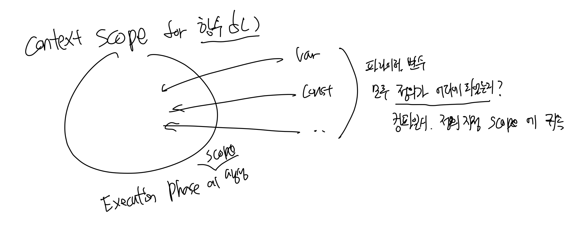

# JavaScript

JavaScriptはウェブページの3つの要素のうちの1つです。

*   **HTML**: ウェブページ（文書）のフォーマットを定義するマークアップ言語
*   **CSS**: ウェブページ（文書）のデザイン要素に関する言語
*   **JavaScript**: ウェブページ（文書）とユーザー間のインタラクションイベントに関するすべての処理

JavaScriptは、関数を宣言して呼び出すことで同期的に実行することもできますし、コールバックを通じて特定のイベント時に非同期的に実行させることも可能です。

*   1つのブラウザは、**HTML/CSSエンジン**と**JavaScriptエンジン**で構成されています。

Chrome、Internet Explorer、Safariなど、さまざまなウェブブラウザがそれぞれ独自の**HTML、CSS、JavaScriptエンジン**を搭載しています。その中でも代表的な**JavaScriptエンジン**はChromeで使われているV8であり、本稿でもV8について扱います。ちなみに、ブラウザから**JavaScriptエンジン**だけを切り離し、**非同期イベント処理ライブラリであるlibuv**と結合してサーバーとして構築したのがNode.jsです。本当にそれだけです。

## インタープリタ言語

JavaScriptはスクリプト言語であり、インタープリテーションを経るため、ブラウザのコンソールで一行一行の結果をすぐに確認できます。他のスクリプトと同様に、一つのファイルにまとめてバッチのように実行させることも可能ですが、その際は短いコンパイルの後、インタープリテーションが行われます。

*   JavaScriptは**スクリプト言語**であり、**インタープリタ言語**です。ただし、[短い**コンパイル過程**を持ちます。](https://dev.to/genta/is-javascript-a-compiled-language-20mf)

JavaScriptは.jsファイルを実行する際、まず**変数および関数宣言のみをスキャンするJIT（Just-In-Time）コンパイル過程**を経てから実行されます。JITコンパイルは、私たちがよく知るC++やJavaのようなコンパイル言語で中間コードを作成する[**AOT（Ahead-of-Time）コンパイル過程**とは異なります。](https://dev.to/deanchalk/comment/8h32) JavaScriptをインタープリタ言語として学ぶため、コンパイル段階がないと理解しがちですが、厳密にはコンパイル過程が存在します。しかし、コンパイル過程があるという事実だけでJavaScriptをコンパイル言語と呼ぶのは、[コンパイル言語の定義とは異なるため、](https://gist.github.com/kad3nce/9230211#compiler-theory)インタープリタ言語と呼ぶ方がより適切です。

### V8におけるJITコンパイル

他のプログラミング言語のコンパイルと同様に、V8エンジンもASTの生成、バイトコード変換を通じてJavaScriptをコンパイルします。加えて、繰り返し変換されるバイトコードは毎回コンパイルすると効率が低下するため、キャッシングする独自のV8コンパイラソリューションを備えています。

*   **Ignition**: パーサーによって生成されたASTをバイトコードに変換します。
*   **TurboFan**: バイトコード実行中に繰り返し実行されるバイトコード（関数）をキャッシングします。
    *   バイトコードをキャッシングすることで、不要なコンパイル時間を削減します。
        *   コンパイル時にキャッシュされたバイトコードを読み込んで参照します。
    *   プロファイラを通じて関数呼び出し回数を保存・追跡します。

ASTとバイトコードのキャッシングに関する過程は本稿の趣旨と異なるため、簡単に説明するに留めます。

# JavaScriptエンジンとランタイム

プログラミング言語の実行には、実行可能な言語への変換、メモリへのロード、実行を管理するエンジンが当然存在します。JavaScriptエンジンがJavaScriptの実行機に該当し、`setTimeout`のようにカーネルを使用するなど、豊かなJavaScript体験のために提供されるWeb APIなどを付加すると、それが私たちが使用するブラウザになります。

*   **JavaScriptエンジン**はJavaScript実行機です。
*   **JavaScriptランタイム**は、上記のJavaScriptエンジンにWeb APIなどを付随させたものです。

## JavaScriptエンジン

JavaScriptエンジンは、[2つのメモリ構成要素](https://blog.sessionstack.com/how-does-javascript-actually-work-part-1-b0bacc073cf)に分かれます。

*   **ヒープ（Heap）**: **すべての変数と関数をロード**するメモリ領域
*   **スタック（Call Stack）**: **関数実行順序に合ったポインタをロード**するメモリ領域

変数と関数はヒープにロードされ、関数の呼び出し順序はスタックにロードされて、シングルスレッドを通じて順番に実行されます。

ここで、JavaScriptのスタックは他のプログラミング言語と少し異なります。他のプログラミング言語では、関数が実行されるたびに、その関数のローカル変数、パラメータ情報などもすべてコールスタックにロードされます。関数実行に必要なコンテキストをすべて含むことから、コールスタックに格納される各関数のメモリ領域をコンテキストスコープと呼ぶこともあります。**それに対し、JavaScriptではコールスタックには関数実行順序のポインタのみをロードし、コンテキストスコープに該当する関数および変数はすべてヒープに格納します。** 賢明な方々は気づくかもしれませんが、これはすべての関数の変数がヒープという一つの空間に区別なく集まることを意味し、ホイスティングとクロージャという概念が発生する概念的な起点に該当します。

## JavaScriptランタイム

JavaScriptといえば、非同期処理について耳にタコができるほど聞きますが、シングルスレッドがいったいどのように非同期処理を行うのでしょうか？「非同期実行」と「非同期結果の格納」、そして「それを現在のシングルスレッドに持ってくる」のを助ける3つの要素が、以下で説明するJavaScriptランタイムに含まれているからです。

JavaScriptランタイムは、JavaScriptエンジンに以下の3つの構成要素が追加されます。

*   **Web API**: JavaScriptにはないDOM、Ajax、setTimeoutなどの[ライブラリ関数](https://developer.mozilla.com/ko/docs/Web/API)。
    *   ブラウザやOSなどでC++など多様な言語で実装され提供されます。
*   **コールバックキュー（Callback Queue）**: 上記Web APIで発生した**コールバック関数**がここに次々と格納されます。
*   **イベントループ（Event Loop）**: 上記コールバックキューに格納された関数をエンジンのスタックに一つずつ移して実行されるようにするスレッドです。

# JavaScriptエンジンの実行プロセス

JavaScriptエンジンは、「JITコンパイル過程」と「実行過程」の2つに分かれてコードを実行します。これまでに読んだり学んだりした内容に基づいて、[JavaScriptコードがエンジン内でどのように実行されるか](https://www.youtube.com/watch?v=QyUFheng6J0&t=435s&ab_channel=HasgeekTV)を見ていきましょう。上で説明した用語を使用しますので、用語の理解が不十分な場合は、再度上の内容を確認してください。

## コンパイルフェーズ（Compilation Phase）

コンパイルフェーズをわかりやすく言うと、**ヒープにロードする過程**と言えるでしょう。ヒープは先に説明した通り、関数実行に必要な内部のパラメータ、変数、関数を（スタックにロードする言語とは異なり）JavaScriptエンジンがロードする場所です。JavaScript実行時にどれほど多くの関数が定義され呼び出されるのでしょうか、**その多くの関数のパラメータや関数内の変数が「一つのヒープ」に保存される**のでしょうか？では、どのように区別するのでしょうか？

関数が実行される時（後で学ぶ実行フェーズ）、その関数に対するスコープが生成され、関数パラメータおよび関数内変数はこのスコープにコンパイル段階（Compilation Phase）で定義およびロードされます。パラメータ、変数のスコープはすべてコンパイル段階で定義されるため、後に学ぶレキシカルスコープと呼ばれます。

*   **コンパイルフェーズ**では、**変数宣言**および**関数宣言**のみが**ヒープにロード**されます。

以下のJavaScriptファイルを例に、コンパイル過程を調べてみましょう。

```javascript
var a = 2;
b = 1;

function f(z) {
  b = 3;
  c = 4;
  var d = 6;
  e = 1;

  function g() {
    var e = 0;
    d = 3 * d;
    return d;
  }

  return g();
  var e;
}

f(1);
```

1.  JavaScriptの初回実行のために、`main()`関数の**グローバルスコープ（window）領域をヒープに生成**します。

JavaScriptを実行すると、**最初に実行される関数は`main()`**であり、**`window`と呼ばれるグローバルスコープをヒープに作成することから始まります**。`window`をグローバル変数の定義に使用した記憶があるでしょう。それが可能なのは、これ自体がグローバルスコープだからです。今後、ヒープにロードされるスコープ領域は以下のように表現します。

```
# Global Scope (window)
-
-
```

次に、生成された**グローバルスコープ（window）領域のヒープ**に、**変数、関数宣言をロード**します。

2.  `var a`は**変数宣言**なので、**グローバルスコープ（window）**領域に`a`をロードします。
3.  `b = 1`は**変数代入**なので、ヒープ（スコープ）にはロードしません。

```
# Global Scope (window)
- a =                                           <-- var a = 2;
-
```

4.  `function f(z)`は**関数宣言**なので、**グローバルスコープ（window）**領域に`f`をロードします。
    *   関数ロード時には、**f関数のバイトコード（blob）へのポインタ値**を一緒にロードします。

```
# Global Scope (window)
- a =
- f = a pointer on f functions bytecode        <-- function f(z) {
```

JavaScriptで最初に実行される`main()`関数のコンパイルフェーズはこれで終了です。この関数（`main()`）のコンパイルフェーズが終了すると、すぐにその関数の最初の行に戻り、これまでにロードしたスコープヒープを用いて、実行フェーズ、つまり関数実行を行います。

## 実行フェーズ（Execution Phase）

*   **実行フェーズ**では、**ヒープにロードされた変数に値を代入**し、**関数を実行**します。

先行する**コンパイルフェーズ**では**変数、関数宣言**のみが行われましたが、この過程では**変数代入**が行われます。つまり、以前に**変数宣言**がどこで行われたかを探し、見つけた宣言に値を代入するという意味です。では、もし**変数宣言**が見つからなかったらどうなるでしょうか？

### スコープチェーン（Scope Chain）

代入しようとする**変数に対する宣言**が、自分（関数）のスコープヒープで見つからなかった場合、以下の手順を踏みます。

*   自分を呼び出した**親関数のスコープ**から探します。
*   そこにもなければ、**親の親のスコープ**など、自分を呼び出した祖父母（？）たちを遡って探し続けます。
*   最終的にJavaScriptの初回実行関数である`main()`のグローバルスコープにまで到達して探します。

**この過程を、変数宣言の存在を連鎖的にスコープで探すという意味で、スコープチェーンと呼びます。** そうして探し回ってもグローバルスコープヒープにまで存在しなかった場合、**グローバルスコープヒープに新しい変数を宣言すると同時に代入**することになります。結局、グローバル変数となるわけです。

---

引き続き、実行フェーズの過程を例で説明します。

```
# Global Scope (window)
- a =
- f = a pointer for f functions bytecode
```

5.  `a = 2`は**変数代入**なので、`a`変数を探して代入します。
    *   **グローバルスコープ（window）**領域に変数`a`が存在します。

```
# Global Scope (window)
- a = 2                                         <-- var a = 2;
- f = a pointer for f functions bytecode
```

6.  `b = 1`は**変数代入**なので、`b`変数を探して代入します。
    *   **グローバルスコープ（window）**領域に変数`b`は存在しません。
        *   そのため、新たに`b`変数を宣言すると同時に`1`を代入します。

```
# Global Scope (window)
- a = 2
- f = a pointer for f functions bytecode
- b = 1                                         <-- b = 1;
```

7.  `f(1)`は**関数呼び出し**なので、`f()`宣言の有無を確認して実行します。
    *   **グローバルスコープ（window）**領域に関数`f()`が存在します。
        *   `f()`関数の実行のためには、再びコンパイルフェーズおよび実行フェーズが必要となるため、
            *   ヒープに`f()`のための**新しいローカル実行スコープ**領域を生成します。
            *   スコープチェーンのために、必ず自分を呼び出した親関数のスコープへのポインタを持ちます。
                *   `(hidden) A pointer for previous scope`

```
# Global Scope (window)
- a = 2
- f = a pointer for f functions bytecode
- b = 1

# Local Execution Scope for f()                 <-- f(1);
+ (hidden) A pointer for previous scope (= Global Scope (window))
-
-
```

8.  `f(1)`関数実行時、新たに生成された**ローカル実行スコープ**に
    *   再び**コンパイルフェーズ**過程を通じて変数、関数宣言をロードすると、以下のようになります。

```
# Global Scope (window)
- a = 2
- f = a pointer for f functions bytecode
- b = 1

# Local Execution Scope for function f()
+ (hidden) a pointer for previous scope (= Global Scope (window))
- z =
- d =
- e =
```

9.  `f(1)`の**実行フェーズ**過程を終えると
    *   以下のように変数代入および関数`g()`に対するもう一つの**ローカル実行スコープ**が生成されます。

```
# Global Scope (window)
- a = 2
- f = a pointer for f functions bytecode
- b = 3

# Local Execution Scope for function f()
+ (hidden) a pointer for previous scope (= Global Scope (window))
- z = 1
- d = 6
- e = 1
- c = 4

# Local Execution Scope for function g()
+ (hidden) a pointer for previous scope (= Local Execution Scope for function f())
- e =
```

`g()`関数からは、読者自身で書いてみて復習することをおすすめします。（決して面倒だからではありません。）

# JavaScript変数の特性

実は、JavaScriptエンジンの実行プロセスを学んだ理由は、プロセス自体を理解するためでもありましたが、以下の内容を説明するための準備でもありました。JavaScriptエンジンの動作によってJavaScript特有のいくつかの特性が生まれましたが、すべて見ていきましょう。

## レキシカルスコープ（Lexical Scope）

プログラミング言語は、変数スコープがいつ定義されるかによってスコープの名称が異なります。コンパイル時点であれば**「静的スコープ（Static Scope）」**、ランタイム時点であれば**「動的スコープ（Dynamic Scope）」**と呼びます。JavaScriptでは、パラメータ、変数ともに**定義される時**、その位置する関数のスコープに**コンパイル段階**（原文にあった「実行フェーズ」は誤記と思われる）で帰属するため、**「レキシカルスコープ（Lexical Scope）」**とも呼ばれます。[レキシカルの意味は何かを作る、作る時点を指し、パラメータ、変数、関数すべてが作られる時、すなわち定義される時にスコープに従うという点でレキシカルスコープと呼ばれます。](https://www.freecodecamp.org/news/javascript-lexical-scope-tutorial/) したがって、レキシカルスコープは静的スコープと表現することもできます。

以下の例を見ると、関数`b()`と変数`var num = 1;`は、同一の`main()`関数のスコープである**グローバルスコープ（window）で定義されます**。そのため、関数`b()`はいつでも変数`var num = 1;`にアクセスできるのです。

```javascript
var num = 1;

function b() {
  console.log(num);
}

b();
```

上記の例は理解しやすいですが、以下の例は単に一つの関数を追加しただけにもかかわらず、一瞬思考停止に陥ることがあります。

```javascript
var num = 1;

function a() {
  var num = 10;
  b();
}

function b() {
  console.log(num);
}

a();
```

`a()`の実行結果は`10`ではなく`1`です。理由は、`function b()`が

*   **「どこで呼び出されたか」＝「ランタイム」**時点が重要なのではなく、
*   **「どこで定義されたか」＝「コンパイル（レキシカル）」**時点が重要であることを想起すれば

グローバルスコープで定義された関数`b()`は、グローバルスコープで定義された`var num = 1;`を参照することになります。一般的に普遍的なプログラミング言語では、ランタイム時のスコープを考えて`10`だと勘違いしがちなのです。

## 変数シャドーイング（Variable Shadowing）

レキシカルスコープは自然と、もし**同じ名称の変数**が定義されていたとしても、最も近い関数のスコープ（`Local Execution Scope for function`）のみを使用し、現在関数を呼び出した以前の関数に定義されている**同じ名称の変数**は無視されます。探している変数が近い関数スコープに存在すれば、わざわざスコープチェーンを行う必要がなく、これは最も近い関数スコープの変数以外のものは知る必要もなく、知らせることもないという意味で、**変数シャドーイング（Variable Shadowing）**と呼ばれます。

## ホイスティング（Hoisting）: 変数、関数

**コンパイル段階**で**変数、関数宣言**を先に行い、次に**実行段階**で**変数代入および関数実行**を行うため、変数宣言が変数代入時点よりも下に位置したり、関数宣言部が関数呼び出し部よりも下に位置したりしても、とにかく**変数、関数宣言が先に行われた**のでエラーなく正常に処理されます。**変数、関数宣言**がどこで行われようと関係なく、すべて上部に持ち上げられた状態で動作します。という意味で、これを**ホイスティング（Hoisting）**と呼びます。

```javascript
console.dir(exampleV); // output: undefined
// → 「変数宣言」はされていますが、その時点では値が代入されていません。
console.dir(exampleF); // output: f exampleF(x)
console.log(exampleF(2)); // output: 2

var exampleV = 1;
function exampleF(x) {
  return x;
}
```

関数を定義する方法は「関数宣言文」と「関数式」に分かれますが、コンパイル過程を正しく理解していれば、どの定義方式にホイスティングが適用され、どちらには適用されないかを知ることができます。

```javascript
console.dir(functionDeclare); // output: f functionDeclare(x)
console.dir(functionExpression); // output: undefined
// → 「変数定義」はされていますが、その時点では関数が代入されていません。

function functionDeclare(x) {
  return x;
} // 関数宣言文
var functionExpression = function (x) {
  return x;
}; // 関数式
```

「関数式」の場合、コンパイル過程で`var functionExpression`変数のみが宣言されるため、関数は`undefined`となります。

### ブロックスコープ（Block Scope）: const, let

これまでの1) レキシカルスコープと2) ホイスティングは、私たちが一般的に考える方式とは異なるため、間違いやすい点が多かったです。

1.  関数レベルスコープ（レキシカルスコープ + スコープチェーン）= 関数外部で宣言したすべての変数にアクセス可能です。

```javascript
var a = 1;

if (true) {
  var a = 2;
}

console.log(a); // 2 - window関数に該当する変数の汚染（まるでグローバル変数のように）
```

2.  ホイスティング = 宣言（declare）のみがホイスティングされるだけで、代入（assignment）が行われていない場合は`undefined`が発生します。
3.  重複宣言可能 = `var`は`var hello = 1; var hello = 2;`のように重複宣言が可能です。1番、2番とこの特性が組み合わさると、本当に頭が痛くなってしまいます。

この絶望的な世界から私たちの脳を救い出すために、金字塔のように降りてきたES6の変数キーワードが、`const`と`let`です。`const`、`let`で定義された変数は、従来の関数単位のスコープではなく、ブロックスコープとして定義されます。これはつまり

1.  ブロックレベルスコープ = ブロック内の変数のみにアクセスし、他のスコープの変数を汚染しません。

```javascript
let b = 1;

if (true) {
  let b = 2;
}

console.log(b); // 1 - let変数はif-block内でのみ有効です。ブロック外の変数を汚染しません。
```

2.  ホイスティングなし（No Hoisting） = 宣言はされているが代入されていないという意味の`undefined`は表示されず、`Uncaught ReferenceError: ... is not defined`という宣言自体が行われていないことに対するエラーが発生します。
3.  重複宣言不可能 = 重複宣言を試みると`Uncaught SyntaxError: Identifier ... has already been declared`エラーが発生します。

`const`、`let`の登場により、`if`文や`for`文のようなブロックレベル（`{}`）単位での変数定義・使用が可能になりました。他の何も汚染しません。

## ガーベージコレクション（Garbage Collection）



JavaScriptでは、新しい関数が呼び出されるたびにヒープに関数単位のコンテキストスコープが生成されることが、もう頭に叩き込まれていることでしょう。コンテキストスコープは関数呼び出しの間のみ有効であり、その関数の呼び出しが終了すれば、その関数のスコープはヒープから削除されます。これをメモリクリーンアップの意味でガーベージコレクションと呼びます。JavaScriptファイルの実行がすべて終わると、最初に呼び出された`main()`関数も終了し、これに伴いグローバルスコープ（Window）も消滅します。このように、**JavaScriptは単純に関数（ポインタ）の到達可能性（Reachability）に基づいてガーベージコレクションを実行します。** SwiftやJavaが参照カウント戦略によるガーベージコレクションを実行するのと異なり、マークアンドスイープという単純な戦略を採用していることだけを知っていれば十分です。

## クロージャ（Closure）

Java言語では、クラスを通じて変数を`private`で宣言し、カプセル化（Encapsulation）を実現します。外部からクラス内の変数へのアクセスを禁じ、変数の変更はすべて`public`で公開された関数を通じてのみ可能にします。オブジェクト指向プログラミング（OOP）だけでなく、ドメイン駆動設計（DDD）における必須概念がカプセル化ですが、残念ながらJavaScriptのクラスはJavaのクラスと異なり、カプセル化をサポートしていません。もちろん、`_`プレフィックスが付いた変数を暗黙的にプライベート変数と判断する慣習がありましたが、結局オブジェクトをコンソールに出力するとすべて見えてしまうため意味がありません。また、最近のJavaScriptではクラス変数の前に`#`プレフィックスを付けると疑似的なプライベートのように動作することが分かりましたが、[`#変数名`として変数が定義される](http://www.gisdeveloper.co.kr/?p=11697)ため、これも`Object.getOwnPropertySymbols()`を通じてすべて見えてしまい、根本的な解決策ではありません。

この点、JavaScriptではクロージャを使用すれば解決できます。関数が定義されるスコープによって、その関数が参照できる変数が決定されるレキシカルスコープを活用し、「関数の定義」自体を返せばよいのです。これにより、カプセル化を実現できます。まずカプセル化を説明する前に、クロージャをどのように定義するのかについて見ていきましょう。

```javascript
var closureTest = function () {
  return function () {
    console.log("This is innerFunction.");
  };
};
```

あるいは

```javascript
var closureTest = function () {
  function innerFunction() {
    console.log("This is innerFunction.");
  }
  return innerFunction;
};
```

このように関数の定義を返す方式をクロージャと呼びます。

関数が定義されるレキシカルスコープで定義された変数は、その定義された関数からアクセス可能です。という点を活用し、プライベートにしたい変数をクロージャ関数定義の内部に定義すればよいのです。これを通じてカプセル化を実現できます。

```javascript
var closureTest = function () {
  var cannotBeAccessedFromOuter = "This is innerFunction.";

  return function () {
    console.log(cannotBeAccessedFromOuter);
  };
};

var closure = closureTest();
closure(); // output: This is innerFunction.
console.log(closure.cannotBeAccessedFromOuter); // output: undefined
```

プライベート変数は「非公開変数」とも呼ばれます。上記の例は非公開変数が固定値でしたが、これを変更可能な状態として定義することもできます。Javaのオブジェクト指向プログラミングに忠実な方式のコード作成技法です。また、追加で関数を**一つ**だけでなく**複数**定義してみましょう。クロージャの説明で本当に数えきれないほど引用されるカウンター関数を定義してみます。クロージャは常に関数を返すものと思われがちですが、以下のようにオブジェクトを返すこともできます。

```javascript
var counter = function () {
  var count = 0;

  return {
    increase: function (number) { // numberパラメータを追加
      count += number;
    },
    decrease: function (number) { // numberパラメータを追加
      count -= number;
    },
    show: function () {
      console.log(count);
    },
  };
};

var counterClosure = counter();
counterClosure.increase(1);
counterClosure.show(); // output: 1
counterClosure.decrease(1);
counterClosure.show(); // output: 0
```

`counterClosure`内の`count`プライベート変数を変更できる方法は関数を呼び出す方法しかなく、見るためにも関数を通じてのみ見ることができます。これはつまり、`count`変数が`increase()`、`decrease()`、`show()`関数を通せばどこからでもアクセス可能であるという意味でもあります。これはすなわち、`count`変数の**到達可能性（Reachability）**は常に開かれており、JavaScriptエンジンが**ガーベージコレクション（Garbage Collection）**をいつ実行すべきか全く分からないという意味でもあります。

したがって、`counterClosure`オブジェクトは、実行がすべて終わってもメモリから削除されません。`count`変数がいつでも使用できる状態にあるということは、`count`変数が`counter`関数内に存在しますが、グローバルに参照されているという意味でもあります。これにより、`counter`関数が定義されたグローバルスコープが閉じられるまでは存在し続け、メモリリークが発生することになります。

**クロージャ**は、このように**ガーベージコレクション**されないという致命的な欠点を持っていますが、解決のためには[**ガーベージコレクション**されるようにするには、`counterClosure`変数に`null`値を代入して、変数と関数双方への参照を削除（到達可能性を削除）](https://dkje.github.io/2020/09/18/Closure/)すればよいでしょう。

```javascript
counterClosure = null;
```

他の方法としては、再利用性のない関数の場合はIIFE（Immediately Invoked Function Expression）を使用すればよいでしょう。

```javascript
(function hello() { ... })();
```

```javascript
(function makePrivateFunc() {
  const message = "private data";
  const privateFunc = function () {
    console.log(`${message} can also be implemented through the IIFE`);
  };
  privateFunc();
})();
```

---

このように、JavaScriptエンジンの動作は「コンパイル - 実行」の2つの過程で成り立っていること、そして関数の実行（コンテキストスコープ）と変数の定義（レキシカルスコープ）について簡単に見てきました。さらに詳細に入ると限りなく複雑になりますが、ウェブアプリケーション開発者としては、これらの概念を知っていれば実開発や面接で大きな問題はないだろうと思います。

---

1.  [let, const の違い](https://poiemaweb.com/es6-block-scope)
2.  [var, let, const の違い ⏤ 変数宣言と代入、ホイスティング、スコープ](https://www.howdy-mj.me/javascript/var-let-const/)
3.  [関数のスコープ(Scope)](https://www.zerocho.com/category/JavaScript/post/5740531574288ebc5f2ba97e)
4.  [JavaScript VM internals, EventLoop, Async and ScopeChains](https://youtu.be/QyUFheng6J0)