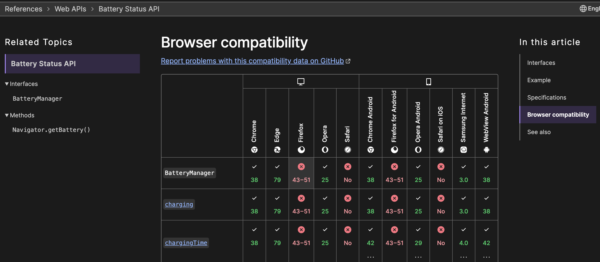
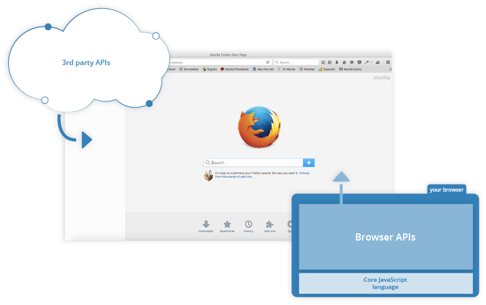
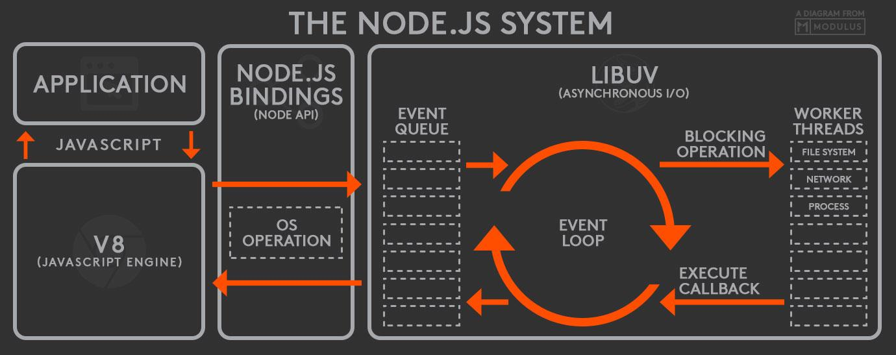

# JavaScriptエンジン

JavaScriptは当初、ウェブブラウザで動的な要素やユーザーエクスペリエンス向上のために登場しました。他のプログラミング言語と同様に、**JavaScriptも実行のためにはインタープリターエンジンを必要**とします。私たちはウェブを閲覧するためにウェブページを表示するブラウザを使用し、ブラウザはウェブを私たちの画面に表示するまでに、独自のHTMLおよびCSSレンダリングエンジンと**JavaScriptエンジン**を内蔵しています。IE、Safari、Chromeなど、さまざまなブラウザはそれぞれ異なる**JavaScriptエンジン**を持っています。その中でも、筆者が主に利用する**Chromeブラウザ（フロントエンド）はV8 JavaScriptエンジンを使用**しており、JavaScriptをサーバーとして活用しようという試みから、**V8 JavaScriptエンジンを使用したNode.jsサーバー（バックエンド）が登場**しました。これにより、V8エンジンはフロントエンド、バックエンドのどちらでも使用される非常に有名なエンジンとなりました。

# JavaScriptランタイム（環境）

同じV8 JavaScriptエンジンを使用しているにもかかわらず、一方は<b>ブラウザ（フロントエンド）</b>で使われ、もう一方は<b>Node.jsサーバー（バックエンド）</b>で使われます。ブラウザもNode.jsも、JavaScriptを駆動言語とする小さな仮想マシンと考えるとよいでしょう。「Environment」は仮想マシンを意味し、「JavaScript Runtime」はJavaScriptを駆動言語として使用することを意味します。これらを合わせて、私たちは**ブラウザ**や**Node.js**を**JavaScriptランタイム環境（Javascript Runtime Environment）**と呼びます。余談ですが、Java開発者はJavaベースのソフトウェアを実行するためにJREというものをインストールしますが、これはJava駆動のためのJava Runtime Environmentの略です。JDK（Java Development Kit）は、デバッグのためにJavaを駆動させるJREと、Java開発に必要なツール類を含むパッケージです。

前述したように、JavaScriptランタイム環境には私たちが簡単に接する2つの種類があります。

-   **ブラウザ（フロントエンド）**
-   **Node.js（バックエンド）**

JavaScriptランタイム環境は大きく2つの要素で構成されます。1つ目は当然、**JavaScript実行（JavaScript Runtime）のための(1) JavaScriptエンジン**が必要であり、2つ目は**ブラウザやNode.js環境を構成し操作を助ける(2) API**が存在します。私たちが普段使うコンピューターのオペレーティングシステム（OS）もAPIであり、CPU、ディスク、メモリ、ファイルおよびネットワークI/Oなどのリソースを活用するために、カーネルという名称のAPIを提供しているのです。

<b>ブラウザ（フロントエンド）</b>と**Node.js（バックエンド）**の順で、構成上の共通点と相違点が何であるか、簡単に見ていきましょう。

## ブラウザ（フロントエンド）

1.  **エンジン** = JavaScriptエンジン (**V8**)
2.  **API** = ブラウザAPI (**Web API**)

ブラウザはこのように構成されています。ブラウザは、ウェブページとユーザー間の相互作用（イベント）処理のために様々なリソースを提供します。ブラウザのリソースには、**並列タスクを実行するためのWorker Thread（Web Worker & Service Worker）**、**データ保存のためのCookieやStorage（LocalStorage & SessionStorage）**などがあり、これらのリソースを活用して、**描画や画像処理のためのCanvas API**、**外部3rd Party API呼び出し（Fetch API）**や簡単な**setTimeout**などが利用できます。MDNドキュメントには非常に多くのAPIが記載されていますが、[主要なものは概ね以下の通りに分類](https://www.educative.io/answers/what-are-browser-apis)できるでしょう。

-   Fetch API
-   DOM API
-   Web Storage API
-   Canvas API
-   Geolocation API

これらはすべてブラウザが**Web API**として提供するものであり、ブラウザごとに実装が少しずつ異なります。そのため、**特定のAPIが特定のブラウザで動作しない場合もあります。**

## Node.js（バックエンド）

1.  **エンジン** = JavaScriptエンジン (**V8**)
2.  **API** = **Node API + libuv**（非同期I/Oライブラリ）
    -   構成: **イベントキュー & イベントループ & ワーカースレッド**
    -   非同期（ネットワーク、ソケットタスク）はOSが提供する**システムAPI**を利用。
    -   ファイルI/Oは**スレッドプール**を利用。
        -   ファイルの場合、OSごとにシステムAPIが存在するが、抽象化の違いによりスレッドプールを使用。

Node.jsはこのように構成されています。V8 JavaScriptエンジンはシングルスレッドで有名ですが、ではブラウザとNode.jsでの非同期処理はどのように行われるのでしょうか？ V8 JavaScriptエンジンがシングルスレッドであるとは、JavaScriptコードを実行する際にStack、Heap、Queueを持ち、シングルスレッドで一行ずつ処理を実行するという意味です。**非同期処理は、ブラウザの場合はWeb APIを活用し、Node.jsの場合はlibuvという非同期ライブラリを活用して処理します。**

libuvは、多数のユーザーリクエストをフロントエンドのイベントキューで受け取り、イベントループというシングルスレッドがイベントキューのリクエストを一つずつ取り出し、バックエンドのワーカースレッドプールに渡して詳細な処理を依頼します。そのため、数千、数万のユーザーリクエストが一度に集中しても、イベントキューに蓄積し、イベントループが非常に高速でワーカースレッドプールに処理を依頼することで、サーバーとして十分にその役割を果たすことができるのです。

シングルスレッド（イベントキュー＆ループ）とマルチスレッド（ワーカースレッドプール）の美しい協調作業と言えるかもしれません。libuvの非同期処理はKernel（システムAPI）を使用するため、性能面でも非常に優れており、ブラウザよりもサーバーに適合するようにJavaScriptを活用できます。Node.jsサーバーというJavaScriptランタイム環境は、その後、ウェブサーバー界において軽量で高速、拡張性の高いものとして絶大な支持を得ています。今やDenoやBunといった新しいJavaScriptランタイム環境の登場により、Node.jsが「おじいちゃん」扱いされることになるのか、今後の動向が注目されます。