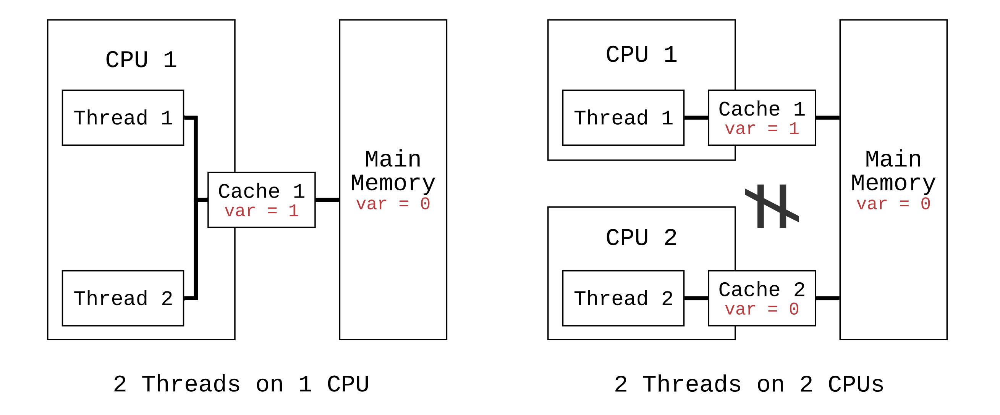

コードを書いていると、**変数**や**メソッド**を**たった一つだけ生成してあらゆる場所で共有**したい場合があります。これには、クラス内に静的変数/メソッドを定義して使用する方法と、シングルトンオブジェクトを一つだけ生成する方法があります。

# 静的変数とメソッド

まず、オブジェクトの初期化なしに、該当クラスの静的変数と静的メソッドを使用する方法です。これは、動的な部分のヒープ領域ではなく静的領域にロードすることで実現され、プログラム内のすべてのスレッドが単一の変数とメソッドにアクセスできるようになります。ヒープ領域と静的領域の違いは、以下で理解できます。

## Java、JVMメモリ

JavaはJVM上でプログラムを動作させます。JVMのMはMachineを意味するように、小さなOSに該当し、ガベージコレクションのような独自のメモリ管理体系を持っています。メモリ領域は以下の3つに分けられます。

-   **変化しない値**を格納する**<u>静的領域</u>** （これを指す用語は以下の合計3つ）
    -   変化しない値を格納するという意味で**静的領域**とも呼ばれ
    -   オブジェクト化される前のクラスそのものを格納するという意味で**クラス領域**とも呼ばれ (クラスロード)
    -   オブジェクト化される前のクラスの関数を格納するという意味で**メソッド領域**とも呼ばれます。
-   **変化する値**を格納する<b><u>ヒープ領域</u></b>と<b><u>スタック領域</u></b>
    -   **<u>スタック領域</u>**: 関数内の「パラメータ」や「ローカル変数」のように、その関数ブロック内のみで生存する変数を保存
    -   **<u>ヒープ領域</u>**: オブジェクトを保存

オブジェクト生成の最も根幹となるクラスは、バイトコード形式で静的領域にロードされます。そのクラスをオブジェクト化するたびに、そのオブジェクトとオブジェクトの変数、メソッドは上記のクラスバイトコードを参照して生成された後、ヒープ領域にロードされます。**静的変数およびメソッドは、オブジェクトなしでクラスに存在するものであるため、静的領域に保存されます。**

静的領域へのクラスロードおよびオブジェクト生成を担当するものを**クラスローダー**と呼びますが、このローダーをカスタム変更しない限り、通常JVM上には一つだけ存在します。これは、もし二つのクラスローダーを持つように変更した場合、静的変数がそれぞれのクラスローダーの静的領域にロードされるという意味です。

# シングルトンパターン

これまで学んだ静的変数およびメソッドは次のように整理でき、シングルトンとの違いに基づいて理解すると良いでしょう。

## 静的変数とメソッド

-   **静的領域**に生成される**クラス変数、メソッド**
-   プログラムの開始と同時にクラスローダーによってバイトコード形式で**静的領域**メモリに直接ロードされます。

```java
class Calculator {
  // * Public: Can be initialized from outer
  public Calculator() {} // 原文のCaculatorをCalculatorに修正
  // * Static: sum(a, b)
  public static int sum(Integer a, Integer b) { // 原文のInteger a, Integer aをInteger a, Integer bに修正。戻り値のintを追加
    return a + b;
  }
}
```

## シングルトン変数とメソッド = 単一オブジェクト

-   **ヒープ領域**に生成される**オブジェクト変数、メソッド**
-   プログラム実行中に必要なその時点でオブジェクトとして**ヒープ領域**にロードされます。
    -   必要なその時点でオブジェクトとしてロードすることを**遅延ロード(Lazy Loading)**と呼び、これが事実上シングルトンパターンの存在意義です。
    -   長期間使用されない場合は、その後GCによって解放されます。

```java
class Calculator {
  // * Private: Cannot be initialized from outer
  private Calculator() {} // 原文のCaculatorをCalculatorに修正
  // * Non-Static: sum(a, b)
  public int sum(Integer a, Integer b) { // 原文のInteger a, Integer aをInteger a, Integer bに修正。戻り値のintを追加
    return a + b;
  }

  // * Singleton: Can be initialized only once using getInstance()
  private static Calculator uniqueInstance;
  public static Calculator getInstance() {
    if (uniqueInstance == null) {
      uniqueInstance = new Calculator();
    }
    return uniqueInstance;
  }
}
```

シングルトンは一見単純な概念ですが、問題は、オブジェクトが既に存在するかどうかを判断する`getInstance()`関数に多数のスレッドが同時にアクセスした場合、各スレッドがオブジェクトがまだ生成されていないと独立して判断し、複数のオブジェクトを生成してしまう可能性がある点です。つまり、シングルトンオブジェクトが複数生成/存在してしまう可能性があるということです。

このような致命的な問題にもかかわらず、現場でこれについてそれほど深く考慮されない理由は、シングルトンオブジェクトが内部変数/状態値を持たず、上記の`Calculator`の例のようにパラメータを受け取って適切に処理するものがほとんどであるため、たとえシングルトンオブジェクトが複数生成/存在したとしても、大きな問題になることが少ないためです。

しかし、シングルトンオブジェクトが独自の状態値を持つ場合は話が異なります。二つのシングルトンオブジェクトをそれぞれ異なるスレッドが見ていると、全く異なる状態を参照するという恐ろしい状況が発生します。多数が単一のリソースにアクセスする状態を競合状態と呼び、英語では**Race Condition**と呼びます。これの解決には、「さあ、ゆっくり一人ずつ入ってください」という**ロック(Lock)**を適用する必要があります。もちろん、性能低下はおまけです。

# レースコンディション

Javaのオブジェクト、変数、メソッドはすべて基本的にノンブロッキングであるため、前述のように、多数のスレッドが単一のシングルトンオブジェクトに同時にアクセスした場合、**各スレッドで一貫性のない状態を読み取ってしまう問題が発生します。**

シングルトンの例で使用された`Calculator`クラスの`getInstance()`関数に、二つのスレッドが同時に侵入したと仮定しましょう。同時に`if (uniqueInstance == null)`ブロックに侵入した時点で、**どのスレッドも次の行である`new Calculator()`を実行していなかったと仮定すると、両方のスレッドは`uniqueInstance`がnullであると判断します。**そして次の行で、両方のスレッドがそれぞれ新しいオブジェクトを生成することになり、こうなると二つのスレッドは一つのオブジェクト関数ではなく、各自のオブジェクト関数を参照することになります。単純な計算オブジェクトであれば大きな影響はありませんが、もし一つの状態を共有しようとするオブジェクトであれば、二つのスレッドが互いに異なる状態を見ているという恐ろしい状況が発生します。

```java
Thread1: getInstance()
  if (uniqueInstance == null) {         // 2019-03-03 00:00:01
    uniqueInstance = new Calculator();  // 2019-03-03 00:00:03 - Calculator オブジェクト 1 生成 (Thread1)
```

```java
Thread2: getInstance()
  if (uniqueInstance == null) {         // 2019-03-03 00:00:02
    uniqueInstance = new Calculator();  // 2019-03-03 00:00:04 - Calculator オブジェクト 2 生成 (Thread2)
```

これを解決するために最も単純に考えられるのは、**関数単位のブロッキング**です。

## 関数単位のブロッキング - Synchronized

多数のスレッドが一つの関数にアクセスしようとした場合、一つのスレッドがその関数を実行している間は、他のスレッドが待機するようにブロッキングする手法です。Javaが提供する**synchronized**キーワードを使用すると、簡単に該当関数の呼び出しをブロッキングできます。これで、Thread 1が該当関数を呼び出して終了するまで、Thread 2はその関数呼び出しを待ち続ける必要があります。これにより、二つのスレッドが一つの関数を同時に呼び出すことはなくなるように見えます。

```java
class Calculator {
  ...

  public static synchronized Calculator getInstance() {
    if (uniqueInstance == null) {
      uniqueInstance = new Calculator();
    }
    return uniqueInstance;
  }
}
```

しかし、シングルトンの`getInstance()`関数が上記の例のロジックよりも複雑で実行時間が長い場合、他のスレッドは一つのスレッドが`getInstance()`呼び出しを完了するその長い時間中、停止しなければならないという性能上の問題があります。このため、関数単位のブロッキングではなく、関数内の**その変数だけをピンポイントでブロッキング**する方が良いでしょう。

## 変数生成単位のブロッキング - Volatile (DCL)

本来の目的は「**変数**」のスレッド間共有であるため、関数単位のブロッキングを使用して、変数以外の残りの長いロジック実行の時間まで手をこまねいて性能問題まで発生させる理由は特にありません。賢いプログラマーたちの悩みの結果、「**関数**」ではなく「**変数**」単位のブロッキングを考案し、これを**DCL (Double Checked Locking)**と呼びます。なぜ名称がDouble Checkedなのかは、以下のコードを見ると、オブジェクト生成ロジックに入る前と、入った後、生成する前にもう一度nullチェックを行うことから推測できます。

-   **関数単位のブロッキング - 関数に`synchronized`を追加**

```java
  private static Calculator uniqueInstance;
  public static synchronized Calculator getInstance() {
    if (uniqueInstance == null) {
      uniqueInstance = new Calculator();
    }
    return uniqueInstance;
  }
```

-   **変数生成単位のブロッキング - 変数に`volatile`を追加、関数内の該当変数に`synchronized`を追加**

```java
  private volatile static Calculator uniqueInstance;
  public static Calculator getInstance() {
    if (uniqueInstance == null) {
      synchronized (Calculator.class) { // Classオブジェクトで同期
        if (uniqueInstance == null) {
          uniqueInstance = new Calculator();
        }
      }
    }
    return uniqueInstance;
  }
```

従来の関数ブロッキング方式では`getInstance()`関数に`synchronized`が付いているのに対し、変数生成単位のブロッキングでは変数に`volatile`が追加され、該当関数内では`volatile`クラスを`synchronized`で指定していることが分かります。

### 可視性(Visibility)問題

すべてのプログラムおよびスレッドはCPUを介して演算を実行し、演算に必要な変数値は「メインメモリ」からCPUのすぐ隣にある「キャッシュ」に取得されて使用されます。もし二つのスレッドがそれぞれ異なるCPU（マルチコア環境）で一つのシングルトンオブジェクトを共有した場合、何が起こるでしょうか？



二つのスレッドが共有する一つのオブジェクトは、基本的に「メインメモリ」にロードされています。
各スレッドが各CPUで値を変更する場合、

-   1.  まずメインメモリからキャッシュに変数値を取得し、
-   2.  CPUが該当キャッシュの値を変更し、
-   3.  キャッシュで変更された値をメインメモリに書き込む（同期する）過程を経ます。

二つのスレッドが同時に変数の値にアクセスする場合、最初のスレッドが自分が割り当てられたCPU内のキャッシュの変数を先に変更したにもかかわらず、まだメインメモリに書き込んでいないため、二番目のスレッドは変更された値を知らないまま、自分のCPUで独立して値の変更を実行するという問題が発生します。このスレッド間の変数同期または不一致の問題は、あるスレッドの値の更新を他のスレッドでは見ることができないという意味で**可視性(Visibility)問題**と呼ばれます。

また、複数のスレッドが単一のCPUで実行される場合でも、JITコンパイラによってアセンブリレベルのコード再配置(Reorder)が発生し、スレッド間で参照する変数値が異なる可能性があるという記事も見た記憶があります。

### DCL (Double Checked Locking) - Volatileの意味

可視性問題を解決するために、「キャッシュ」と「メインメモリ」間で**読み取られた(READ)値が一致するように強制するのが`volatile`**キーワードです。変数に`volatile`キーワードを追加すると、その変数はCPUが「キャッシュ」の値を読み取る際に同時に「メインメモリ」の値をReadすることを保証します。あるスレッドが値を変更した場合、すぐにメインメモリに適用され、他のスレッドが値を読み取るときに最新の値を読み取ることができるようになるのです。

しかし、二つのスレッドが同じメインメモリの値を取得して変更する場合は依然として問題であるため、値を書き込む作業には避けられずブロッキングをかける必要があります。**値を変更(WRITE)する関数に`synchronized`**キーワードを通じてブロッキングをかけます。これにより、あるスレッドが書き込みを行っている間は、他のスレッドは待機し、前のスレッドが書き込みを終えるとすぐにメインメモリから値を読み取って次の書き込みを進めることになります。ちなみに、これはトランザクションの最高レベルの隔離段階であるIsolation段階に該当する概念でもあります。

## 変数使用単位のブロッキング - Lazy Holder

本当にこの記事を読んでいる読者の皆様には申し訳ありませんが、残念ながら、変数生成単位のブロッキングによって単一生成が「完全に」保証されたわけではありません。まさか、CPUキャッシュまで考慮したのに、一体何をまた見なければならないのでしょうか。トランジスタレベルまで見なければならないのでしょうか？まだ一段階残っています。

**DCLによってオブジェクトの単一生成自体は保証**されました。ただし、**単一オブジェクト生成の直後**に他のスレッドがその変数をすぐに使用しようとすると、まだ完全に生成されていない不完全なオブジェクトを使用してしまう可能性があるという問題が存在します。単一生成を開始すると、該当クラスの`uniqueInstance = new Calculator()`を通じてコンストラクタが実行されますが、コンストラクタが少しでも複雑な場合、完全なオブジェクトが作成されるまでにはもう少し時間がかかるでしょう。しかし、そのオブジェクトにアクセスする他のスレッドは、該当行`uniqueInstance = new Calculator()`が実行されたことを認識するだけで、オブジェクトが完全に作成されたかどうかは待ちません。この時、まだ完全に生成されていない不完全なオブジェクトを他のスレッドが取得して使用してしまうのです。これを**out-of-order write問題**と呼びます。

解決策は、該当オブジェクトが**単に生成された**か否かではなく、**完全に生成された**ことを保証することです。これを保証する方法は、さらに賢いプログラマーたちによって本当に多様に提案されてきましたが、独創的なものもありますが、その中でも最も理解しやすいのは以下の通りです。

```java
public class Calculator {
  ...
  private static class LazyHolder {
      private static final Calculator UNIQUE_INSTANCE = new Calculator();
  }
  public static Calculator getInstance() {
      return LazyHolder.UNIQUE_INSTANCE;
  }
}
```

`static final`で定義された`UNIQUE_INSTANCE`は、クラスローダーによってプログラム開始時に最も早く静的領域に直接ロードされます。これは、静的変数/メソッドの方式を組み合わせたものです。これにより、`getInstance()`が呼び出される**前**に`UNIQUE_INSTANCE = new Calculator()`が必ず実行され、オブジェクトの存在を保証できるようになります。

私はC#を少し使ったことがありますが、シングルトンオブジェクトを定義するためにクラスを作成する方法を参照していたとき、なぜ以下のように複雑に定義するのか理解できませんでした。今回シングルトンオブジェクトを学ぶことで、マルチスレッド環境でのオブジェクト生成および使用に関するブロッキングを保証するためだったのだと理解できるきっかけとなりました。

```csharp
public sealed class Singleton
{
    private static readonly Lazy<Singleton> lazy = new Lazy<Singleton>(() => new Singleton());
    public static Singleton Instance { get { return lazy.Value; } }
    private Singleton() {}
}
```

実際、シングルトンを理解するためには、本記事の[シングルトンパターン](/pattern/singleton-pattern/#シングルトン-パターン)だけ読めば十分です。わざわざレースコンディション、可視性問題、DCL、Volatile、LazyHolderといった概念まで頭が破裂するほど知る必要はありません。しかし、C#を使用するユーザーであれば、なぜLazyHolder構文を使用するのかを知っておくべきですし、他の言語開発においても状態を内包するクラスのシングルトンオブジェクトを生成するケースが全くないとは言い切れません。

---

1.  https://gampol.tistory.com/entry/Double-checked-locking%EA%B3%BC-Singleton-%ED%8C%A8%ED%84%B4
2.  http://thswave.github.io/java/2015/03/08/java-volatile.html