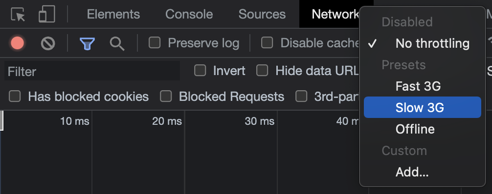

# 多数の呼び出しによるパフォーマンス低下問題

スロットリングとデバウンスは、**多数の呼び出しによるパフォーマンス低下問題を解決するため、呼び出しの数を少なくする手法**です。JavaScriptでマウススクロールに何の制約もなくイベントを適用した場合、スクロール時にそのイベントが非常に多数呼び出されるでしょう。もしそのイベント内に重い処理があれば、メモリに大きな負担をかけることになります。このような状況で呼び出し数を減らすために考案されたソリューションが、スロットリングとデバウンスです。JavaScriptだけでなく、他の言語や開発環境においても、短期間に多数の呼び出しが発生する状況であれば、どのようなものでも少ない量の呼び出しに変換するためにこの手法が使用でき、汎用的な概念と言えます。

# 過剰な呼び出しを適切な量に減らす方法

単位時間あたりの呼び出し量を減らすという点で、スロットリングとデバウンスは共通点を持っていますが、その方式が異なります。

-   スロットリングは、**多数の呼び出しに間隔を空ける**ことであり、
-   デバウンスは、**多数の呼び出しをまとめる**ことです。

## 「間隔」 = スロットリング (Throttling)

スロットリングは、フロントエンド開発時にページロード時間を遅いネットワーク環境で測定するために**Chrome開発者ツールが提供するネットワークスロットリング**を考えると理解しやすいでしょう。スロットリングという用語の意味自体が、**呼び出しの間に遅延を設けて周波数を下げる = 呼び出し間隔を長くすること**を意味します。スロットリングの本来の定義は、携帯電話で発熱がひどくなった際に、デバイス保護のためCPUのクロック数を急激に下げることを指します。ゲームや動画を好む人であれば、動画がスムーズに再生されていたのに、カクカクと途切れるようになるフレームドロップを想像すると良いでしょう。

スロットリングは、**「個々の行動」に対する処理**が必要なときに使用します。例としては、

-   スクロールに伴う継続的なイベント
-   ドラッグ＆ドロップ時の継続的なイベント

## 「グループ化」 = デバウンス (Debouncing)

デバウンスは、回路工学に由来すると考えられます。スイッチをOn/Offする際、電流の流れが[ On → Off ]と綺麗に切り替わるのではなく、[ On → Off → On → Off → On → Off ]のように短時間で細かく振動する現象が存在します。これを「バウンス」と呼び、このバウンスを綺麗に[ On → Off ]の単一の切り替えに変換することを「デバウンス」と言います。これは、数多くの呼び出しを少数の呼び出しにまとめるものです。

デバウンスは、**「行動をしたか否か」という単一の事実**が重要なときに使用します。例としては、

-   最終的なリサイズに対する単一イベント
-   最終的な検索語入力に対する単一イベント

# まとめ

まとめると、特定の行動をしたかどうかを判断したい場合は**デバウンス**でまとめ、行動をすべて認識したいがイベントが多すぎるため数を減らしたい場合は**スロットリング**で適切な遅延（間隔）を設定すれば良い、ということになります。

---

1.  [The difference between throttling and debouncing](https://css-tricks.com/the-difference-between-throttling-and-debouncing/)
2.  [How to optimize web app with debounce and throttle](https://blog.knoldus.com/how-to-optimize-web-app-with-debounce-and-throttle/)