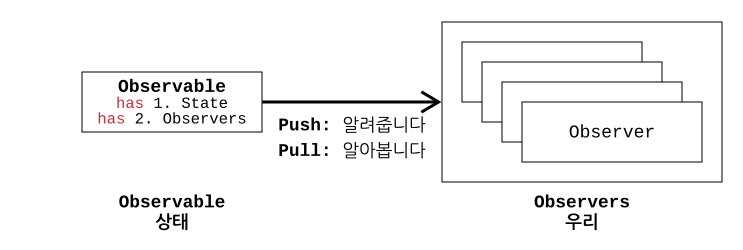

# 변수

프로그래밍을 처음 배울때 우리는 먼저 변수에 대해 배웁니다.
변하지 않는 값은 Constant 상수라고 부르며, Variable 변수의 값은 수시로 변합니다.
변수는 수시로 변할 수 있기 때문에 말 그대로 프로그램 내내 산전수전을 다 겪습니다.

# 상태

변수는 위에서 언급한대로 정말 다양한 상태를 갖습니다.
이러한 변수의 상태를 알기 위해서는 두 가지 방법이 있습니다.

## Push 방식

> **자동**: **변수가** 자신이 상태가 바뀌었음을 우리에게 **알려줍니다.**

## Pull 방식

> **수동**: **우리가** 변수가 상태가 바뀌었는지를 직접 **알아봅니다.**

자동으로 우리에게 알려주는게 가장 편해보일 수도 있겠지만 굳이 알 필요가 없는데 계속해서 자신의 상태에 대해 말해준다면 매우 귀찮겠지요. 그 상태를 계속 추적하기 위한 자원도 불필요하게 낭비될것입니다. 그럴때는 우리가 필요할때만 상태를 볼 수 있는 수동의 방법도 필요합니다. 이를 조금 고지식하게 Push 와 Pull 방식으로 이야기합니다. <b>변수의 상태를 하나의 ‘주제’</b>라고 본다면 주제를 중심으로 <b>우리에게 알려주는지(Push 방식)</b> 아니면 <b>우리가 알아보는지(Pull 방식)</b>에 따라 상태를 알 수 있는 방법이 나뉘는것입니다.

# 옵저버 패턴

> 옵저버 패턴은 변수의 상태를 (Push 와 Pull 중 원하는 방식으로) 알 수 있는 패턴입니다.



일반적으로 이 패턴을 설명할때 상태를 ‘주제’라 보고 Publish-Subscribe(발행-구독) 모델로 설명하곤합니다. 여기선 패턴 이름이 옵저버 패턴인 만큼 헷갈리지 않게 구독모델이 아닌 **Observer** 와 **Observable** 두 가지 용어로만 설명을 드리겠습니다. 옵저버 패턴에는 앞서 말씀드린 딱 두 종류의 인터페이스만 존재합니다. 하나는 **상태를 갖고있는 옵저버블**, 나머지 하나는 **상태를 보려하는 옵저버**입니다.

## Observable

위 옵저버 패턴 그림을 보시면 옵저버블 인터페이스는 두 가지 정보를 갖습(has)니다.

- State = 상태
- Observers = 옵저버 리스트

오해를 해서는 안되는 점이 옵저버블 인터페이스는 상태 자체가 아니라 상태를 ‘갖고 있다’는 것입니다. 상태를 갖고있다는 의미로 옵저버블, 즉 <b>옵저버는 이 옵져버블 인터페이스를 통해 상태를 ‘볼 수 있다’는 의미</b>인것입니다. 그리고 옵저버블은 상태를 알려주거나/알아보려는 옵저버들을 리스트(물론 다른 자료구조형도 가능합니다)로 관리하여 <b>Push 방식의 경우에는 상태를 누구에게 보내줄지?</b> 그리고 <b>Pull 방식의 경우에는 상태를 누구만 볼 수 있는지?</b> 결정할 수 있습니다.

- 옵저버블 인터페이스

```java
interface Observable {
    protected List<Observer> observers;
    public void registerObserver(Observer o);
    public void removeObserver(Observer o);
    public void notifyObserver(Object obj);
}
```

- 옵저버블 구현

```java
class StateObservable implements Observable {
    private State state;
    public void changeState() { /* 상태가 변경됩니다. */ }

    public void registerObserver(Observer o) { /* 옵저버 제외 */ }
    public void removeObserver(Observer o) { /* 옵저버 추가 */ }

```

- 옵저버블이 옵저버에게 알리는 Push 방식의 notifyObserver 구현

```java
    public void notifyObserver(State state) { /* 2. 옵저버 리스트의 각 옵저버들에게 1. 상태를 전송 */ }
}
```

- 옵저버블이 옵저버에게 읽히는 Pull 방식의 notifyObserver 구현

```java
    public void notifyObserver() { /* 아무것도 하지 않습니다. */ null }
    public State getState() { /* 상태를 보고싶으면 옵저버가 이 함수를 호출하면 됩니다. */ return state; }
}
```

## Observer

옵저버는 길게 설명할 것 없이 **상태를 보고자 하는 인터페이스**입니다. 인터페이스인 만큼 해당 정보를 보고, 활용하고싶다면 의도에 맞게 원하는 방식대로 구현하여 사용하시면 됩니다.

- 옵저버 인터페이스

```java
interface Observer {
    protected Observable observable;
    public void getStateFromObservable();
}
```

- 옵저버 구현

```java
class StateObserver implements Observer {
    private State state;

    public StateObserver(Observable observable) {
        this.observable = observable;
        this.observable.registerObserver(this);
    }
    public void update(state) {
        this.state = state;
    }
}
```

왜 StateObserver 를 `Observable.getObservers().add(new StateObserver())` 방식으로 추가하지 않고 StateObserver 객체를 생성할때 Observable 를 넣어줌으로써 생성자 안에서 추가를 해주었을까요?

> `Observable.getObservers()` 를 호출하지 않음으로써 옵저버 리스트를 옵저버블 외부에 절대 노출 X

---

옵저버 패턴을 왜 굳이 패턴으로 정의했을까요? 저렇게 복잡하게 할 필요까진 없을텐데요. 옵저버블과 옵저버 두 인터페이스가 서로의 구현에 대해서 전혀 알 필요없이 데이터만을 주고 받는데 의의가 있습니다. 좀 더 풀어쓰자면 아래와 같습니다.

> 옵저버블이 갖는 상태와 옵저버 테이블 모두 외부에 노출하지 않은채 오로지 옵저버들만 알게끔하는 것<br>
> ”서로 상호작용을 하는 객체 사이에는 가능하면 느슨하게 결합하는 디자인을 사용해야 한다.”는 원칙입니다.

잘 이해가 되셨는지요. 오늘의 디자인 패턴은 여기서 마치도록 하겠습니다.

---
