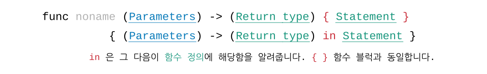
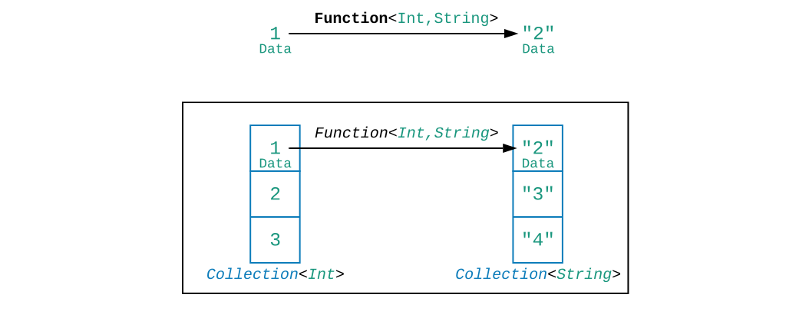
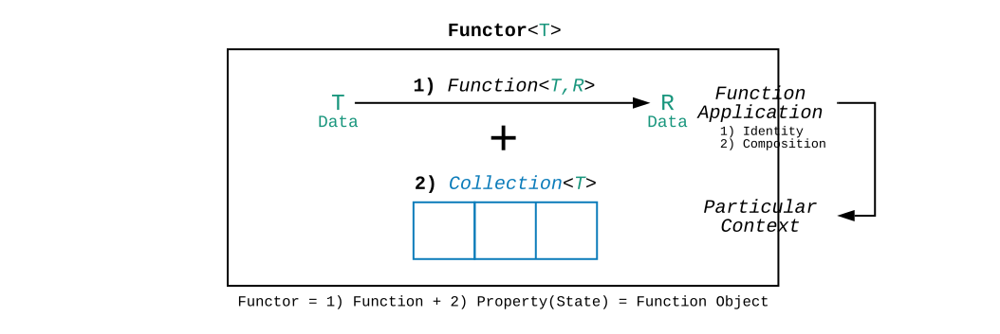
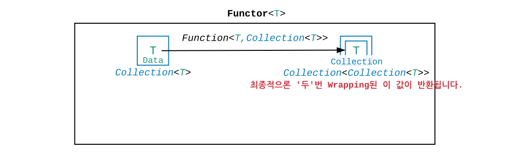
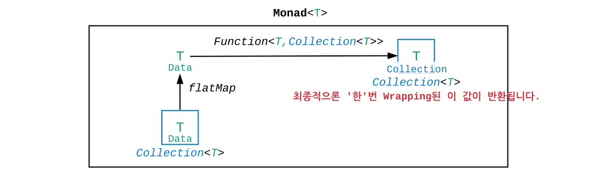
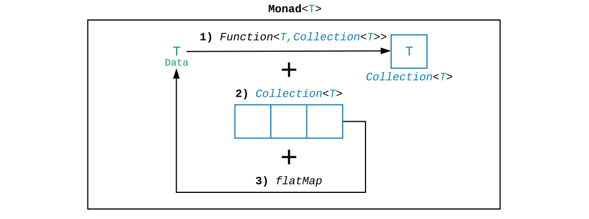
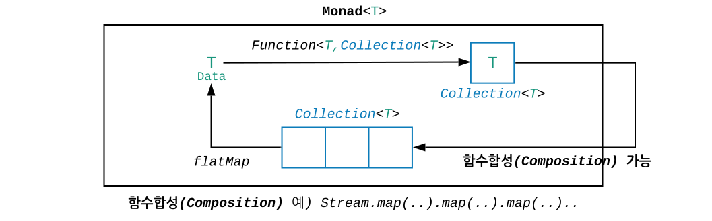

# 함수형 프로그래밍

함수형 프로그래밍은 한 마디로 요약할 수 있습니다.

> 함수를 ① 변수에 ② 파라미터에 ③ 반환값에 사용할 수 있고, ④ 순수 함수 특성을 가져야한다.

- ‘함수’는 **일급함수**(first-class function) 입니다.
  - ① ‘함수’를 **변수**에 대입할 수 있습니다.
  - ② ‘함수’를 **파라미터**로 넘길 수 있습니다.
  - ③ ‘함수’를 **반환**할 수 있습니다
  - ④ ‘함수’는 **순수 함수** 특성을 갖습니다.
    - **참조 투명성** 및 **부수효과 없음**(Side-Effects): 외부 상태나 변수, 환경의 영향을 받지 않고, 같은 파라미터로 함수를 호출하면 매 항상 같은 결과를 반환합니다.

## 함수 포인터

함수는 값이 아닌 참조인 만큼 **함수를 일급함수로 사용하기 위해서는 함수 포인터를 이용**해야 합니다.

- ① 함수 포인터를 통해 함수를 **변수**로 사용할 수 있습니다.
- ② 함수를 **파라미터**로 넘기고 싶다면 함수 포인터를 전달하면 가능합니다.
- ③ 함수를 **반환**하고 싶으면 반환하려는 함수에 대한 포인터를 반환하면 가능합니다.

```cpp
void qsort (void* base, size_t n, size_t size,  int (*compare)(const void*,const void*));
```

위 C 언어 예를 보면 퀵소트 알고리즘의 마지막 파라미터로 compare 함수 포인터를 넘겨주는걸 볼 수 있습니다. 다만 [C 언어에서의 함수는 런타임에 정의된 함수가 아니라 미리 컴파일된 함수는 이유로 일급함수(first-class function)가 아닌 이급함수(second-class function)로 부르자는 의견](https://en.wikipedia.org/wiki/First-class_citizen#Functions)도 있는듯 합니다.

# 람다 (익명함수)

람다는 컴퓨터과학 및 수리논리학에 사용되는 개념으로 현 프로그래밍 함수의 원형에 해당하는 개념입니다.

> 입력값을 받고 함수 외부에 정의된 자유변수를 활용하여 결과를 반환하는 **함수 추상표현법** 입니다.

함수를 정의만 할 뿐 수행하지 않는다는 점이 [프로그래밍 내에서 함수를 정의를 먼저하는 것과 동일](https://ko.wikipedia.org/wiki/%EB%9E%8C%EB%8B%A4_%EB%8C%80%EC%88%98#%ED%95%B5%EC%8B%AC_%EA%B0%9C%EB%85%90)합니다. 수리논리 개념이자 함수의 원형인만큼 **람다는 함수명이 존재하지 않습니다.** 이런 이유로 **람다를 프로그래밍에서는 익명함수로 부르기도 합니다.** 개념이라는 것은 알겠는데 그럼 람다는 언제 왜 사용되는것일까요?

프로그래밍에서는 값을 사용하는 두 가지 방법이 있습니다.

- **재사용성**을 위해 값을 정의 후 변수에 할당하여 **Ⓐ 변수로 사용하는 방법**

```ts
let defined: Int = 10;
print(defined);
```

- **일회성** 사용을 위해 값을 **Ⓑ 바로 inline 으로 사용하는 방법**

```ts
print(10);
```

함수를 사용하는 방법도 값과 같이 두 가지 방법이 있습니다.

- **재사용성**을 위해 함수를 정의 후 **Ⓐ 참조로 사용하는 방법**

```ts
const defined = (param: Int) => { return param; };
print(defined(10));
```

- **일회성** 사용을 위해 함수를 **Ⓑ 바로 inline 으로 사용하는 방법**

```ts
print(((param: Int) => { return param; })(10));
```

람다는 변수, 파라미터, 반환값에 함수 포인터를 넘겨준다는 것은 일반 함수 사용과 동일하지만, 함수 정의 시점이 다르기 때문에

- **함수 이름이 필요없으며**
- **함수의 유효범위가 일회성**이라는 장점이 있습니다.
  - 일반 함수는 정의 시 정의 구역 내 전역으로 존재하지만,
    - 어려운 말로 전역 네임스페이스에 소속되는 정적인 구현체
  - 람다는 정의 시 정의 블럭 내 일회성으로 존재합니다.

람다를 통해 함수를 일급함수로 사용 시 미리 정의할 필요없이 inline 으로 함수를 정의하여 바로 사용이 가능해졌습니다.

## 함수객체

객체지향 프로그래밍에서는 함수가 단일 함수로는 존재할 수 없으며 꼭 클래스안에 속해야하는 한계가 있습니다. 함수를 **람다로 사용하고싶다면 함수객체를 만들어 객체레벨로 사용**해야합니다. 객체지향 프로그래밍에서 람다는 겉으로 보기에는 단일 함수로 존재하는것 같지만, 실제론 이름없는 객체가 단일 함수를 감싸고 있는 **함수객체의 Syntactic Sugar** 라고 보시면됩니다.

# 클로저

[**람다**와 **클로저** 이 둘은 같아보이지만 엄연히 다른 개념](https://stackoverflow.com/questions/220658/what-is-the-difference-between-a-closure-and-a-lambda/220728#220728)입니다. 각 정의를 살펴보면

- **람다**

> 람다는 **익명함수**를 뜻합니다.<br>
> 함수를 변수, 파라미터, 반환값에 일회성으로 바로 사용하고싶을때 쓰입니다.

- **클로저**

> [클로저는 <b>함수가 정의될 때의 환경(상태)을 갖는 함수</b>를 뜻합니다.](https://en.wikipedia.org/wiki/Closure_(computer_programming)#cite_note-2)<br>
> 여기서 환경은 **클로저가 정의되는 범위(Scope)에 있는 지역변수들**을 의미합니다.

일반적으로 클로저는 함수 A 내부에서 함수(클로저) C 를 정의하는 방식으로 많이 사용합니다. **함수 A 내에 클로저 C 가 정의된다면 C 는 A 의 변수들을 파라미터로 넘기지 않았음에도 자연적으로 참조하여 사용할 수 있습니다.** 이것이 <b>환경(상태)</b>입니다.

- 함수 A 의 변수 와 클로저 C 의 관계를
- 클래스 A 내 필드와 메서드 C의 관계로 생각하시면 이해가 쉽습니다.

**클로저를 함수를 객체처럼 사용하기 위한 방법**으로 본다면, 클로저를 사용하는 이유는 객체를 사용하는 이유와 비슷합니다.

- 클로저 C 가 참조하는 외부 변수를 상태처럼 계속 갖기 때문에 반복 호출하더라도 해당 상태를 계속 활용할 수 있습니다.
- 외부 변수는 함수 A 범위 내에만 정의되었기 때문에 외부 접근이 불가능합니다.

```swift
func query(dbName: String) -> (String) -> (Person) {
  let instance: DBInstance = DBConfig.getInstance(dbName)
  // * 클로저 내부 { } 에서 클로저가 정의된 함수 내 존재하는 instance 변수를 사용하였습니다.
  return { (tableName: String) -> (Person) in 
    return instance.getTable(tableName).getFirst()
  }
}
```

## Swift 클로저

위에서 살펴보았듯 클로저의 정의가 익명함수는 아니지만, **Swift 에서는 클로저가 이름 없이 사용되기 때문에 사실상 익명함수의 의미로 사용됩니다.** Swift 의 클로저는 ‘파라미터’와 ‘반환에 해당하는 구문’을 in 으로 구별합니다.



Swift 의 클로저는 아래와 같이 원하는 만큼 축약할 수 있습니다.

- **기본형**: 파라미터 타입, 반환 타입을 명시하고 in 이후 함수 구문을 작성합니다.

```swift
{ (parameters) -> (return_type) in return /* statements using parameters */ }
```

- **축약형**: 반환 타입을 암시적으로 결정합니다

```swift
{ parameters in return /* statesments using parameters */ }
```

- **축약성애자**: 반환 타입뿐만 아니라 반환 식의 return 도 없앴습니다.

```swift
{ parameters in /* statesments using parameters */ }
```

- **변태**: 파라미터 타입을 암시적으로 결정합니다. 사용은 파라미터 순으로 $0, $1 로 사용합니다.

```swift
{ /* statesments using parameters with $0, $1 ... */ }
```

- **Trailing Closure**: 클로저가 마지막 파라미터로 사용된다면 파라미터에 넣지않고 함수 뒤 클로저 { } 로 바로 명시합니다.

```swift
var sorted = sort(names, { $0 < $1 })
var sorted = sort(names) { $0 < $1 }
```

# 고차함수

고차함수는 앞서 살펴본 일급함수 세 조건 중 두번째 혹은 세번째를 활용한 함수를 뜻합니다.

- ② ‘함수’를 **파라미터**로 넘길 수 있습니다.
- ③ ‘함수’를 **반환**할 수 있습니다

> 고차함수는 **함수를 파라미터로 혹은 반환값으로 사용하는 것을 의미**합니다.<br>
> 함수를 사용하는 함수다보니 **메타적 함수**라는 의미에서 한 차원 높은 함수, 고차함수라고 명명

# 커링

커링은 일급함수 세 조건 중 세번째를 활용한 함수를 뜻합니다.

- ③ ‘함수’를 **반환**할 수 있습니다

> 커링(Curring)은 **함수가 함수를 반환하는 것을 의미**합니다.
> 일반적으로 Swift 에서 커링은 함수가 클로저를 반환하는 방식으로 많이 사용됩니다.

```swift
func curringExample: (a: Int, b: Int, c: Int) -> (Int, Int) -> (Bool) { ... }
```

위 `curringExample` 예를 보면 a, b, c 파라미터를 받아 (Int, Int) 두 파라미터를 받아 -> (Bool) 을 반환하는 함수를 반환합니다

Swift 에서 ‘클래스의 객체’가 ’클래스 객체의 함수’를 호출하는 방법도 커링을 사용합니다.

```swift
let someInstance = SomeClass()
someInstance.someFunction(params: /* parameters */) 
```

위 클래스 객체의 함수는 실제로 아래와 같이 클래스 함수에 객체를 넘겨 수행합니다.

```swift
SomeClass.someFunction(self: someInstance)(params: /* parameters */) 
```

사담으로 Kotlin 의 확장함수도 수신객체타입(클래스)에 대한 함수에 수신객체를 파라미터로 넘기는 형태로 사용됩니다.

# Functor

Functor 는 **데이터 구조**입니다. Functor 개념에 앞서 함수에 대해서 짧게 살펴보겠습니다.

## 함수 = Mapping

함수는 Input A 를 넣으면 Output B 라는 결과가 나오는 것입니다.
달리보자면 함수는 Input A -> Output B, 이 둘에 대한 매핑입니다.

## 데이터 구조 Mapping

어떤 데이터 구조 전체에 대해 매핑을 적용한다면, 데이터 구조 내 원소 각각에 대해 매핑을 적용해야합니다. 예를 들어 데이터 구조가 리스트라면 0, 1 .. 이터레이팅을 통해서 다음과 같은 절차를 거치는데

- **Pull**: 각 원소를 꺼내어
- **Mapping**: 매핑을 적용한 후
- **Push**: 결과 원소를 반환하려는 데이터 구조에 넣습니다.



**각 원소에 대한 매핑 함수를 적용할 수 있음을 Mappable 로 정의**한다면, 예로 살펴본 리스트는 **Mappable 데이터 구조**라고 정의할 수 있습니다. 위 그림 예는 Int 데이터 구조에서 String 데이터 구조로 각 원소에 대해 stringify 한 Functor 의 예입니다.

- Functor 정의

> [Functor 는 <b>Mappable (Mapping 함수를 갖는) 데이터 구조</b>](https://medium.com/@sjsyrek/five-minutes-to-functor-83ef9075978b)입니다.<br>
> 각 원소에 대한 매핑 함수를 적용할 수 있는 데이터 구조라면 Functor 로 부를 수 있습니다.



- ① ‘단위 원소’들로 구성된 데이터 구조
- ② 각 ‘단위 원소’에서 ‘단위 윈소’로의 Mapping 함수

어떤 ① 데이터 구조든 원하는 연산을 적용하고싶다면 데이터 구조안의 단위 원소가 어떤 타입(T)이고, ② 단위 원소(T)에 대한 Mapping만 정의하면 됩니다. [①을 클래스의 프로퍼티, ②를 클래스의 메서드로 본다면 Functor 를 Function Object, 함수객체로 부르기도 합니다.](https://en.wikipedia.org/wiki/Function_object)

> Functor 는 범주론(Category Theory)에서 카테고리에서 동일 카테고리로 사상되는 개념에서 유래했습니다. **데이터 구조에서 동일 데이터 구조로 각 단위 원소들에 대해 Mapping 하는것과 개념적으로 동일**한 것을 알 수 있습니다. 이처럼 데이터 구조(카테고리)는 바뀌지 않은 채 값만 Mapping 되는 것을 범주론에서는 [<b>natural transformation</b>](https://en.wikipedia.org/wiki/Natural_transformation) 라고 정의합니다.

## Haskell's Functor

Functor 를 찾다보면 하스켈의 Functor 개념을 먼저 접하실텐데 하스켈의 Functor 는 typeclass 로 아래와 같이 정의하며, 데이터 구조 타입을 명시해서 원하는대로 인스턴스화 하여 사용합니다. Swift-like 문법으로 표현해보면 아래로 볼 수 있습니다.

- Functor (typeclass)
  - Operation(**① T**) -> (**② R**)
  - **③ S** (Any Data Structure)
- Functor 구현 (instantiation)
  - Operation(**① Int**) -> (**② String**) { +1 and Stringfy }
  - **③ List**

하스켈에서 **Functor 는 데이터 구조 타입(③ S)과 원소(① T)에서 원소(② R)로의 Mapping 추상 함수를 가진 제네릭(③ S, ① T, ② R) 추상 클래스**로 볼 수 있습니다. 하스켈에서 fmap() 이나 map() 함수를 정의할때 Mapping 추상 함수를 정의하고 변환하고자하는 데이터 구조를 주입하면 내부 값만 바뀐 동일한 데이터 구조가 반환됩니다.

Java 유저라면 Stream 의 map() 함수를 떠올리시면 이해가 쉽습니다.

- Stream 이 Mapping 함수를 가질 수 있는, Mappable 데이터 구조에 해당하므로 Functor 라고 부를 수 있고,
- 그 Mapping 함수는 Stream.map() 에 람다(익명함수) 형태로 정의하여 파라미터로 넘겨주면 됩니다.

Java 의 Stream 은 정확히는 모나드입니다. 이유는 Mapping 함수가

- `Operation(T) -> (R)`: 원소(T)에서 원소(T)로 매핑하는 것이 아니라
- `Operation(T) -> (S)`: 원소(T)에서 아예 새 Functor(S)로 반환한다는 것입니다.

Functor 에서는 연산 전 데이터 구조에서 단위 원소를 꺼내 매핑을 적용 후 **결과 원소를 데이터 구조에 넣었습니다.** 반면 모나드에서는 연산 전 데이터 구조에서 단위 원소를 꺼내 매핑을 적용 후 해당 원소를 데이터 구조에 넣어서 **결과 데이터 구조를 반환합니다.** 함수 자체가 데이터 구조를 반환하기 때문에 매핑 함수 결과에 `Stream.map().map().map()…` 과 같이 계속해서 Chaining 으로 연결할 수 있습니다.

왜 <b>‘원소 - 원소 매핑’</b>이 아닌 <b>’원소 - 데이터 구조 매핑’</b>을 하는지 아래 모나드에서 살펴보겠습니다.

# Monad

모나드가 무엇인지 한 마디로 정리하기에 앞서, 왜 모나드가 필요한지에 대해 알아보겠습니다. 프로그래밍 언어의 ‘프로그래밍 함수’와 학문에서의 ‘함수’의 차이점이 무엇인지 아시는지요?

- **수학에서의 함수** : 함수 실행 시 내부에 어떤 상황이 발생하더라도 최종적으로 값을 반환하는걸 보장합니다.
- **프로그래밍 함수** :  함수 실행 시 내부에 어떤 처리할 수 없는 상황이 발생하면 값을 반환하지 못한채 중간에 Exception을 발생시킵니다.

고등, 대학 수학에서 그 어떠한 함수도 f(x) 중간에 실행하다가 입력해준 값이 잘못되어있으면 중간에 Exception을 내지(…) 않았습니다. 하지만 프로그래밍 함수는 작동 중 상태가 잘못되었을 경우 Exception 을 발생시킵니다.

> Exception 을 발생시키는 것을 순수함수 관점에서는 Side-Effect 로 정의하기 때문에 [Exception 이 발생하는 함수를 **비순수 함수**로 정의](https://github.com/funfunStudy/study/wiki/%EC%88%9C%EC%88%98%ED%95%A8%EC%88%98-(Pure-Function))합니다.

만약 프로그래밍 함수에서 Exception 발생시 중간에 멈추는것이 아니라 해당 실패 상태가 발생했음을 상태값으로써 결과에 함께 반환한다면 Side-Effect 는 없어지게 됩니다. 프로그래밍 함수의 순수함수화인 셈입니다. **이렇게 ① 상태값과 함수 본연의 ② 결과값을 함께 반환하기 위해서는 이 둘을 묶는 데이터 구조가 필요할 것 같습니다.**

> Functor 의 Mapping 함수를 순수함수로 만들기위해 함수의 결과에<br>
> Exception 이 발생할 수 있는 ① 상태값 및 ② 결과값을 모두 포함하는 데이터 구조를 반환해보았습니다.



Functor 의 Mapping 함수가 데이터 구조를 반환하도록 만들었지만 **반환되는 데이터 구조가 한번 더 Functor 의 데이터 구조로 감싸져서 반환되는 문제**가 발생했습니다.

- Exception 상태값을 갖는 데이터 구조가
- Mapping 함수를 수행한 Functor 의 데이터 구조에 한번 더 감싸진채로 반환되었습니다.

Functor 는 자신의 데이터 구조의 내부 원소에서 그에 대한 연산을 수행하고 결과 원소를 데이터 구조에 Mapping 하여 반환하기 때문입니다.



불필요하게 두 번 감싸지 않고 Exception 상태값만을 포함한 데이터 구조를 반환하기 위하여 Mapping 함수의 결과를 그대로 반환하고, Mapping 함수 수행 전에 갖고있는 데이터 구조에서 값을 추출하는 <b>Unwrap 함수를 명시합니다. 이를 flatMap 함수라고 부르며 이 flatMap 으로 얻어진 ‘데이터 구조의 내부 원소’에 대한 Mapping 결과인 ‘데이터 구조’를 바로 반환하도록 하는것이 모나드 패턴</b>입니다.

- Monad 정의

> Monad는 **Unwrap(flatMap) 함수를 포함하는 Mappable 데이터 구조**입니다.<br>
> Monad의 Mapping 함수는 ① 상태값과 ② 결과값 모두를 갖는 데이터 구조를 반환합니다.



- ‘단위 원소’로 구성된 (1) 데이터 구조
- ‘단위 원소’에서 ‘Exception 상태를 포함한 (2) 데이터 구조’로의 Mapping 함수
- (1) 데이터 구조에서 ‘단위 원소’을 꺼내는 Unwrap(flatMap) 함수

모나드에 대한 설명을 보면 Context 와 Content 이 둘을 가진 데이터 타입으로 설명하는 글들이 많습니다. Context 를 값이 있음/없음에 대한 ‘상태’값으로, Content 는 우리가 연산하려는 ‘값’ 내지 ‘결과’값으로 설명합니다. Monad 의 Context 가 꼭 값이 있음/없음의 상태를 가져야하는것은 아니지만 일반적으로 함수 수행 중에 Exception 이 발생할 수 있는 경우들은 값이 null 인 경우가 대부분이기 때문에 많은 설명들에서 nullable 로 설명하는것 같습니다.

## Function Composition

모나드는 결과 데이터 구조가 상태값을 갖는다는것 뿐만 아니라 **함수의 합성이 가능하다는 성질**도 갖습니다.

- **composition with associative**:<br>
  두 Mapping 함수 f(x), g(x) 가 있다면 두 함수를 합성시 f(g(x)) = (f.g)(x) 의 결과를 갖는다.<br>
  또한 associative 성질에 의해 f(g(x)) = (f.g)(x) = (g.f)(x) = g(f(x)) 도 만족한다.



이렇게 함수형 프로그래밍의 클로저, 고차함수, 커링, Functor, 모나드 총 5개의 개념을 다뤄보았습니다. 질문이나 논의할 사항이 있으면 댓글이나 개인적으로 알려주시면 감사하겠습니다. 특히 이번 글은 시니어 개발자분의 도움으로 틀린 내용들을 가다듬고 다시 보완할 수 있었습니다. 다음 글에서는 Swift 의 클로저가 외부 변수를 참조하면서 생기는 참조 순환 문제와 그걸 해결하기 위한 기법들을 설명하겠습니다.

---

- https://medium.com/@sjsyrek/five-minutes-to-functor-83ef9075978b
- https://medium.com/@jooyunghan/functor-and-monad-examples-in-plain-java-9ea4d6630c6
- http://adit.io/posts/2013-04-17-functors,_applicatives,_and_monads_in_pictures.html
- http://seorenn.blogspot.com/2014/06/swift-closures.html
- https://stackoverflow.com/questions/356950/what-are-c-functors-and-their-uses
- https://stackoverflow.com/questions/2030863/in-functional-programming-what-is-a-functor

---