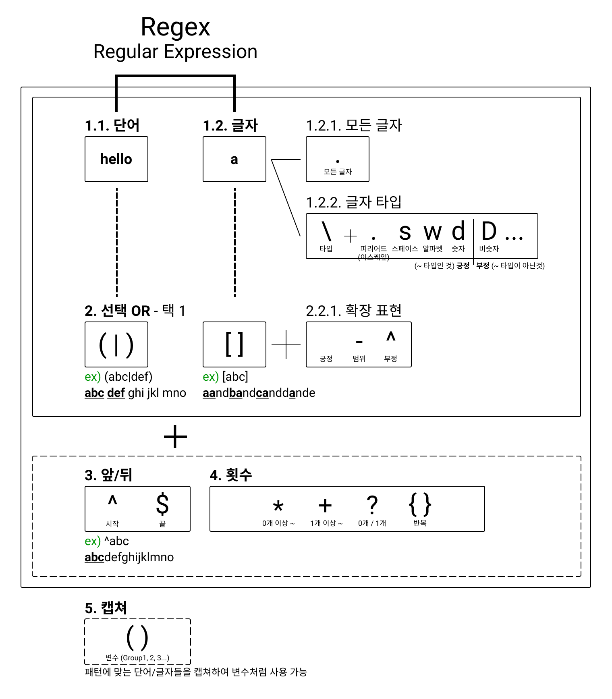

개인적으로 좋아했던 구글 Tech Lead 유튜버가 개발자라면 당연히 알아야할 몇가지 스킬을 업로드한적이 있다.

- Regular Expressions
- SQL
- Debugging Skills (Problem Solving)
- Tooling Language
- Anti-Social Skill

이 중 오늘의 주제는 가장 첫번째에 언급된 **정규표현식**이다. 중간에 5번이라는 스파이가 있는듯 한데 개발자는 사실상 코딩보단 말을 많이하는 직업이라 생각해서 그리 좋은 전략은 아닌듯하다. **정규표현식**은 학사때도 나중에 공부해야지 하고 메모는 많이 해놓았는데 정작 제대로 외우진 않고 매번 필요할때마다 찾아 쓴듯하다. 최근에 정리하였는데 나름 문법처럼 분류해서 외우면 쉽다. 사실 Regex 는 Tech Lead 말대로 개발하는데 너무 널리 사용된다. 텍스트 검색, 정확히는 패턴 매칭에 사용되는데 검색이라면 아래같이 수많은 유즈케이스들이 있다.

- grep 을 통한 로그/텍스트 분석
- 개발하고 있는 코드/디렉토리 검색
- commit 이전 코드 체킹
- 웹 크롤링
- URL 파싱
- 값/포맷 validation

Regex 는 처음보았을때나 공부하기 전까지는 암호내지 외계어처럼 보이긴 한다. 우리가 흔히 접하는 언어는 semantic 이 word 혹은 그 조합으로 표현되지만, semantic 들이 각각 하나의 charactor 에 매핑되어있는건 암호체계와 동일하기 때문이다. 이것도 syntax 로 분류하면 아래와 같이 나뉘어지는데, 정규표현식을 익히는데 많은 도움이 된다.

기본적으로 특정 단어를 검색하기 위해 정규표현식을 사용하는데, 단순히 찾고싶은 **1. 특정 단어를 직접 명시**하는 방법도 있지만 **2. 글자나 숫자 조합으로써 단어를 명시**할수도 있다. 정규표현식은 이에 두 가지 방법을 제공한다.

# 기본 문법

간단하게 검색하고 싶은 특정 단어만 명시하면 된다.
만약 여러 단어를 한번에 검색하고 싶다면 <b>() 안에 | 를 통해 다수의 단어를 넣으면 된다.</b>

## 단어

특정 글자를 명시하고 싶을땐 단어와 같은 방식으로 사용하면 되는데 <b>[]를 통해 여러 글자를 찾을수도 있고, [] 내부에서 확장 표현을 통해 A 부터 Z 까지(A-Z) 규칙을 추가하거나 특정 글자를 제외할 수도 있다.</b>

## 글자 타입

숫자 글자를 검색하고 싶다면 위에서 배운대로 [0-9] 도 좋지만 ‘숫자’ 글자 타입을 명시하여 검색할수도 있다. 글자의 타입을 명시하기 위한것이 역슬래시(\\)며 예를 들면 **‘숫자’ 글자 타입은 \d** 로 표현할 수 있고 **‘숫자가 아닌’ 글자 타입은 \D 와 같이 대문자로 표기**할 수 있다.

# 확장 문법

## 앞뒤 위치

특정 단어 혹은 글자를 찾더라도 글의 가장 앞쪽에 혹은 가장 뒷쪽에 존재하는 것을 찾고 싶을때 사용한다.

## 반복 횟수

특정 단어 혹은 글자가 **몇번 반복된 것을 검색하고 싶은지 명시**할 수 있다.

> (abc){1} = abc 
> (abc){1,3} = abc, abcabc, abcabcabc 
> (abc)? = (공백), abc 
> (abc)+ = abc, abcabc …

## 캡쳐 = 그룹핑

앞부분에서 설명하였듯 패턴으로 검색할 단어를 집합으로 묶을때 사용하거나 검색한 결과물들을 활용하려고 할때 결과값을 저장하는 역할을 한다.

---

정규표현식은 한번 배워두면 어떤 개발 언어에서든 모든곳에서 범용적으로 사용가능하며, 개발에서 활용할 수 있는 경우의 수가 매우 많아 유용하다. 이렇게 정리함으로써 이젠 매번 검색할일 없이 잘 사용할 수 있을듯하다.

---